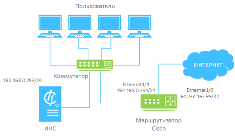

ИКС поддерживает сбор статистики по IP-трафику с маршрутизаторов Cisco Systems по протоколу Netflow версий 5 и 9.

---

## Пример

На схеме ИКС находится во внутренней сети предприятия и имеет один сетевой интерфейс. В приведенном примере использованы следующие параметры сети:

- Локальная сеть предприятия имеет адрес: 192.168.0.0/255.255.255.0.
- Маршрутизатор Cisco — шлюз по умолчанию в сети, адрес внутреннего интерфейса: 192.168.0.254.
- ИКС находится внутри локальной сети, адрес: 192.168.0.253.



Чтобы **настроить маршрутизатор Cisco**, выполните следующие действия:

1. На маршрутизаторе настройте два сетевых интерфейса:

```
Ethernet1/0 с адресом 64.233.167.99/255.255.255.255
Ethernet1/1 с адресом 192.168.0.254/255.255.255.0
```

2. Конфигурационный файл маршрутизатора:

```
version 12.3
service timestamps debug datetime msec
service timestamps log datetime msec
no service password-encryption
!
hostname Router
!
boot-start-marker
boot-end-marker
!
ip subnet-zero
!
ip cef
!
```

3. Особенностью маршрутизаторов Cisco является то, что маршрутизатор посылает по Netflow статистику только входящих в интерфейс пакетов. Таким образом, при использовании NAT в качестве адреса назначения для всех пакетов с внешнего интерфейса будет указан внешний адрес маршрутизатора (64.233.167.99). Чтобы обойти это ограничение, необходимо после выполнения преобразования NAT перенаправить входящий трафик еще на какой-то интерфейс. В примере используется Loopback0:

```
!
interface Loopback0
ip address 10.0.0.1 255.255.255.0
ip route-cache policy
ip route-cache flow
!
```

4. Для внешнего сетевого интерфейса включите NAT, экспорт Netflow и укажите опцию перенаправления пакетов на Loopback0:

```
!
interface Ethernet1/0
ip address 64.233.167.99 255.255.255.255
ip nat outside
ip route-cache policy
ip route-cache flow
ip policy route-map MAP
!
```

5. Для внутреннего сетевого интерфейса включите NAT и экспорт Netflow:

```
!
interface Ethernet1/1
ip address 192.168.0.254 255.255.255.0
ip nat inside
ip route-cache policy
ip route-cache flow
!
```

6. Укажите параметры NAT и адрес ИКС для экспорта Netflow-статистики, а также шлюз по умолчанию для доступа в сеть Интернет:

```
!
ip nat inside source list 1 interface Ethernet1/0 overload
ip flow-export version 5
ip flow-export destination 192.168.0.253 9995 (порт приема статистики на ИКС)
ip classless
ip route 0.0.0.0 0.0.0.0 213.187.105.999
!
```

7. Списки доступа для NAT и перенаправления трафика на Loopback0:

```
!
access-list 1 permit 192.168.0.0 0.0.0.255
access-list 108 permit ip any 192.168.0.0 0.0.0.255
!
```

8. Включите SNMP-сервер, чтобы получить конфигурацию сетевых интерфейсов на ИКС:

```
!
snmp-server community public RO
snmp-server ifindex persist
snmp-server enable traps tty
!
```

9. Правила для перенаправления трафика для списка доступа 108 в интерфейс Loopback0:

```
! 
route-map MAP permit 10
match ip address 108
set interface Loopback0 Ethernet1/1
!
End
```

Более подробную информацию по настройке Netflow на маршрутизаторе Cisco с использованием NAT можно найти [здесь](http://www.opennet.ru/base/cisco/netflow_nat.txt.html).

> ⚠ Начиная с IOS 12.3(11)T, при настройке экспорта Netflow использовать Loopback нет необходимости. Достаточно в настройках интерфейсов указать:

```
ip flow ingress
```

После настройки маршрутизатора Cisco следует [добавить](provaydery-i-seti-obzor-3.md) его в ИКС.
