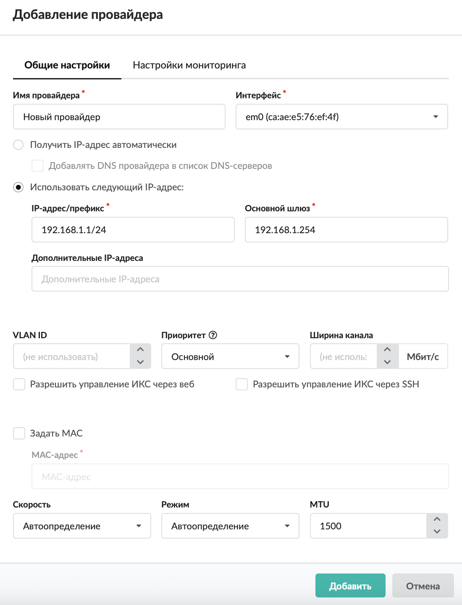
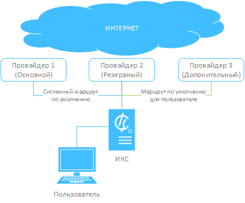
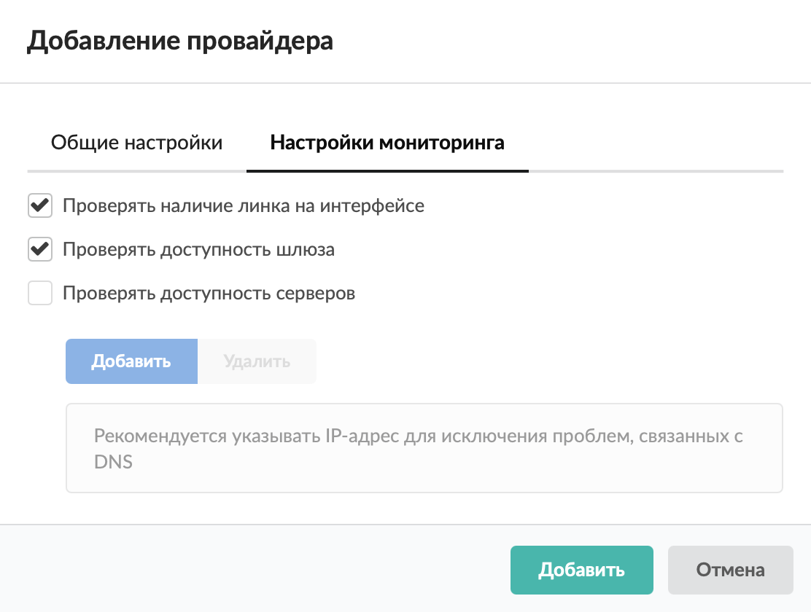
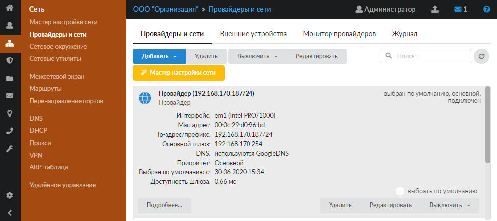
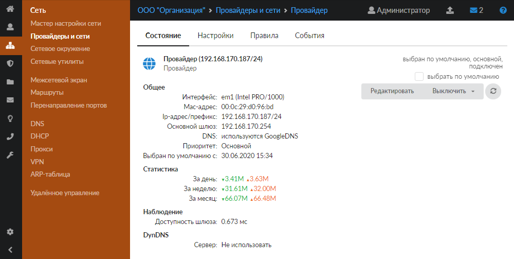
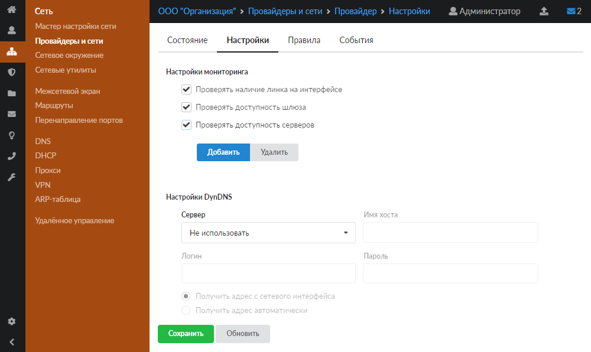
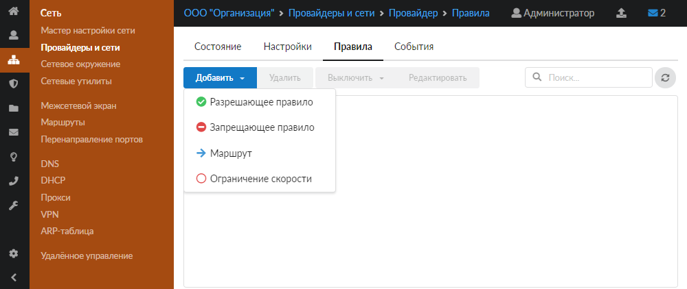
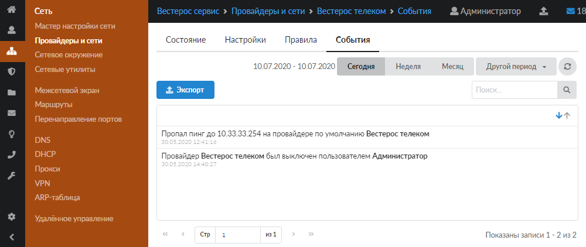

Добавить провайдер можно в меню **Сеть > Провайдеры и сети**.

---

Добавить [провайдер](../../o-dokumentacii/slovar-terminov-3.md) можно в меню **Сеть > Провайдеры и сети**. Для этого выполните следующие действия:

1. Нажмите кнопку **«Добавить»** и выберите **«Провайдеры > Провайдер»**.

   

2. На вкладке **«Общие настройки»** введите **название** провайдера.

3. Выберите **интерфейс**, на который будет назначен данный провайдер.

   

4. Установите **переключатель**:

   - «Использовать следующий [IP-адрес](../../o-dokumentacii/slovar-terminov-3.md)» — укажите **диапазон адресов** в виде IP-адрес/префикс либо адрес:маска. Также требуется ввести адрес основного шлюза;
   - «Получить IP-адрес автоматически» — если провайдер выдает адреса по протоколу [DHCP](../../o-dokumentacii/slovar-terminov-3.md). При необходимости можно установить флаг **«Добавлять DNS провайдера в список DNS-серверов»**.

5. Если требуется, укажите **дополнительные IP-адреса**.

   > С дополнительными IP-адресами автоматически не работают правила, которые создаются для провайдеров (которые автоматически работают для IP-адреса из поля «IP-адрес/префикс»). Для дополнительных IP-адресов необходимо добавлять правила вручную.

6. Чтобы создать [VLAN](../../o-dokumentacii/slovar-terminov-3.md)-сеть, укажите значение параметра **VLAN ID** (по умолчанию он не используется).

7. Выберите **приоритет**:

   - основной — трафик от всех пользователей направляется через данного провайдера. Если у вас два или более интернет-каналов, можно назначить обоим провайдерам приоритет «Основной». Трафик, не проходящий через прокси-сервер, будет направляться через каждый из них посредством динамической балансировки, что позволит значительно разгрузить каналы и объединить их для повышения пропускной способности. Трафик [прокси-сервера](../../o-dokumentacii/slovar-terminov-3.md) будет направлен через канал «по умолчанию»;
   - резервный — трафик через провайдера не направляется до тех пор, пока работает основной. В случае отключения основного провайдера резервный занимает его место;
   - дополнительный — трафик через провайдера не направляется, за исключением созданных в веб-интерфейсе статических маршрутов.

   Пример

   

   На схеме представлена работа трех провайдеров ИКС. Основной Провайдер 1 является шлюзом по умолчанию для всех пользователей и сервисов. Провайдер 2 неактивен до тех пор, пока не пропадет связь с Провайдером 1. Провайдер 3 настроен как дополнительный. Для выделенного пользователя настроен статический маршрут через данного провайдера.

8. Установите **ширину канала** (в Мбит/с).

9. Если требуется, установите **флаги**:

   - «Разрешить управление ИКС через веб» — будет разрешаться трафик от любого источника, идущий на IP-адрес провайдера на порт веб-интерфейса через сетевой интерфейс, на котором настроен провайдер;
   - «Разрешить управление ИКС через [SSH](../../o-dokumentacii/slovar-terminov-3.md)» — будет разрешаться трафик от любого источника, идущий на IP-адрес провайдера на порт 22 через сетевой интерфейс, на котором настроен провайдер.

10. На вкладке можно задать [MAC-адрес](../../o-dokumentacii/slovar-terminov-3.md) интерфейса, а также **скорость**, **режим работы** и [MTU](../../o-dokumentacii/slovar-terminov-3.md).

11. На вкладке **«Настройки мониторинга»** установите, каким образом ИКС будет понимать, что основной (Провайдер 1) недоступен и пора переключиться на резервного (Провайдера 2). ИКС может определять доступность провайдера по нескольким критериям, которым соответствуют **флаги**:

    - «Проверять наличие линка на интерфейсе» (установлен по умолчанию);
    - «Проверять доступность шлюза» (установлен по умолчанию);
    - «Проверять доступность серверов» — при установке флага укажите серверы, доступность которых будет проверяться. Для этого нажмите **«Добавить»**.

    

12. Нажмите **«Добавить»** — новый провайдер появится в списке.

    

13. Для более детальных настроек провайдера откройте его индивидуальный модуль.

## Индивидуальный модуль провайдера

Для перехода в индивидуальный модуль провайдера нажмите на него, а затем — на кнопку **«Подробнее...»**.

В данном модуле расположены следующие вкладки:

- [Состояние](#tab1)
- [Настройки](#tab2)
- [Правила](#tab3)
- [События](#tab4)

### Состояние

На вкладке отображается общее состояние провайдера и сведения о его DynDNS-сервере. Также здесь можно назначить данный провайдер по умолчанию при помощи одноименного флага.

### Настройки

На данной вкладке можно выполнить [настройки мониторинга](#monitoring) и настройки DynDNS.

При использовании **службы DynDNS** ИКС с помощью специальной программы-клиента периодически сообщает серверу DynDNS, находящемуся в сети Интернет, свой текущий IP-адрес. В свою очередь, сервер создает и периодически обновляет для данного адреса DNS-запись в домене `dyndns.org`. Таким образом, не зная текущего IP-адреса сервера, мы всегда можем получить доступ к нему по доменному имени.

Для использования функции DynDNS выполните следующие действия:

1. Зарегистрируйте учетную запись на сайте `dyndns.org` или `no-ip.com` и зарезервируйте собственное доменное имя в одном из предложенных доменов.
2. На вкладке **«Настройки»** укажите тип сервиса, используемые логин и пароль, а также имя хоста, которое будет сопоставляться IP-адресу.
3. При помощи переключателя укажите тип выбора выдаваемого адреса:
   - непосредственно с сетевого интерфейса ИКС;
   - автоматическое получение (в том случае, если ИКС находится за [NAT](../../o-dokumentacii/slovar-terminov-3.md)).
4. Нажмите кнопку **«Сохранить»**.

### Правила

Данная вкладка позволяет назначить правила [межсетевого экрана](../mezhsetevoy-ekran/mezhsetevoy-ekran-obzor-3.md) для всего трафика, который проходит через данного провайдера.

Например, можно создать запрещающее или разрешающее правило, маршрут, а также ограничение скорости. Все правила, которые будут созданы на данной вкладке, также будут отображены в списке правил межсетевого экрана.

### События

На данной вкладке отображается журнал всех системных сообщений от интерфейса провайдера с указанием даты и времени.

[Журнал](https://doc.a-real.ru/index.php?article=196#summary) является стандартным элементом веб-интерфейса ИКС.
