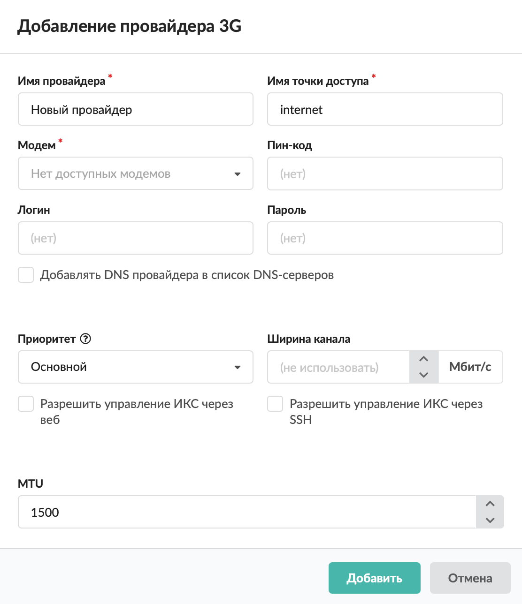

Настройка подключения ИКС к мобильному интернету через 3G-модем.

---

Чтобы подключить ИКС к мобильному Интернету вашего сотового оператора, вставьте USB-модем в порт компьютера, на котором установлен ИКС, и добавьте провайдер 3G в меню **Сеть > Провайдеры и сети**:

1. Нажмите кнопку **«Добавить»** и выберите **«Провайдеры > Провайдер 3G»**.

   

2. Введите **название** провайдера.

3. Укажите **имя точки доступа**.

   

4. Выберите **модем** из раскрывающегося списка.

5. В окне можно ввести **ПИН-код** от SIM-карты, а также **логин** и **пароль** для подключения.

6. Если требуется, установите флаг **«Добавлять DNS провайдера в список DNS-серверов»**.

7. Выберите **приоритет**:

   - основной — трафик от всех пользователей направляется через данного провайдера. Если у вас два или более интернет-каналов, можно назначить обоим провайдерам приоритет «Основной». Трафик, не проходящий через прокси-сервер, будет направляться через каждый из них посредством динамической балансировки, что позволит значительно разгрузить каналы и объединить их для повышения пропускной способности. Трафик прокси-сервера будет направлен через канал «по умолчанию»;
   - резервный — трафик через провайдера не направляется до тех пор, пока работает основной. В случае отключения основного провайдера резервный занимает его место;
   - дополнительный — трафик через провайдера не направляется, за исключением созданных в веб-интерфейсе статических маршрутов.

8. Установите **ширину канала** (в Мбит/с).

9. Если требуется, установите **флаги**:

   - «Разрешить управление ИКС через веб» — будет разрешаться трафик от любого источника, идущий на IP-адрес провайдера на порт веб-интерфейса через сетевой интерфейс, на котором настроен провайдер;
   - «Разрешить управление ИКС через SSH» — будет разрешаться трафик от любого источника, идущий на IP-адрес провайдера на порт 22 через сетевой интерфейс, на котором настроен провайдер.

10. В окне также можно задать MTU.

11. Нажмите **«Добавить»** — новый провайдер появится в списке.

12. Для более детальных настроек провайдера откройте его [индивидуальный модуль](provayder-2.md).

> ⚠ Внимание! ИКС может работать с 3G-модемами, которые определяются как сетевая карта автоматически. Если этого не происходит, вы можете обратиться в службу технической поддержки ([наши контакты](https://xserver.a-real.ru/#main-footer)).
