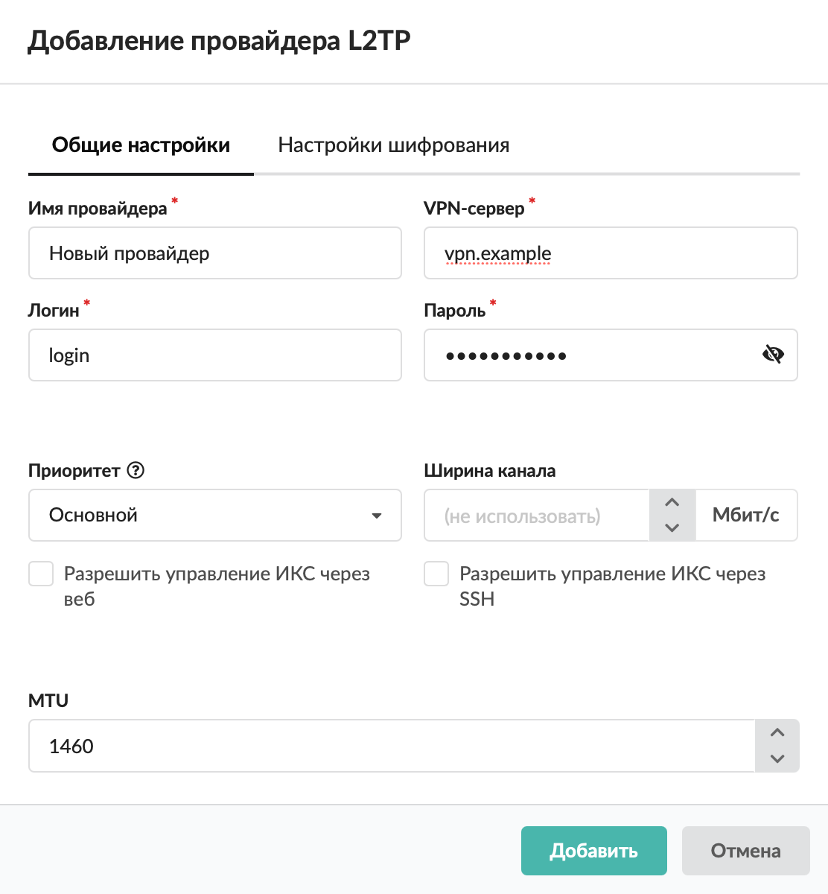
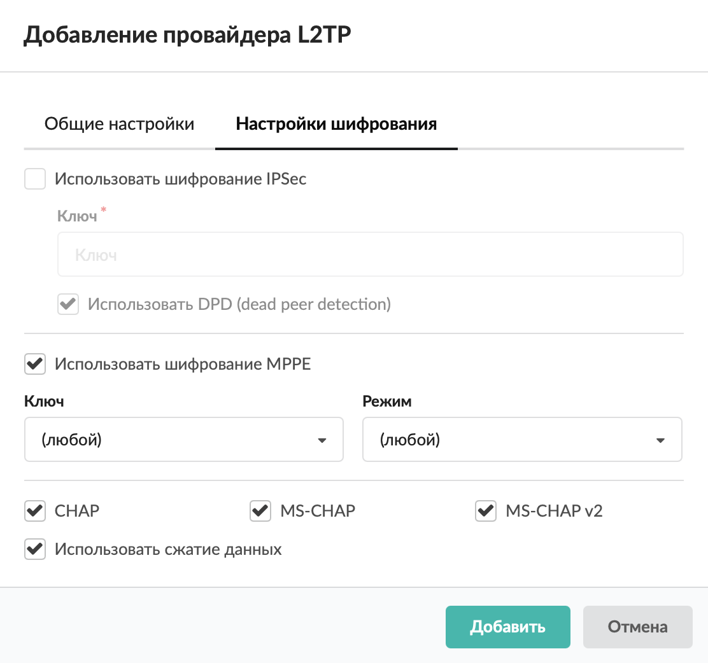

Добавить провайдер L2TP можно в меню **Сеть → Провайдеры и сети**.

---

Добавить провайдер **L2TP** можно в меню **Сеть &gt; Провайдеры и сети**. Для этого выполните следующие действия:

1. Нажмите кнопку **«Добавить»** и выберите **«Провайдеры &gt; Провайдер PPTP»**.

2. Заполните вкладки **«Общие настройки»** и **«Настройки шифрования»** по аналогии с настройками [провайдера PPTP](https://doc.a-real.ru/index.php?article=210).

3. При настройке шифрования также можно выбрать **шифрование** [IPSec](../../o-dokumentacii/slovar-terminov-3.md) (потребуется ввести ключ). Если флаг **«Использовать DPD (dead peer detection)»** установлен, провайдер L2TP будет периодически спрашивать VPN-сервер, доступен ли он.

4. Нажмите **«Добавить»** — новый провайдер появится в списке.

5. Для более детальных настроек провайдера откройте его [индивидуальный модуль](provayder-2.md).

Провайдер L2TP также можно настроить [поверх IP/DHCP](provayder-l2tp-poverh-ip-dhcp-2.md).
