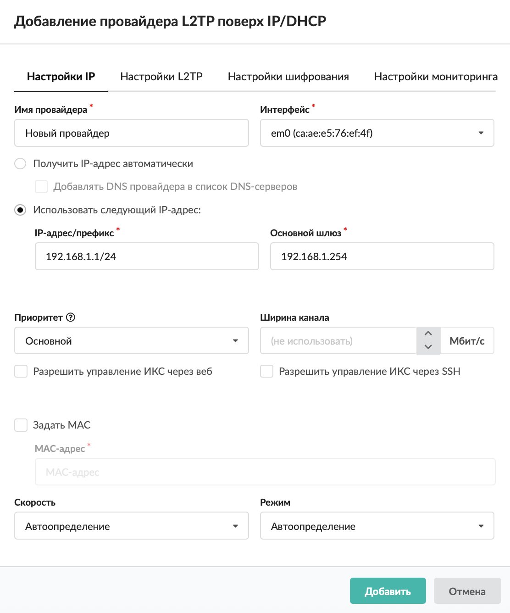
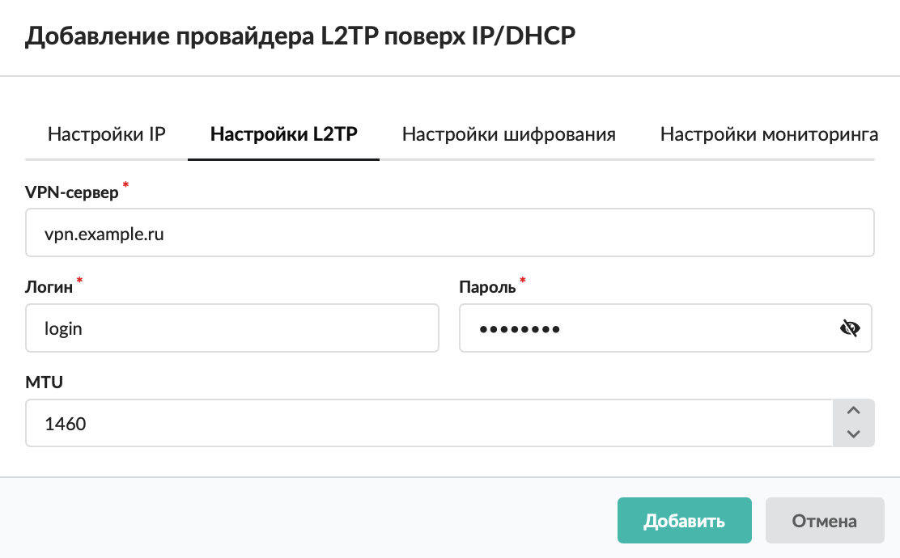
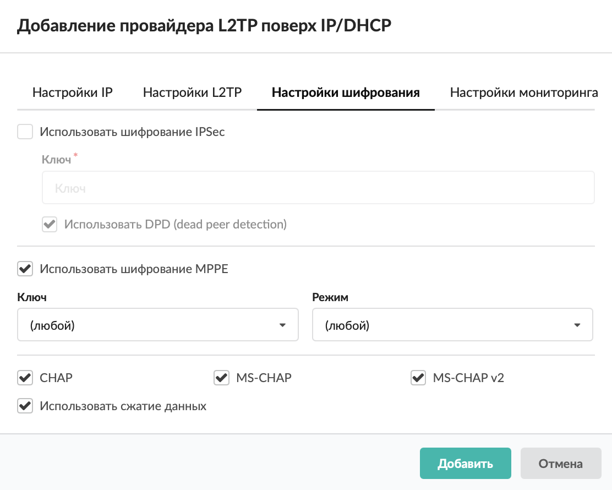
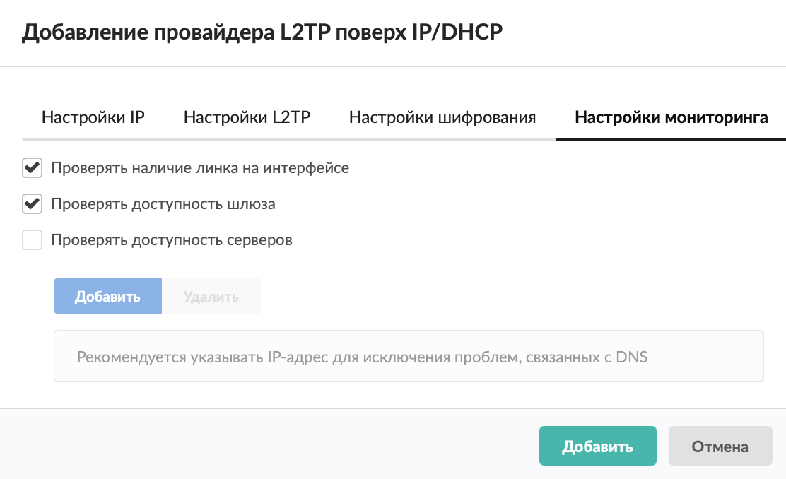

# Провайдер L2TP поверх IP/DHCP

В большинстве случаев L2TP-соединение настраивается поверх текущего IP-протокола, поэтому создание L2TP-провайдера можно упростить путем совмещения настройки PPP- и IP-параметров.

---

Добавить провайдер L2TP поверх IP/DHCP можно в меню **Сеть &gt; Провайдеры и сети**. Для этого выполните следующие действия:

1. Нажмите кнопку **«Добавить»** и выберите **«Провайдеры &gt; Провайдер L2TP поверх IP/DHCP»**.

   

2. Заполните вкладку **«Настройки IP»** по аналогии с общими настройками [статического провайдера](https://doc.a-real.ru/index.php?article=201#general_settings).

   

3. Введите данные на вкладке **«Настройки L2TP»** по аналогии с общими настройками [провайдера PPTP](https://doc.a-real.ru/index.php?article=210#general_settings).

   

4. Определите параметры шифрования на вкладке **«Настройки шифрования»** по аналогии с настройкой [провайдера L2TP](https://doc.a-real.ru/index.php?article=212#encryption).

   

5. Заполните вкладку **«Настройки мониторинга»** по аналогии с настройкой [статического провайдера](https://doc.a-real.ru/index.php?article=201#monitoring).

   

6. Нажмите **«Добавить»** — новый провайдер появится в списке.

7. Для более детальных настроек провайдера откройте его [индивидуальный модуль](https://doc.a-real.ru/index.php?article=201#individual).

---

**Источник:** [Документация ИКС — Провайдер L2TP поверх IP/DHCP](https://doc.a-real.ru/index.php?article=213)
