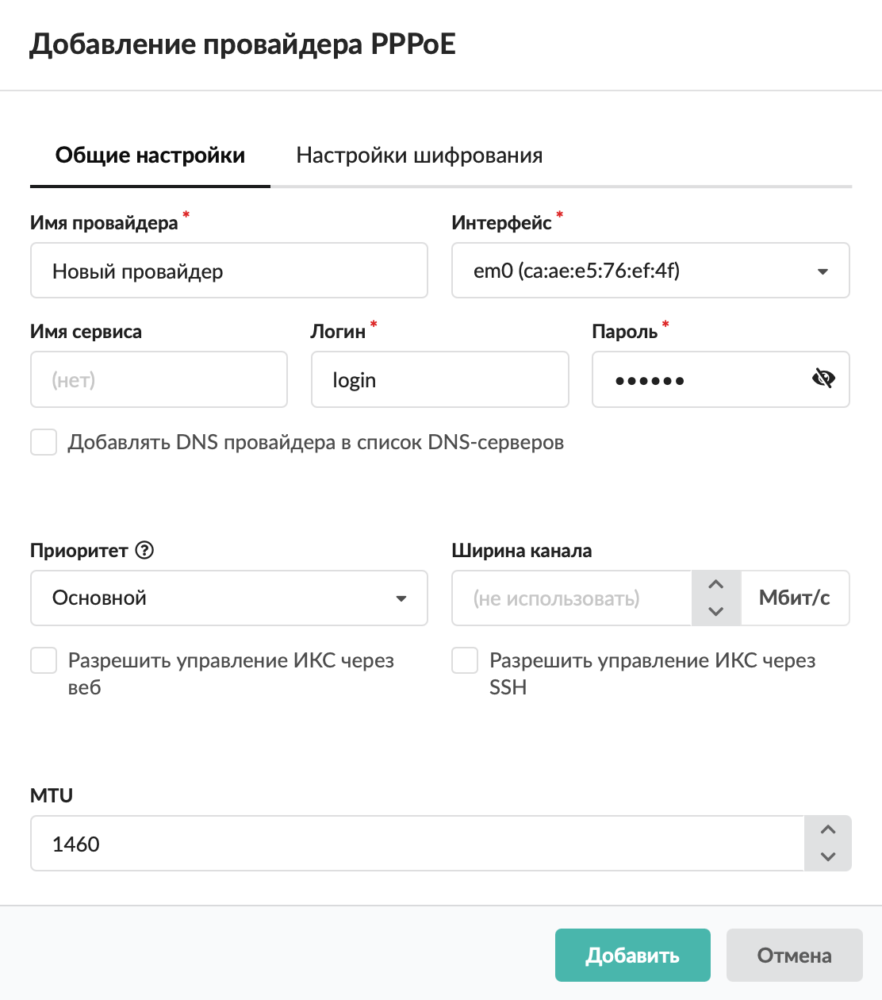
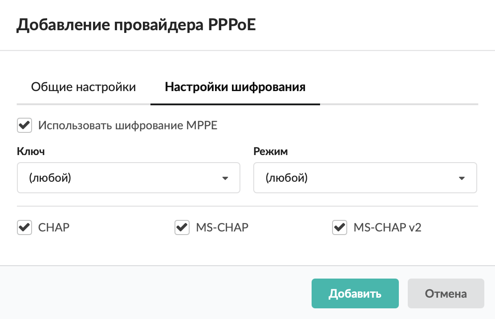

# Провайдер PPPoE

Добавить провайдер PPPoE можно в меню **Сеть &gt; Провайдеры и сети**.

---

1. Нажмите кнопку **«Добавить»** и выберите **«Провайдеры &gt; Провайдер PPPoE»**.

2. На вкладке **«Общие настройки»** введите **название** провайдера.

3. Выберите **интерфейс**, на который будет назначен данный провайдер.

4. Введите **имя сервиса**, **логин** и **пароль**.

5. Если требуется, установите флаг **«Добавлять DNS провайдера в список DNS-серверов»**.

6. Выберите **приоритет**:

- основной — трафик от всех пользователей направляется через данного провайдера. Если у вас два или более интернет-каналов, можно назначить обоим провайдерам приоритет «Основной». Трафик, не проходящий через прокси-сервер, будет направляться через каждый из них посредством динамической балансировки, что позволит значительно разгрузить каналы и объединить их для повышения пропускной способности. Трафик прокси-сервера будет направлен через канал «по умолчанию»;
- резервный — трафик через провайдера не направляется до тех пор, пока работает основной. В случае отключения основного провайдера резервный занимает его место;
- дополнительный — трафик через провайдера не направляется, за исключением созданных в веб-интерфейсе статических маршрутов.

7. Установите **ширину канала** (в Мбит/с).

8. Если требуется, установите **флаги**:

- «Разрешить управление ИКС через веб» — будет разрешаться трафик от любого источника, идущий на IP-адрес провайдера на порт веб-интерфейса через сетевой интерфейс, на котором настроен провайдер;
- «Разрешить управление ИКС через SSH» — будет разрешаться трафик от любого источника, идущий на IP-адрес провайдера на порт 22 через сетевой интерфейс, на котором настроен провайдер.

9. На вкладке также можно задать **MTU**.

10. На вкладке **«Настройки шифрования»** определите параметры шифрования по аналогии с настройкой провайдера PPTP.

11. Нажмите **«Добавить»** — новый провайдер появится в списке.

12. Для более детальных настроек провайдера откройте его индивидуальный модуль.

---

**Источник:** [Документация ИКС — Провайдер PPPoE](https://doc.a-real.ru/index.php?article=214)
