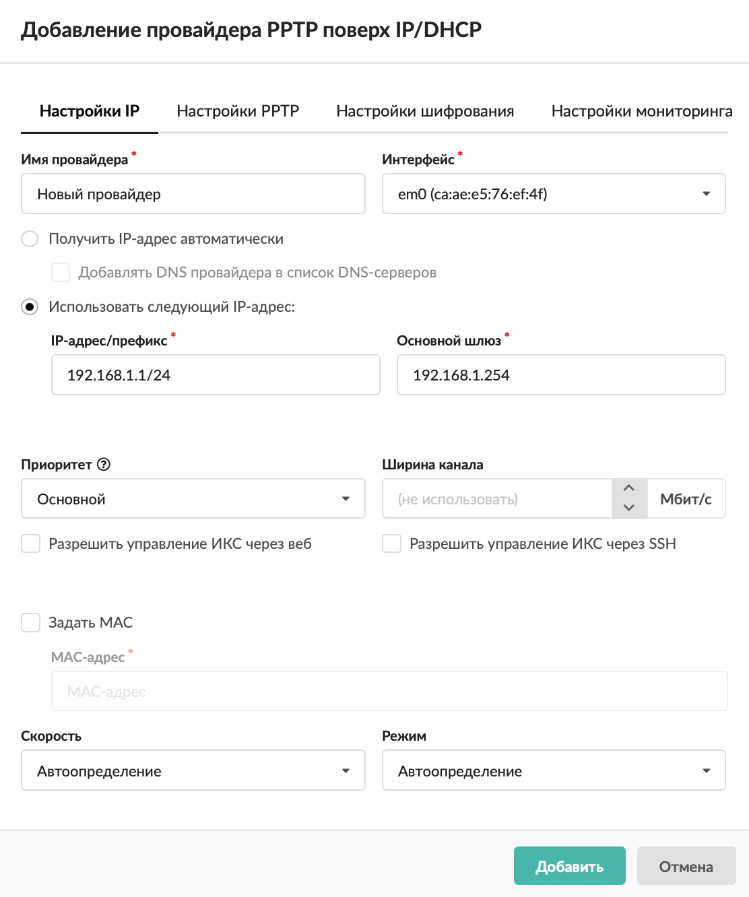
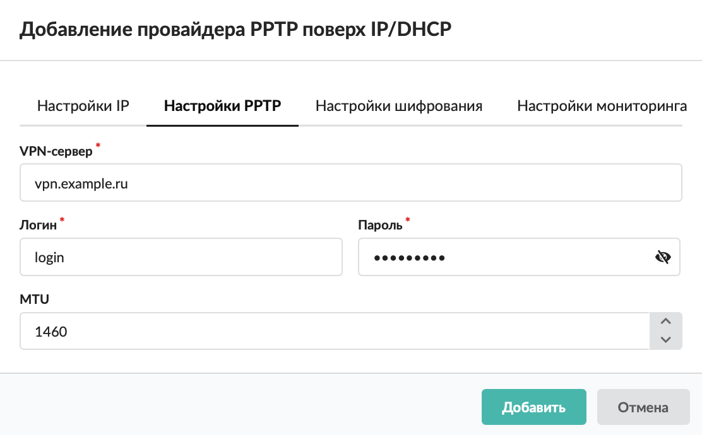
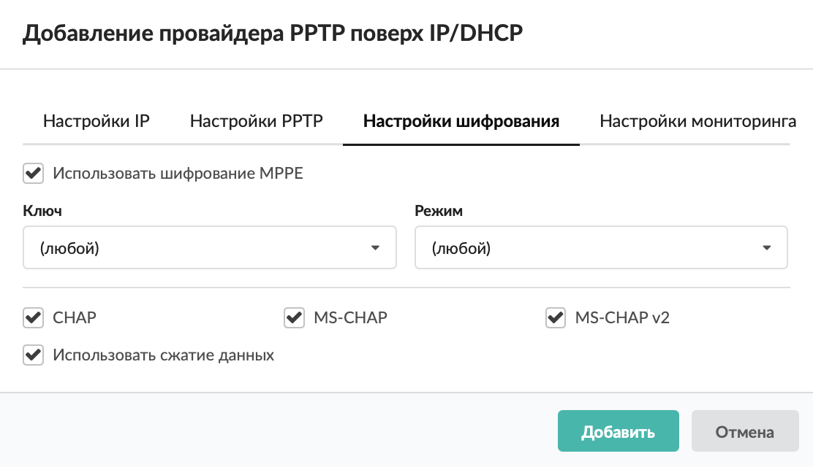
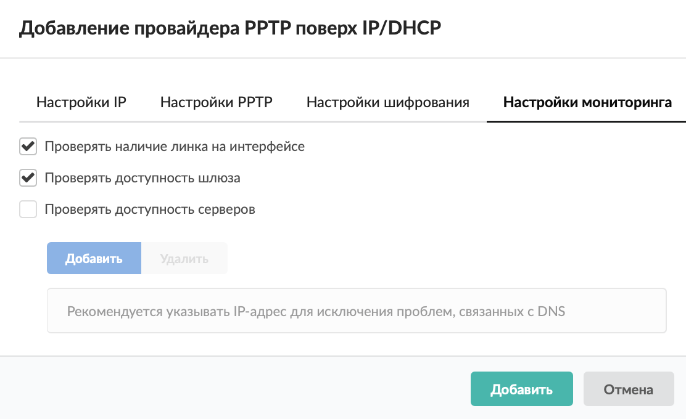

В большинстве случаев PPTP-соединение настраивается поверх текущего IP-протокола, поэтому создание PPTP-провайдера можно упростить путем совмещения настройки PPP- и IP-параметров.

Добавить провайдер PPTP поверх IP/DHCP можно в меню **Сеть > Провайдеры и сети**. Для этого выполните следующие действия:

1. Нажмите кнопку **«Добавить»** и выберите **«Провайдеры > Провайдер PPTP поверх IP/DHCP»**.

   

2. Заполните вкладку **«Настройки IP»** по аналогии с общими настройками [статического провайдера](provayder-2.md).

   

3. Введите данные на вкладке **«Настройки PPTP»** по аналогии с общими настройками [провайдера PPTP](provayder-pptp.md).

   

4. Определите параметры шифрования на вкладке **«Настройки шифрования»** по аналогии с настройкой [провайдера PPTP](provayder-pptp.md).

   

5. Заполните вкладку **«Настройки мониторинга»** по аналогии с настройкой [статического провайдера](provayder-2.md).

   

6. Нажмите **«Добавить»** — новый провайдер появится в списке.

7. Для более детальных настроек провайдера откройте его [индивидуальный модуль](provayder-2.md).
