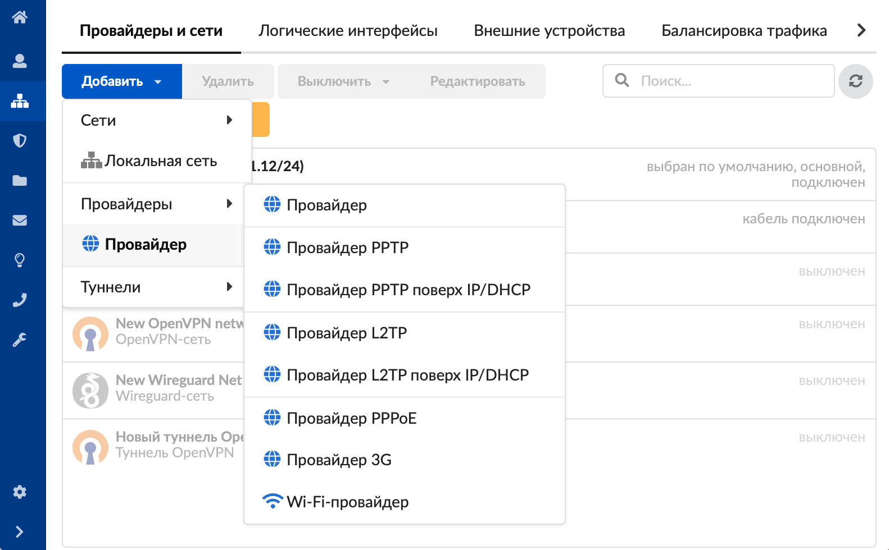
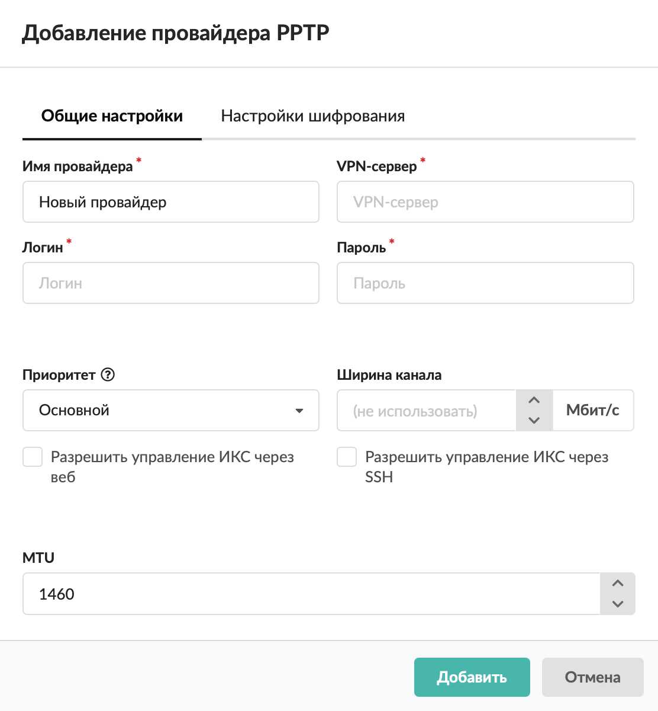
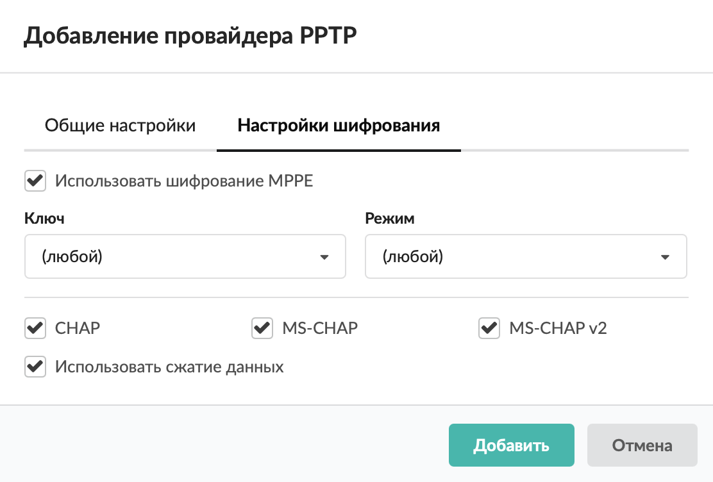

Настройка PPTP-провайдера в межсетевом экране ИКС для подключения к интернету через VPN-канал с авторизацией по логину и паролю.

---

Настройка [PPTP](/index.php?article=24#pptp)-провайдера производится в том случае, когда подключение к [провайдеру](/index.php?article=24#provider) осуществляется по технологии [VPN](/index.php?article=197) с указанием имени сервера, логина и пароля подключения.

Добавить провайдер PPTP можно в меню **Сеть > Провайдеры и сети**. Для этого выполните следующие действия:

1. Нажмите кнопку  **«Добавить»**  и выберите  **«Провайдеры > Провайдер PPTP»** .
 

2. На вкладке  **«Общие настройки»**  введите **название** провайдера.
3. Укажите имя или [IP-адрес](/index.php?article=24#ip-address)   **VPN-сервера** .
 

4. Введите **логин** и **пароль** .
5. Укажите адреса [**DNS-серверов**](/index.php?article=24#dns-server) .
6. Выберите **приоритет** :
 - основной — трафик от всех пользователей направляется через данного провайдера. Если у вас два или более интернет-каналов, можно назначить обоим провайдерам приоритет «Основной». Трафик, не проходящий через прокси-сервер, будет направляться через каждый из них посредством динамической балансировки, что позволит значительно разгрузить каналы и объединить их для повышения пропускной способности. Трафик [прокси-сервера](/index.php?article=24#proxy) будет направлен через канал «по умолчанию»;
- резервный — трафик через провайдера не направляется до тех пор, пока работает основной. В случае отключения основного провайдера резервный занимает его место;
- дополнительный — трафик через провайдера не направляется, за исключением созданных в веб-интерфейсе статических маршрутов.
7. Установите **ширину канала**  (в Мбит/с).
8. Если требуется, установите  **флаги** :
 - «Разрешить управление ИКС через веб» — будет разрешаться трафик от любого источника, идущий на IP-адрес провайдера на порт веб-интерфейса через сетевой интерфейс, на котором настроен провайдер;
- «Разрешить управление ИКС через  [SSH](/index.php?article=24#ssh) » — будет разрешаться трафик от любого источника, идущий на IP-адрес провайдера на порт 22 через сетевой интерфейс, на котором настроен провайдер.
9. На вкладке также можно задать  [**MTU**](/index.php?article=24#mtu) .
10. Вкладка **«Настройки шифрования»** позволяет изменить настройки шифрования при передаче данных. Опции, выставленные по умолчанию, подходят для подавляющего большинства интернет-провайдеров. Если провайдер выставляет особые требования к оборудованию или вы настраиваете собственный [PPP](/index.php?article=24#ppp) -сервер с индивидуальными настройками, можно изменить параметры шифрования создаваемого провайдера.
 

По умолчанию используется **шифрование** [MPPE](/index.php?article=24#mppe) (если требуется, выберите ключ и режим). Если при установлении соединения с сервером VPN возникают проблемы, уточните у вашего провайдера, не требуются ли особые параметры настроек шифрования и поддерживается ли данная опция в принципе.
11. Выберите поддерживаемые **типы авторизации PPP** (CHAP, MS-CHAP или MS-CHAPv2) при помощи соответствующих флагов. По умолчанию все флаги установлены.
12. При необходимости снимите флаг **«Использовать сжатие данных»** (по протоколу [MPPC](/index.php?article=24#mppc) ). По умолчанию сжатие включено.
 

13. Нажмите **«Добавить»** — новый провайдер появится в списке.
14. Для более детальных настроек провайдера откройте его [индивидуальный модуль](/index.php?article=201#individual).

Провайдер PPTP также можно настроить [поверх IP/DHCP](/index.php?article=211).
