# Провайдеры и сети

Модуль «Провайдеры и сети» позволяет управлять внешними, внутренними и виртуальными сетями, подключенными к ИКС.

---

Модуль **«Провайдеры и сети»** позволяет управлять внешними, внутренними и виртуальными сетями, подключенными к ИКС.

В качестве объекта [маршрутизации](https://doc.a-real.ru/index.php?article=24#routing) выступают:

- [WAN](https://doc.a-real.ru/index.php?article=24#wan) — сеть, которая в терминологии ИКС обозначается как [провайдер](https://doc.a-real.ru/index.php?article=24#provider);
- [LAN](https://doc.a-real.ru/index.php?article=24#lan) — локальная сеть;
- внутренняя сеть — сеть, которая подключена к ИКС не напрямую, а отделена маршрутизатором;
- пользователь — конечный объект маршрутизации.

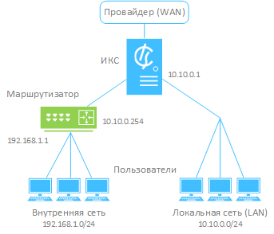

Для открытия модуля перейдите в меню **Сеть > Провайдеры и сети**.

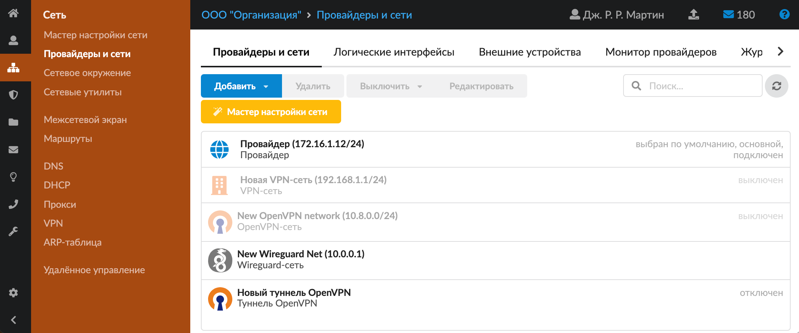

В модуле расположены следующие вкладки:

- **Провайдеры и сети**
- **Логические интерфейсы**
- **Внешние устройства**
- **Балансировка трафика**
- **Монитор провайдеров**
- **Журнал**

## Провайдеры и сети

Данная вкладка содержит список всех внешних, внутренних и виртуальных сетей, подключенных к ИКС.

У каждого объекта в списке отображается имя сети, IP-адрес интерфейса, статус сигнала и доступность шлюза (для провайдеров). При нажатии на объект показываются все его основные параметры.

Любой объект можно **отредактировать** или **удалить** при помощи соответствующих кнопок.

Объект можно **выключить**, а затем снова **включить** — это удалит настройки интерфейса без необходимости заново создавать объект.

Также на данной вкладке расположена кнопка запуска [мастера настройки сети](https://doc.a-real.ru/index.php?article=54).

Чтобы добавить новую сеть, нажмите кнопку **«Добавить»** и выберите нужный объект:

| Сети | Провайдеры | Туннели |
|------|------------|---------|
| [Локальная сеть](https://doc.a-real.ru/index.php?article=200) | [Провайдер](https://doc.a-real.ru/index.php?article=201) | [Туннель IPsec](https://doc.a-real.ru/index.php?article=218) |
| [Внутренняя сеть](https://doc.a-real.ru/index.php?article=199) | [Провайдер PPTP](https://doc.a-real.ru/index.php?article=210) | [Туннель IPIP](https://doc.a-real.ru/index.php?article=219) |
| [Wi-Fi-сеть](https://doc.a-real.ru/index.php?article=202) | [Провайдер PPTP поверх IP/DHCP](https://doc.a-real.ru/index.php?article=211) | [Туннель GRE](https://doc.a-real.ru/index.php?article=220) |
| [VPN-сеть](https://doc.a-real.ru/index.php?article=197) | [Провайдер L2TP](https://doc.a-real.ru/index.php?article=212) | [Туннель OpenVPN](https://doc.a-real.ru/index.php?article=221) |
| [OpenVPN-сеть](https://doc.a-real.ru/index.php?article=198) | [Провайдер L2TP поверх IP/DHCP](https://doc.a-real.ru/index.php?article=213) | |
| [SSTP-сеть](https://doc.a-real.ru/index.php?article=311) | [Провайдер PPPoE](https://doc.a-real.ru/index.php?article=214) | |
| [Wireguard-сеть](https://doc.a-real.ru/index.php?article=392) | [Провайдер 3G](https://doc.a-real.ru/index.php?article=215) | |
| [DMZ-сеть](https://doc.a-real.ru/index.php?article=203) | [Wi-Fi-провайдер](https://doc.a-real.ru/index.php?article=216) | |

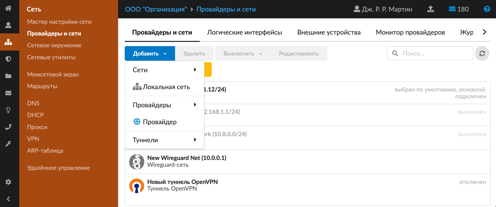

## Логические интерфейсы

Данная вкладка содержит список всех логических интерфейсов ИКС.

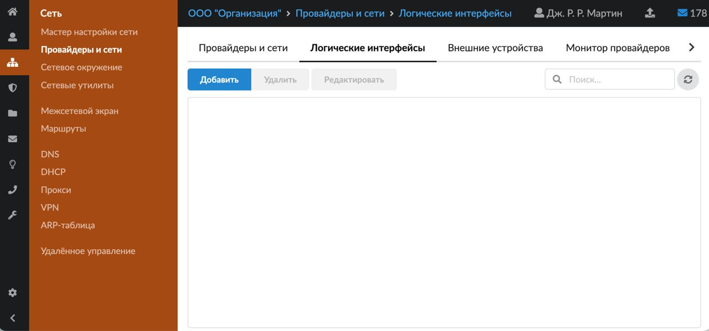

Для того чтобы добавить новый логический интерфейс, выполните следующие действия:

1. Нажмите **«Добавить»** — появится окно добавления логического интерфейса.
2. Введите **название** и **описание**.

   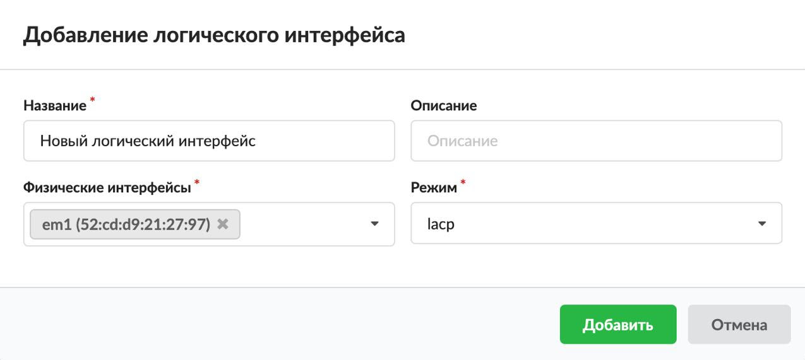

3. Укажите **физические интерфейсы**.
4. Выберите один из доступных **режимов**:
   - **failover** — отправляет трафик только через активный порт. Если основной порт становится недоступным, используется следующий активный порт. Первый добавленный интерфейс — главный порт; любые интерфейсы, добавленные после этого, используются в качестве отказоустойчивых устройств. По умолчанию полученный трафик принимается только тогда, когда он получен через активный порт. Это ограничение может быть снято, если установить параметр sysctl `net.link.lagg.failover_rx_all` в ненулевое значение, что полезно для определенных настроек мостовой сети;
   - **lacp** — поддерживает IEEE 802.1AX (ранее 802.3ad). Протокол управления агрегацией (LACP) и протокол маркеров. LACP будет согласовывать набор агрегируемых ссылок с соседним узлом в одну или несколько групп Link Aggregated. Каждая группа LAG состоит из портов с одинаковой скоростью, настроенных на полнодуплексный режим. Трафик будет сбалансирован по портам в LAG с наибольшей суммарной скоростью. В большинстве случаев будет только одна LAG, которая содержит все порты. В случае изменений в физическом соединении Link Aggregation быстро сходится к новой конфигурации. LACP обеспечивает резервирование на уровне канала при отказе сети и балансировке нагрузки трафика. Даже если одна связь выйдет из строя, остальные связи между двумя коммутаторами все равно будут работать. Они также принимают на себя тот трафик, который должен проходить через вышедшего из строя, поэтому пакет данных не будет потерян. Требуется поддержка и настройка со стороны соседнего узла (коммутатора или группы коммутаторов);
   - **loadbalance** — балансирует исходящий трафик между активными портами на основе хеша заголовка протокола и принимает входящий трафик с любого активного порта. Это статическая опция, которая не предполагает согласования режима работы с принимающим оборудованием. Хэш включает в себя Ethernet-адрес источника и получателя и (если доступно) VLAN тег, а также IP-адрес источника и получателя;
   - **roundrobin** — распределяет исходящий трафик с помощью циклического планировщика через все активные порты и принимает входящий трафик от любого активного порта. Использование циклического режима может привести к неупорядоченному поступлению пакетов к клиенту. Пропускная способность может быть ограничена, поскольку клиент выполняет переупорядочивание пакетов с интенсивным использованием ЦП;
   - **broadcast** — отправляет кадры на все порты группы LAG и получает кадры на любой порт LAG.
5. Нажмите **«Добавить»** — новый логический интерфейс появится в списке.

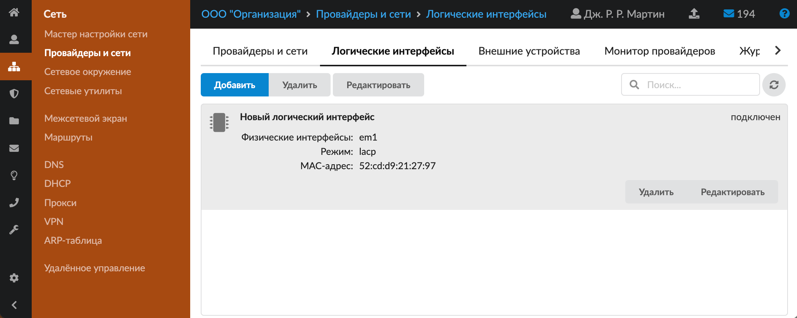

## Внешние устройства

Данная вкладка предназначена для настройки получения статистики с [Cisco](https://doc.a-real.ru/index.php?article=230)-устройств. ИКС поддерживает сборку статистики по IP-трафику с маршрутизаторов Cisco Systems по протоколу Netflow версий 5 и 9.

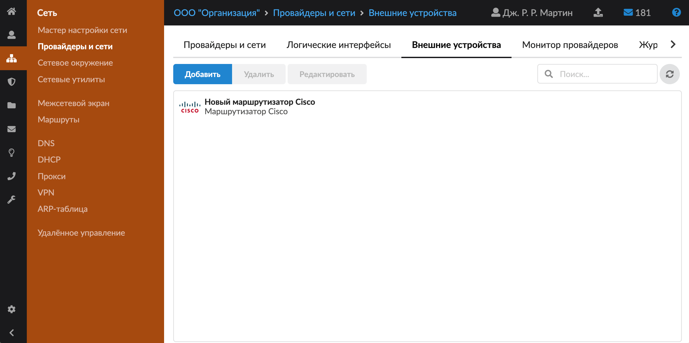

1. Нажмите **«Добавить»** — появится окно добавления маршрутизатора Cisco.
2. Введите название маршрутизатора и его IP-адрес.

   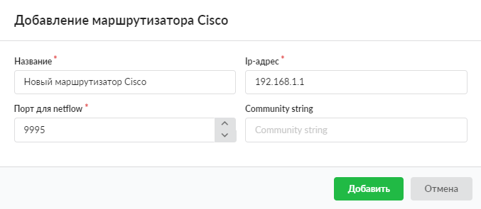

3. В поле **«Порт для [Netflow](https://doc.a-real.ru/index.php?article=24#netflow)»** укажите порт, который предварительно прописали в [конфигурации Cisco-устройства](https://doc.a-real.ru/index.php?article=230).
4. В поле **«Community string»** можно ввести дополнительную текстовую информацию для [SNMP](https://doc.a-real.ru/index.php?article=24#snmp).
5. Нажмите **«Добавить»** — новый маршрутизатор Cisco появится в списке.

Теперь можно заводить [пользователей](https://doc.a-real.ru/index.php?article=124) на ИКС и выделять им адреса из локальной сети. Вся IP-статистика будет пересылаться с маршрутизатора Cisco и обрабатываться ИКС.

> ⚠ **Внимание!** Чтобы ИКС принимал Netflow-статистику, в списке пользователей должен быть пользователь с присвоенным ему IP-адресом Cisco-маршрутизатора.

Если ИКС не используется в качестве интернет-шлюза организации или прокси-сервера организации, он не сможет выполнять функции контроля доступа клиентов в Интернет, так как трафик клиентов идет через маршрутизатор в обход ИКС.

## Балансировка трафика

Вкладка предназначена для управления распределением исходящего трафика между несколькими провайдерами.

Опция **«Использовать фиксированные соединения»** определяет поведение системы при распределении трафика:

- Опция включена. Система привязывает соединения к источнику. Это означает, что все соединения, инициированные одним и тем же IP-адресом (источником), будут передаваться через одного и того же провайдера.
- Опция выключена. Каждое новое исходящее соединение может быть направлено через любого доступного провайдера в соответствии с заданным алгоритмом распределения: без учета IP-адреса источника.

Каждому провайдеру можно задать **вес**. Это числовой коэффициент, который определяет относительную частоту использования провайдера при распределении трафика. В настройках балансировки можно установить один из **переключателей**:

- Распределять трафик на всех основных провайдерах равномерно.
- Указать распределение веса вручную.

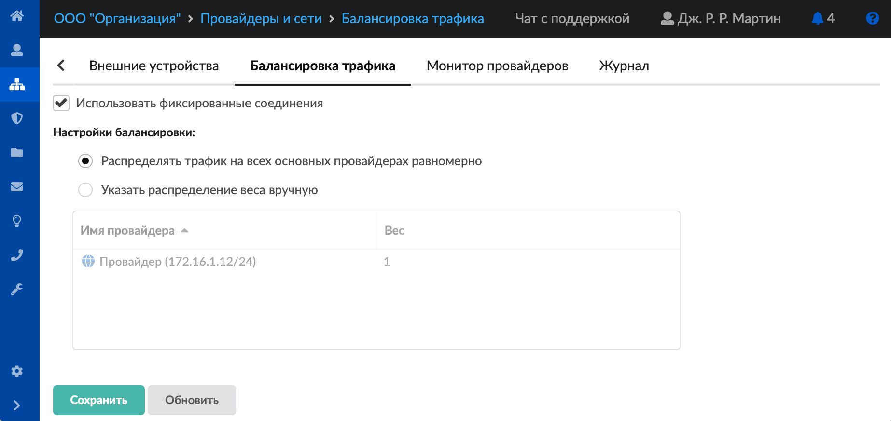

### Пример с равными весами

Если включена опция «Использовать фиксированные соединения» и у двух провайдеров вес 1: соединения от одного источника будут направлены через первого провайдера, а от другого источника — через второго, и так далее, поочерёдно.

Если опция выключена, то соединённые будут чередоваться для каждого соединения без учёта источника.

### Пример с разными весами

Если задать провайдерам веса 2 и 1 и включена опция «Использовать фиксированные соединения»:

- соединения от первых двух уникальных источников будут закреплены за провайдером с весом 2;
- третий источник будет использовать второго провайдера;
- затем схема повторяется (два — один — два — один и т.д.).

Такой подход позволяет учитывать различия в производительности провайдеров.

Например:

Если один из провайдеров обладает большей пропускной способностью, ему можно назначить больший вес (например, одному 3, а другому — 1).

В результате 75% трафика от разных источников будет направлено через более производительного провайдера, что позволит эффективнее использовать его ресурсы.

### Исключения из балансировки

Если для трафика источника задан условный маршрут, он будет иметь приоритет и не будет подчиняться общим правилам балансировки.

> ⚠ **Важно!** Весь трафик, исходящий с прокси-сервера, направляется через провайдера по умолчанию, если только не заданы явные маршруты, указывающие на использование другого провайдера.

Чтобы внесённые изменения вступили в силу, нажмите кнопку **«Сохранить»**.

## Монитор провайдеров

На данной вкладке отображаются сведения о мониторе провайдеров. Это служба, которая следит за состоянием провайдеров и их переключением. Выводятся следующие данные:

- статус службы (**запущен**, **остановлен**, **выключен**, **не настроен**);
- кнопка **«Включить»** / **«Выключить»** — позволяет запустить или остановить службу;
- журнал последних событий.

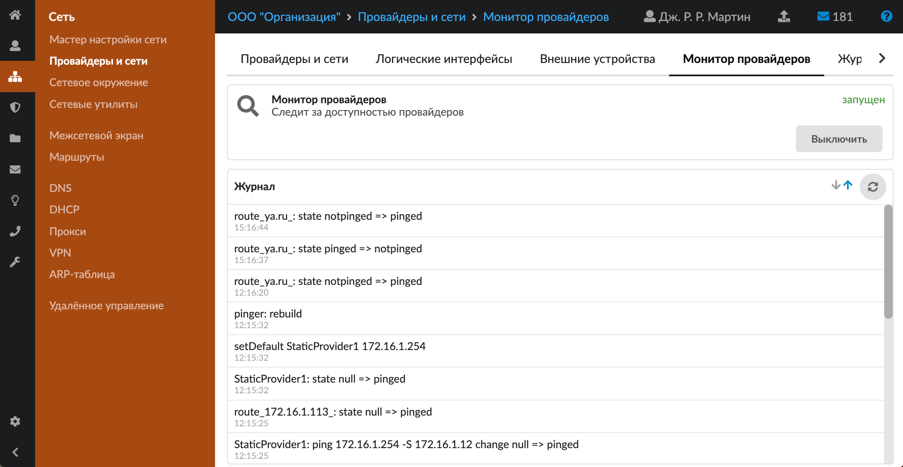

## Журнал

На данной вкладке отображается сводка всех системных сообщений модуля с указанием даты и времени.

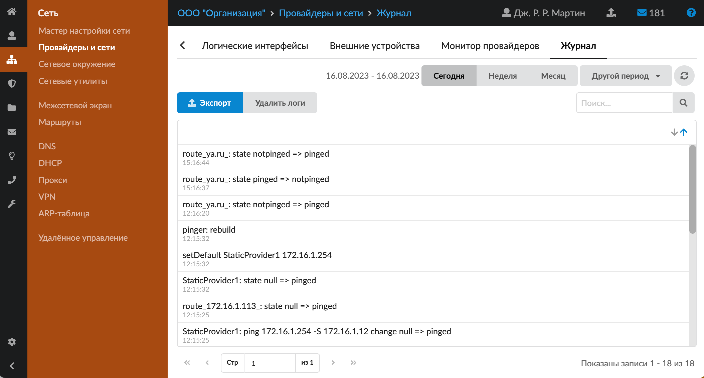

[Журнал](https://doc.a-real.ru/index.php?article=196#summary) является стандартным элементом веб-интерфейса ИКС.

---

**Источник:** [Документация ИКС — Провайдеры и сети](https://doc.a-real.ru/index.php?article=55)
