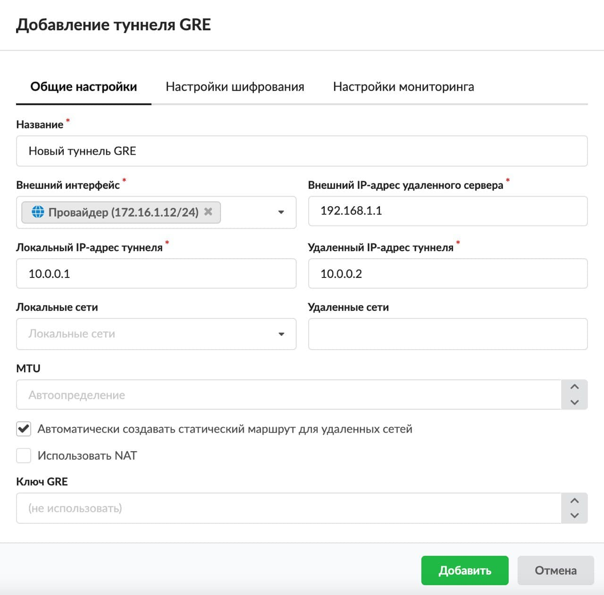
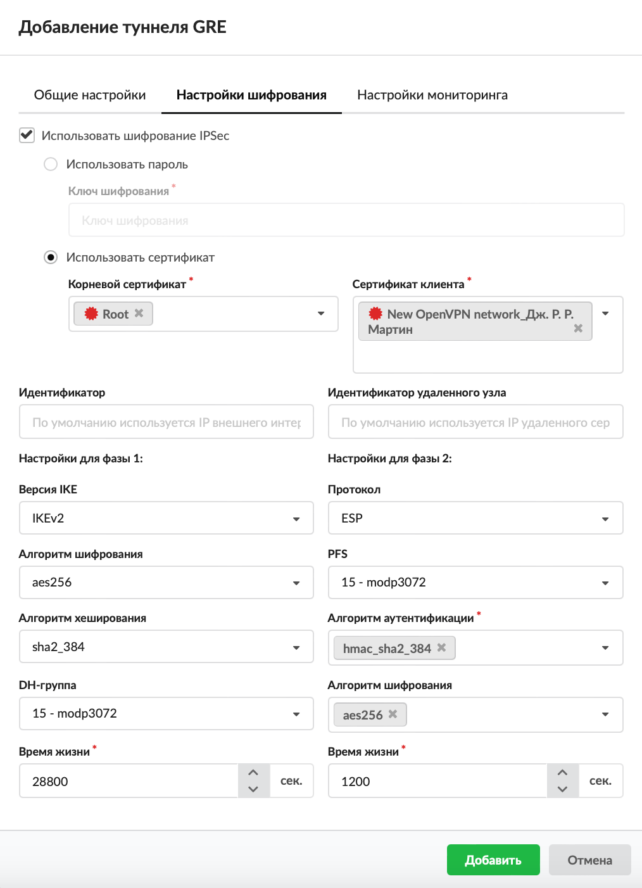
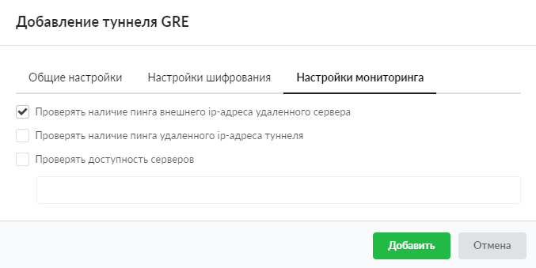
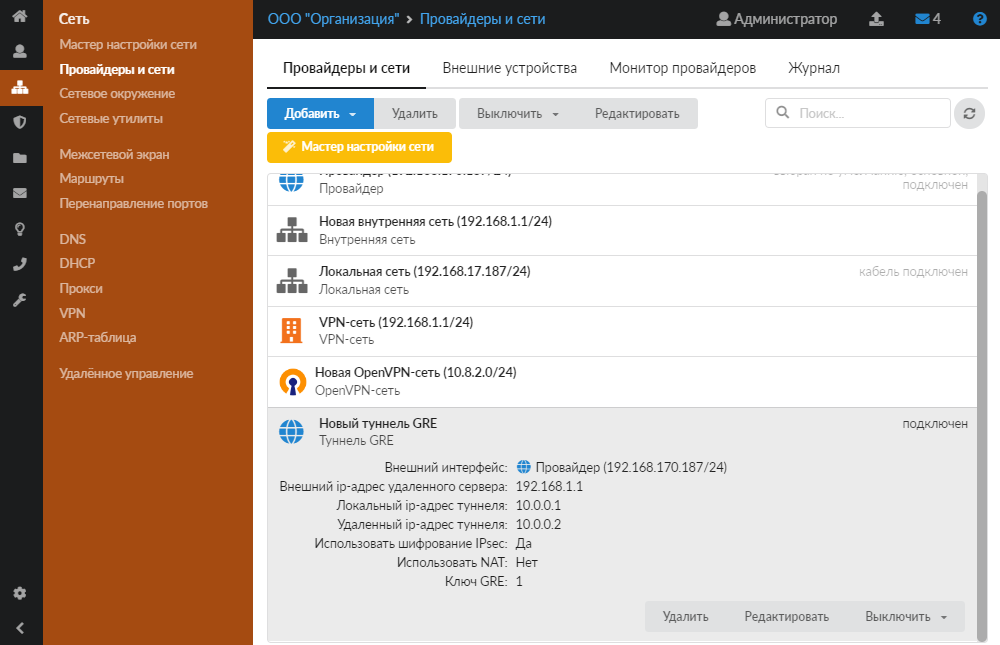

# Туннель GRE

Если в вашей компании имеется удалённый филиал, в котором также установлен ИКС, то для объединения локальных сетей безопасным способом наиболее подходящим решением будет настройка шифрованного [туннеля](/index.php?article=24#tunnel) между ними.

---

Для обеспечения безопасности передачи данных в туннеле используется [IPSec](/index.php?article=24#ipsec). Защита передачи данных по туннелям позволяет избежать утечки информации и получения ложных данных.

В ИКС можно настроить подключение между серверами статическим туннелем по [IPIP](/index.php?article=24#ipip)- или [GRE](/index.php?article=24#gre)-протоколу.

Обычно выбор типа туннеля зависит от промежуточных провайдеров, которые по каким-либо причинам могут блокировать трафик GRE или IPIP, что приводит к невозможности использования какого-то одного типа туннеля. Принципиальной разницы между данными типами туннелей нет.

Добавить туннель GRE можно в меню **Сеть &gt; Провайдеры и сети**. Для этого выполните следующие действия:

1. Нажмите кнопку **«Добавить»** и выберите **«Туннели &gt; Туннель GRE»**.

2. На вкладке **«Общие настройки»** введите **название** туннеля.

3. Выберите **внешний интерфейс**.

4. Введите в соответствующих полях следующие **адреса**: внешний IP-адрес удалённого сервера, локальный IP-адрес туннеля, удалённый IP-адрес туннеля.

5. На вкладке также можно задать **локальные сети**, **удалённые сети** и [MTU](/index.php?article=24#mtu).

6. Если требуется, установите **флаги**:

- «Автоматически создавать статический маршрут для удалённых сетей»;
- «Использовать [NAT](/index.php?article=24#nat)».

7. При необходимости задайте **ключ GRE**. По умолчанию он не используется.

8. На вкладке **«Настройки шифрования»** можно выбрать шифрование IPSec и установить его параметры.

> ⚠ Внимание! Данную процедуру необходимо произвести на обоих концах туннеля, в противном случае передача данных работать не будет.

> ⚠ Внимание! При использовании IPSec-шифрования в туннелях IPIP и GRE трафик будет проходить через интерфейс `enc0`. Статистика на данном интерфейсе не собирается!

9. На вкладке **«Настройки мониторинга»** можно установить **флаги**:

- «Проверять наличие пинга внешнего IP-адреса удалённого сервера» — проверка, отвечает ли на [ICMP](/index.php?article=24#icmp)-запросы внешний адрес удалённого сервера, который указан в общих настройках туннеля. Если пинг не будет проходить, в статусе туннеля отобразится соответствующее уведомление;
- «Проверять наличие пинга удалённого IP-адреса туннеля» — проверка доступности удалённого IP-адреса туннеля;
- «Проверять доступность серверов» — при установке флага укажите серверы, доступность которых будет проверяться.

По умолчанию все флаги сняты.

10. Нажмите **«Добавить»** — новый туннель появится в списке.

11. Аналогичные настройки необходимо произвести на другом конце туннеля.

> ⚠ Внимание! Для корректной работы туннеля необходимо, чтобы в [межсетевом экране](/index.php?article=27) ИКС был разрешён GRE-трафик, а также разрешены входящие соединения с IP-адреса удалённого сервера.

---

**Источник:** [Документация ИКС — Туннель GRE](https://doc.a-real.ru/index.php?article=220)
