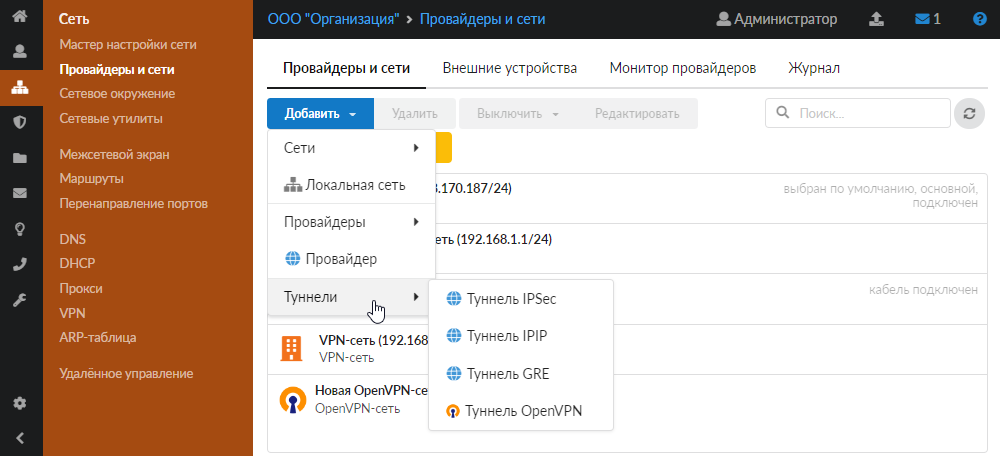
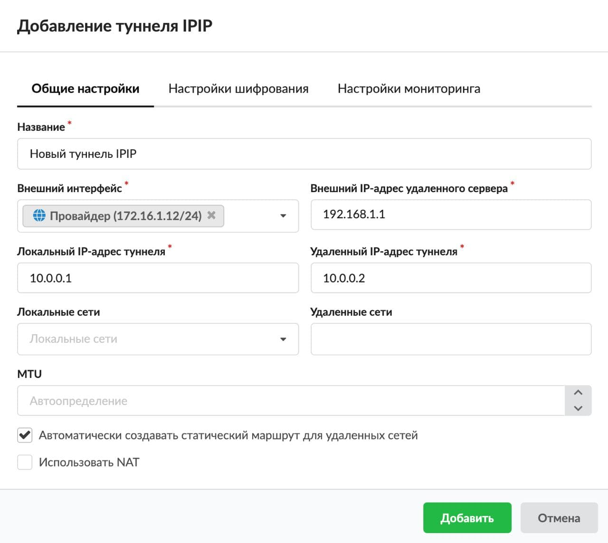
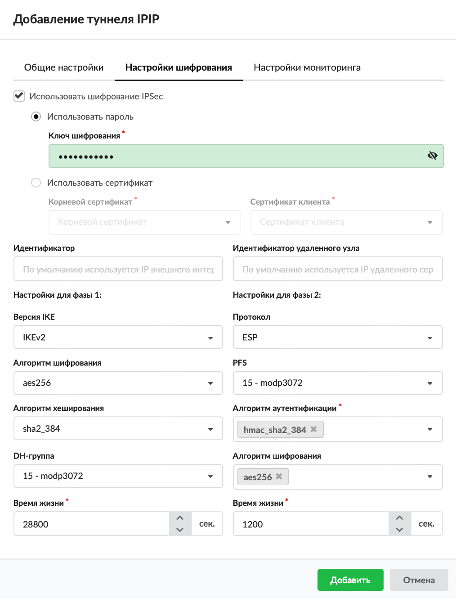
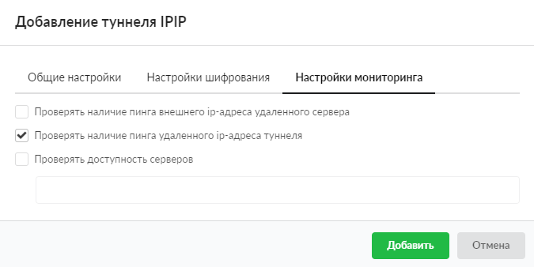
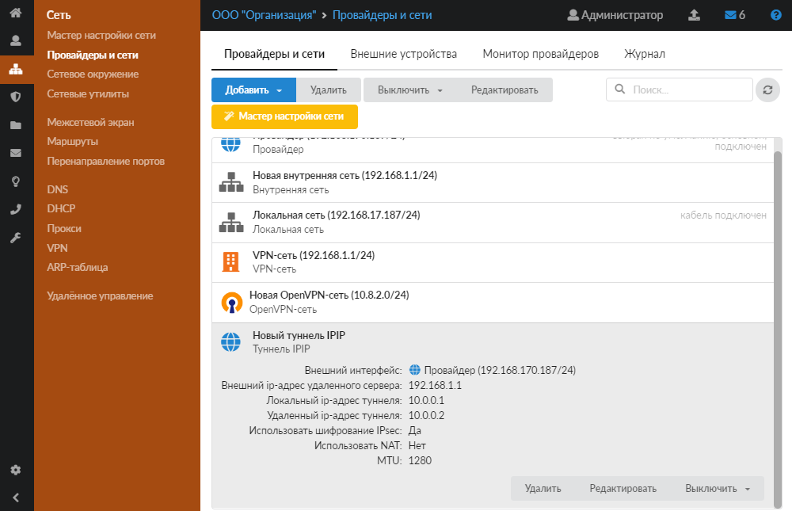

Если в вашей компании имеется удаленный филиал, в котором также установлен ИКС, то для объединения локальных сетей безопасным способом наиболее подходящим решением будет настройка шифрованного туннеля между ними.

Для обеспечения безопасности передачи данных в туннеле используется IPSec. Защита передачи данных по туннелям позволяет избежать утечки информации и получения ложных данных.

В ИКС можно настроить подключение между серверами статическим туннелем по IPIP- или GRE-протоколу.

Обычно выбор типа туннеля зависит от промежуточных провайдеров, которые по каким-либо причинам могут блокировать трафик GRE или IPIP, что приводит к невозможности использования какого-то одного типа туннеля. Принципиальной разницы между данными типами туннелей нет.

Добавить туннель IPIP можно в меню **Сеть > Провайдеры и сети**. Для этого выполните следующие действия:

1. Нажмите кнопку **«Добавить»** и выберите **«Туннели > Туннель IPIP»**.

   

2. На вкладке **«Общие настройки»** введите **название** туннеля.
3. Выберите **внешний интерфейс**.
4. Введите в соответствующих полях следующие **адреса**: внешний IP-адрес удаленного сервера, локальный IP-адрес туннеля, удаленный IP-адрес туннеля.

   

5. На вкладке также можно задать **локальные сети**, **удаленные сети** и **MTU**.
6. Если требуется, установите **флаги**:
   - «Автоматически создавать статический маршрут для удаленных сетей»;
   - «Использовать NAT».
7. На вкладке **«Настройки шифрования»** можно выбрать шифрование IPSec и установить его параметры.

   > ⚠ Внимание! Данную процедуру необходимо произвести на обоих концах туннеля, в противном случае передача данных работать не будет.
   > ⚠ Внимание! При использовании IPSec-шифрования в туннелях IPIP и GRE трафик будет проходить через интерфейс `enc0`. Статистика на данном интерфейсе не собирается!

   

8. На вкладке **«Настройки мониторинга»** можно установить **флаги**:
   - «Проверять наличие пинга внешнего IP-адреса удаленного сервера» — проверка, отвечает ли на ICMP-запросы внешний адрес удаленного сервера, который указан в общих настройках туннеля. Если пинг не будет проходить, в статусе туннеля отобразится соответствующее уведомление;
   - «Проверять наличие пинга удаленного IP-адреса туннеля» — проверка доступности удаленного IP-адреса туннеля;
   - «Проверять доступность серверов» — при установке флага укажите серверы, доступность которых будет проверяться.

   По умолчанию все флаги сняты.

   

9. Нажмите **«Добавить»** — новый туннель появится в списке.

   

10. Аналогичные настройки необходимо произвести на другом конце туннеля.

> ⚠ Внимание! Для корректной работы туннеля необходимо, чтобы в [межсетевом экране](../mezhsetevoy-ekran/mezhsetevoy-ekran-obzor-3.md) ИКС был разрешен GRE-трафик, а также разрешены входящие соединения с IP-адреса удаленного сервера.
