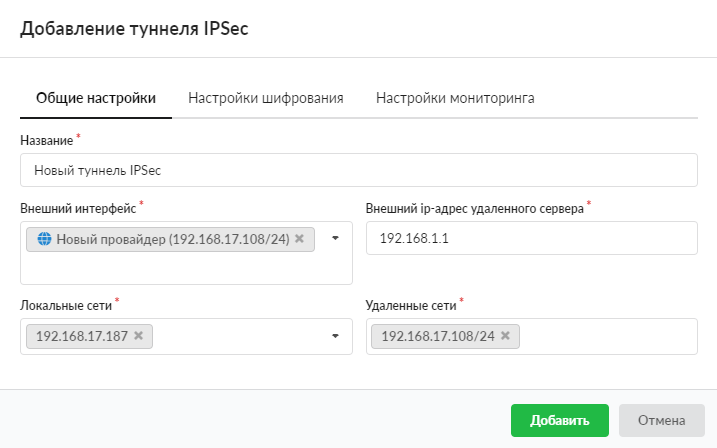
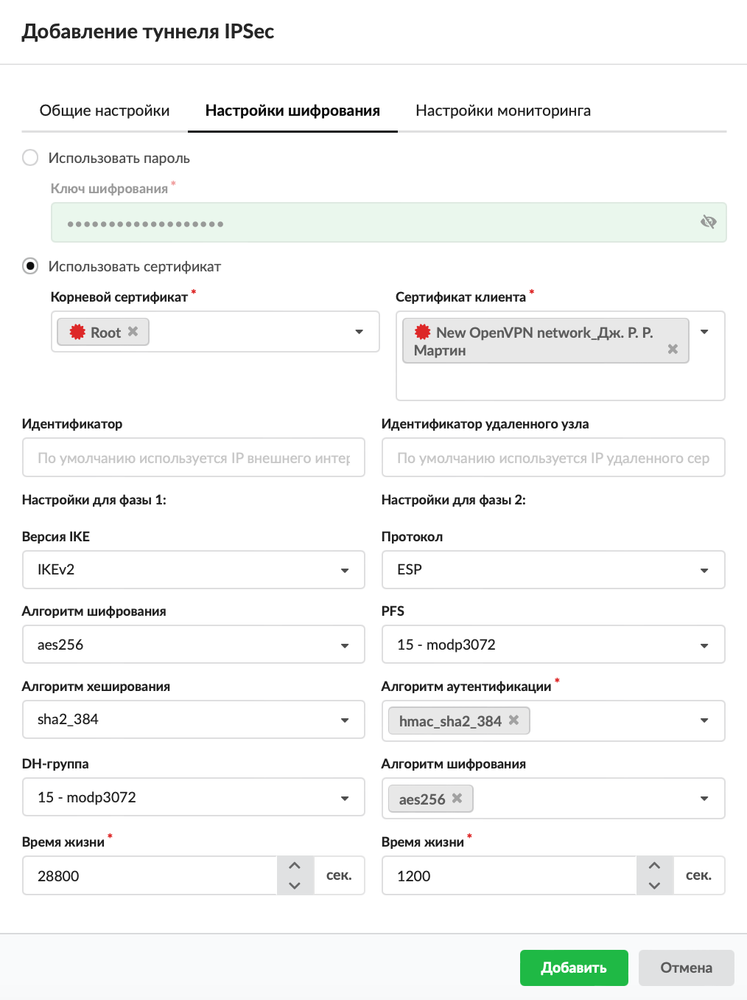
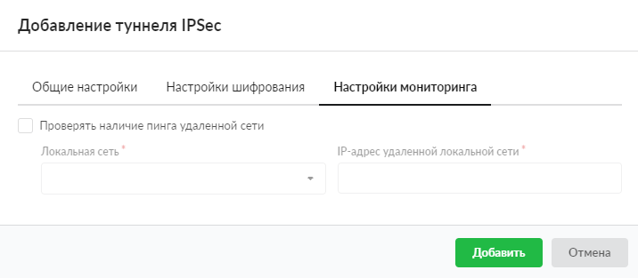

---

Если в вашей компании имеется удаленный филиал, в котором также установлен ИКС, то для объединения локальных сетей безопасным способом наиболее подходящим решением будет настройка шифрованного [туннеля](/index.php?article=24#tunnel) между ними.

Для обеспечения безопасности передачи данных в туннеле используется [IPSec](/index.php?article=24#ipsec). Защита передачи данных по туннелям позволяет избежать утечки информации и получения ложных данных.

В ИКС можно настроить подключение между серверами IPSec-туннелем, в котором IPSec работает в туннельном режиме. Особенностью данного туннеля является то, что он считается активным только до тех пор, пока между локальными и удаленными сетями туннеля происходит обмен трафиком. При отсутствии такого трафика в течение 8 часов туннель объявляется неактивным, с соответствующим статусом туннеля (время можно задать в [настройках шифрования](#tab2)).

Добавить туннель IPSec можно в меню **Сеть > Провайдеры и сети**. Для этого выполните следующие действия:

1. Нажмите кнопку **«Добавить»** и выберите **«Туннели > Туннель IPSec»**.

2. На вкладке **«Общие настройки»** введите **название** туннеля.
3. Выберите **внешний интерфейс**.
4. Введите в соответствующих полях следующие **адреса**: внешний IP-адрес удаленного сервера, локальные сети, удаленные сети.

5. На вкладке **«Настройки шифрования»** можно установить параметры шифрования IPSec, а также выбрать идентификатор (по умолчанию используется IP внешнего интерфейса) и идентификатор удаленного узла (по умолчанию используется IP удаленного сервера).

> ⚠ Внимание: Внимание! Данную процедуру необходимо произвести на обоих концах туннеля, в противном случае передача данных работать не будет.

6. На вкладке **«Настройки мониторинга»** можно установить флаг **«Проверять наличие пинга удаленной сети»**. Данный флаг позволяет задать пинг до IP-адреса в удаленной сети с указанием в качестве источника IP-адрес ИКС из локальной сети. Таким образом, если пинг будет проходить успешно, статус туннеля всегда будет «Подключен». При установке флага выберите локальную сеть и введите IP-адрес удаленной локальной сети.

7. Нажмите **«Добавить»** — новый туннель появится в списке.
8. Аналогичные настройки необходимо произвести на другом конце туннеля.

> ⚠ Внимание: Внимание! Для корректной работы туннеля необходимо, чтобы в [межсетевом экране](/index.php?article=27) ИКС был разрешен трафик от внешнего удаленного адреса, а также разрешен трафик от локальных  удаленных сетей, если это необходимо.

IPSec-туннель может иметь один из следующих **статусов**:

- не активен — через туннель за время его жизни не прошел трафик;
- подключен — туннель включен и работает;
- нет пинга до — мониторинг включен, но пинги не проходят.
