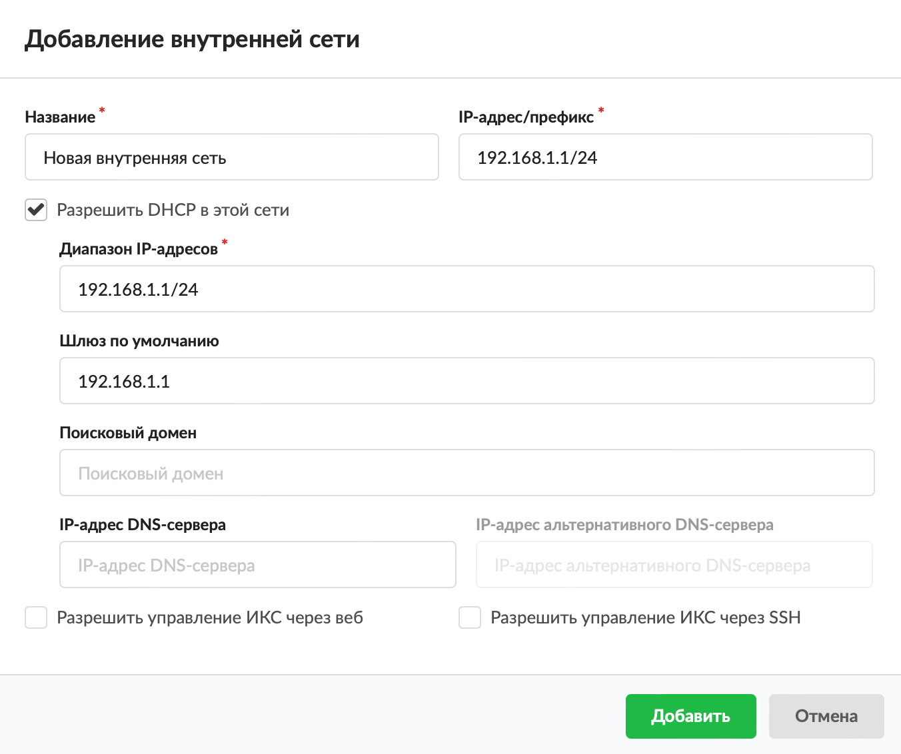
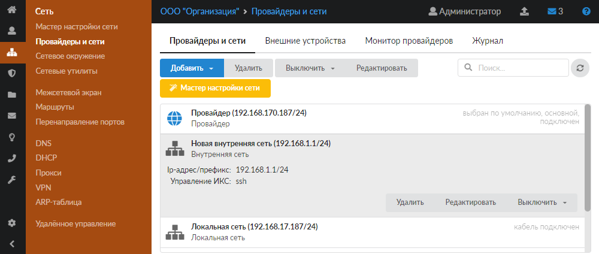
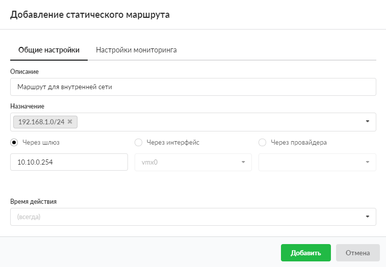

В ИКС предусмотрена возможность создать внутреннюю сеть организации.

---

В ИКС предусмотрена возможность создать [внутреннюю сеть](/index.php?article=24#internal) организации.

В данном примере локальная сеть, подключенная непосредственно к ИКС, имеет адресацию 10.10.0.0/24. В сети также находится маршрутизатор, к которому подключена сеть 192.168.1.0/24. Несмотря на то что в пользователях ИКС прописаны адреса из этой сети, по умолчанию межсетевой экран транслирует во внешнюю сеть только адреса локальных сетей (при помощи сервиса [NAT](/index.php?article=24#nat)). Чтобы явным образом указать ИКС, какие сети транслировать, используется внутренняя сеть.

Добавить внутреннюю сеть можно в меню **Сеть > Провайдеры и сети**. Для этого выполните следующие действия:

1. Нажмите кнопку **«Добавить»** и выберите **«Сети > Внутренняя сеть»**.

   

2. Введите **название** сети.

3. Укажите **диапазон адресов** в виде IP-адрес/префикс либо адрес:маска.

   

4. При установке флага **«Разрешить DHCP в этой сети»** данный интерфейс назначается раздающим адреса локальным компьютерам из задаваемого диапазона, по протоколу [DHCP](../dhcp-2.md).

   Укажите диапазон адресом сети с маской либо интервалом IP-адресов (например, 192.168.1.10-192.168.1.250).

5. При необходимости укажите IP-адрес **шлюза по умолчанию**.

6. Если требуется, укажите **поисковый домен**. Это DNS-зона, которая будет автоматически подставляться к запросам на имена первого уровня.

7. Вы можете ввести **IP-адрес DNS-сервера** и (или) **IP-адрес альтернативного DNS-сервера**. Они будут выданы подключенным к данной сети хостам по [DHCP](/index.php?article=24#dhcp).

8. Если требуется, установите **флаги**:

   - «Разрешить управление ИКС через веб» — позволяет подключаться к веб-интерфейсу ИКС из данной сети;
   - «Разрешить управление ИКС через [SSH](/index.php?article=24#ssh)» — позволяет подключаться по SSH из данной сети.

9. Нажмите **«Добавить»** — новая сеть появится в списке.

   

10. Чтобы ИКС пересылал ответные данные компьютерам из сети (в примере это сеть 192.168.1.0/24), создайте до нее [маршрут](/index.php?article=58) через шлюз (в примере это шлюз 10.10.0.254).

    
