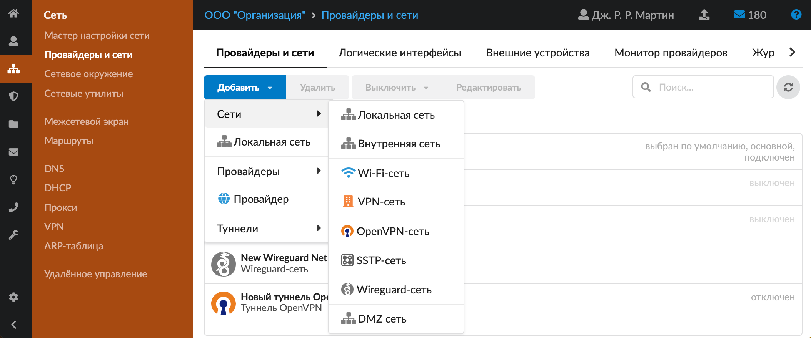
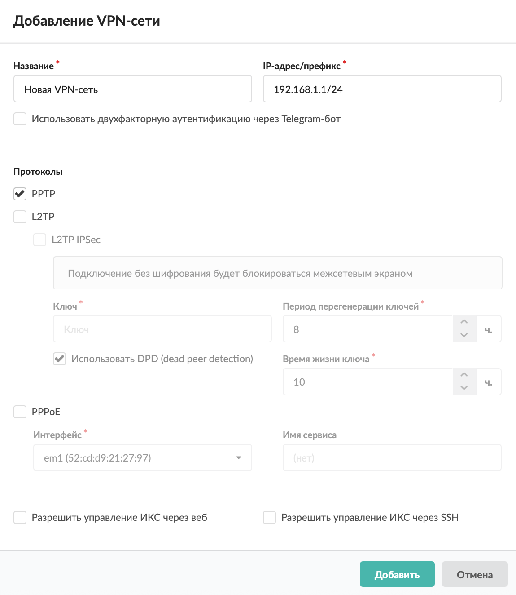
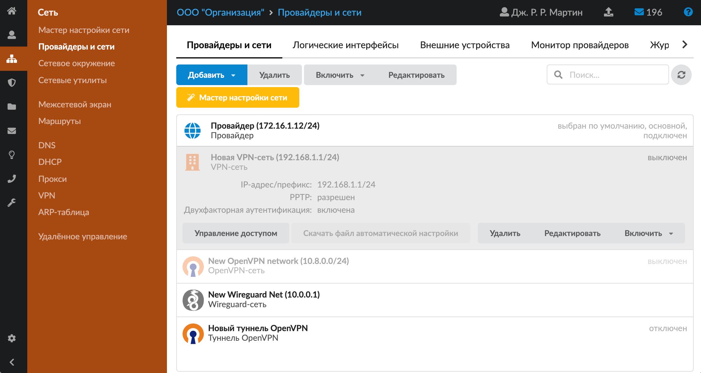

Обычно VPN используется для организации удаленного доступа к локальной сети.

---

Обычно [VPN](../../o-dokumentacii/slovar-terminov-3.md) используется для организации удаленного доступа к локальной сети. Например, в тех случаях, когда пользователю требуется получить доступ к внутренним ресурсам сети предприятия, пока он находится в командировке или отпуске.

Для того, чтобы начать работу с VPN, необходимо создать виртуальную подсеть, в которой будут появляться VPN-пользователи после подключения. Сделать это можно в меню **Сеть &gt; Провайдеры и сети**.

Выполните следующие действия:

1. Нажмите кнопку **«Добавить»** и выберите **«Сети &gt; VPN-сеть»**.

   

2. Введите **название** сети.

3. Укажите **диапазон адресов** в виде IP-адрес/префикс либо адрес:маска. Адреса из данного диапазона будут выдаваться пользователям, которые подключаются через VPN.

4. Для того чтобы **[использовать двухфакторную аутентификацию](../vpn/vpn-obzor-2.md)**, установите соответствующий флаг.

   

5. При необходимости выберите **протоколы**, установив соответствующие флаги:

   - [PPTP](../../o-dokumentacii/slovar-terminov-3.md);
   - [L2TP](../../o-dokumentacii/slovar-terminov-3.md);
   - [L2TP IPSec](../../o-dokumentacii/slovar-terminov-3.md) — потребуется ввести ключ и отметить, будет ли использоваться [DPD](../../o-dokumentacii/slovar-terminov-3.md). Если флаг **«Использовать DPD (dead peer detection)»** установлен, ИКС будет периодически опрашивать своих клиентов, подключены ли они. Мобильные устройства не могут ответить на данный запрос, и у них происходит разрыв соединения. Поэтому, если в VPN-сети предполагается использовать мобильные устройства, рекомендуется снять данный флаг. Введите **период перегенерации ключей** (по умолчанию 8 ч., минимальное значение 1 ч.) и **время жизни ключа** (не должно быть меньше периода перегенерации ключей, по умолчанию 10 ч., на 2 ч. больше периода перегенерации ключей, минимальное значение 3 ч.).
   - [PPPoE](../../o-dokumentacii/slovar-terminov-3.md) — для предоставления пользователям доступа в Интернет через данный протокол PPPoE укажите сетевой интерфейс, который подключен к сети с пользовательскими компьютерами. Если в сети находятся несколько PPPoE-серверов, можно идентифицировать сервер ИКС при помощи поля «Имя сервиса», задав в нем произвольное имя.

6. Если требуется, установите **флаги**:

   - «Разрешить управление ИКС через веб» — позволяет подключаться к веб-интерфейсу ИКС из данной сети;
   - «Разрешить управление ИКС через [SSH](../../o-dokumentacii/slovar-terminov-3.md)» — позволяет подключаться по SSH из данной сети.

7. Нажмите **«Добавить»** — новая сеть появится в списке.

8. Для более детальных настроек VPN-сети открой специальный [модуль](../vpn/vpn-obzor-2.md) в меню **Сеть &gt; VPN** либо нажми кнопку **«Настройки авторизации»**. По кнопке **«Скачать файл автоматической настройки»** можно скачать файл с расширением `.ps1`, который предназначен для запуска в PowerShell.

   

9. В модуле **«VPN»** укажите, какие пользователи могут подключаться к ИКС по VPN. С версии 12.0.0 подключение пользователей с использованием метода аутентификации CHAP не работает.
