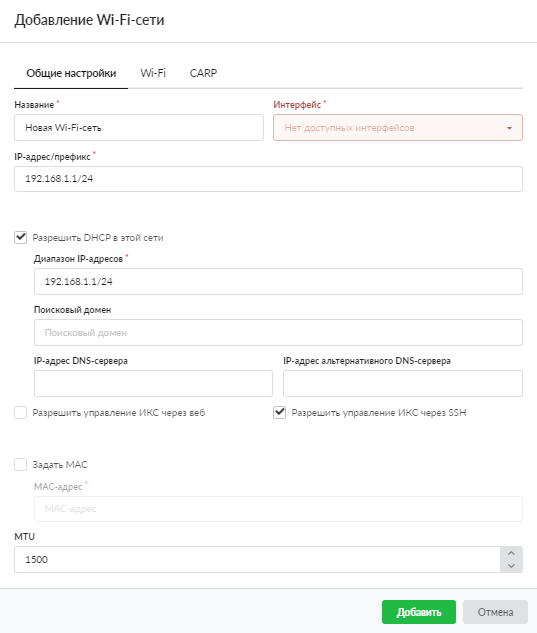
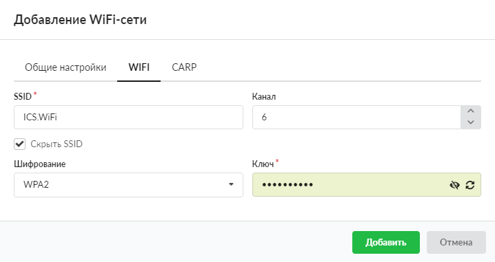
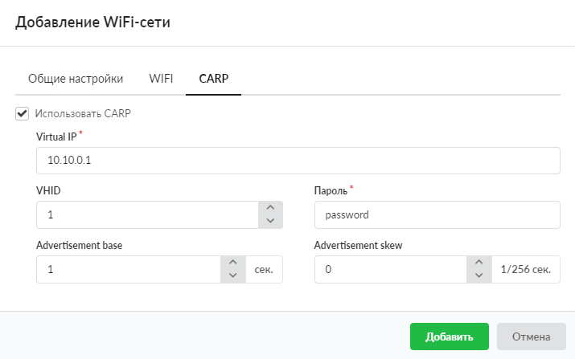

В ИКС можно использовать сетевую карту [Wi-Fi](/index.php?article=24#wi-fi) в режиме точки доступа.

Добавить Wi-Fi-сеть можно в меню **Сеть > Провайдеры и сети**. Для этого выполните следующие действия:

1. Нажмите кнопку **«Добавить»** и выберите **«Сети > Wi-Fi-сеть»**.

2. На вкладке **«Общие настройки»** введите **название** сети.
3. Выберите физический **интерфейс**, на который будет назначен [IP-адрес](/index.php?article=24#ip-address).
4. Укажите **диапазон адресов** в виде IP-адрес/префикс либо адрес:маска.

5. При установке флага **«Разрешить DHCP в этой сети»** данный интерфейс назначается раздающим адреса локальным компьютерам из задаваемого диапазона, по протоколу [DHCP](/index.php?article=61). Укажите диапазон адресом сети с маской либо интервалом IP-адресов (например, 192.168.1.10-192.168.1.250).
6. При необходимости введите **IP-адрес DNS-сервера** и (или) **IP-адрес альтернативного DNS-сервера**. Они будут выданы подключенным к данной сети хостам по [DHCP](/index.php?article=24#dhcp).
7. Если требуется, установите **флаги**:

- «Разрешить управление ИКС через веб»;
- «Разрешить управление ИКС через [SSH](/index.php?article=24#ssh)».
8. При необходимости задайте [**MAC-адрес**](/index.php?article=24#mac-address) интерфейса и [**MTU**](/index.php?article=24#mtu).
9. На вкладке **«Wi-Fi»** введите имя [SSID](/index.php?article=24#ssid), при необходимости установите флаг **«Скрыть SSID»**.
10. Укажите **канал** трансляции пакетов (от 1 до 12).
11. Если требуется, выберите тип **шифрования** и введите **ключ**. По умолчанию установлено значение «Открытое».

12. При необходимости [настройте CARP](/index.php?article=384) на одноименной вкладке.

13. Нажмите **«Добавить»** — новая сеть появится в списке.
