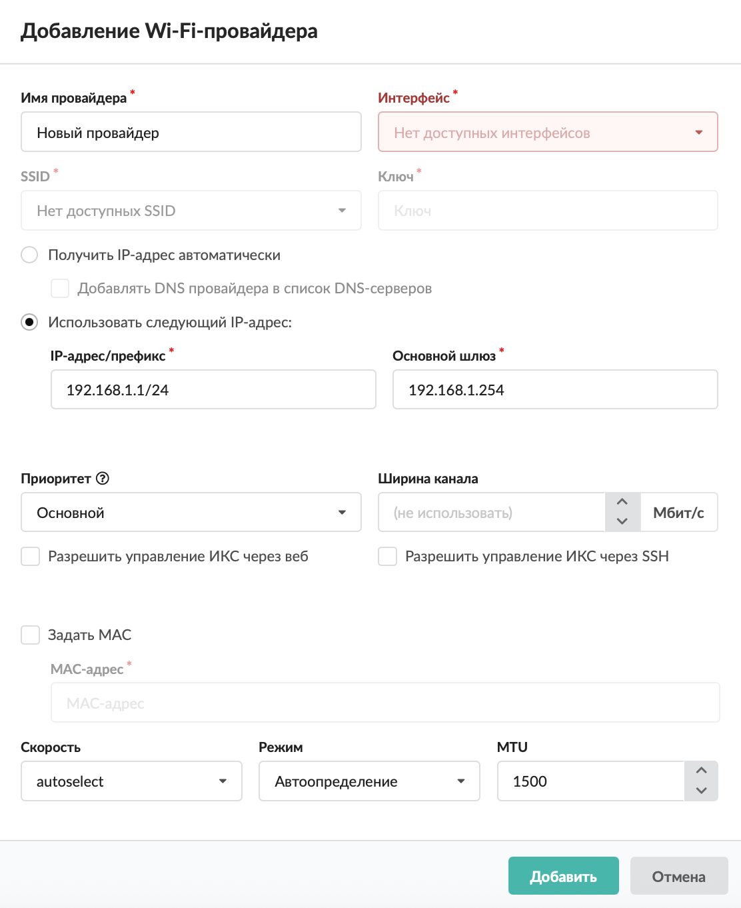

Если в ИКС установлен беспроводной адаптер, то можно подключиться к роутеру провайдера, который оснащён Wi-Fi-антенной, не используя прокладку кабеля.

---

Добавить провайдер Wi-Fi можно в меню **Сеть &gt; Провайдеры и сети**. Для этого выполните следующие действия:

1. Нажмите кнопку **«Добавить»** и выберите **«Провайдеры &gt; Wi-Fi-провайдер»**.

2. Введите **название** провайдера.

3. Выберите **интерфейс**, на который будет назначен данный провайдер.

4. Введите **имя** [SSID](/index.php?article=24#ssid) и **ключ**.

5. Установите **переключатель**:

- «Использовать следующий [IP-адрес](/index.php?article=24#ip-address)» — укажите **диапазон адресов** в виде IP-адрес/префикс либо адрес:маска. Адреса из данного диапазона будут выдаваться пользователям, которые подключаются через провайдер. Также требуется ввести адрес основного шлюза;
- «Получить IP-адрес автоматически» — если провайдер выдает адреса по протоколу [DHCP](/index.php?article=24#dhcp). При необходимости можно установить флаг **«Добавлять DNS провайдера в список DNS-серверов»**.

6. Выберите **приоритет**:

- основной — трафик от всех пользователей направляется через данного провайдера. Если у вас два или более интернет-каналов, можно назначить обоим провайдерам приоритет «Основной». Трафик, не проходящий через прокси-сервер, будет направляться через каждый из них посредством динамической балансировки, что позволит значительно разгрузить каналы и объединить их для повышения пропускной способности. Трафик [прокси-сервера](/index.php?article=24#proxy) будет направлен через канал «по умолчанию»;
- резервный — трафик через провайдера не направляется до тех пор, пока работает основной. В случае отключения основного провайдера резервный занимает его место;
- дополнительный — трафик через провайдера не направляется, за исключением созданных в веб-интерфейсе статических маршрутов.

7. Установите **ширину канала** (в Мбит/с).

8. Если требуется, установите **флаги**:

- «Разрешить управление ИКС через веб» — будет разрешаться трафик от любого источника, идущий на IP-адрес провайдера на порт веб-интерфейса через сетевой интерфейс, на котором настроен провайдер;
- «Разрешить управление ИКС через [SSH](/index.php?article=24#ssh)» — будет разрешаться трафик от любого источника, идущий на IP-адрес провайдера на порт 22 через сетевой интерфейс, на котором настроен провайдер.

9. На вкладке можно задать [**MAC-адрес**](/index.php?article=24#mac-address) интерфейса, а также **скорость**, **режим работы** и [**MTU**](/index.php?article=24#mtu).

10. Нажмите **«Добавить»** — новый провайдер появится в списке.

11. Для более детальных настроек провайдера откройте его [индивидуальный модуль](/index.php?article=201#individual).
