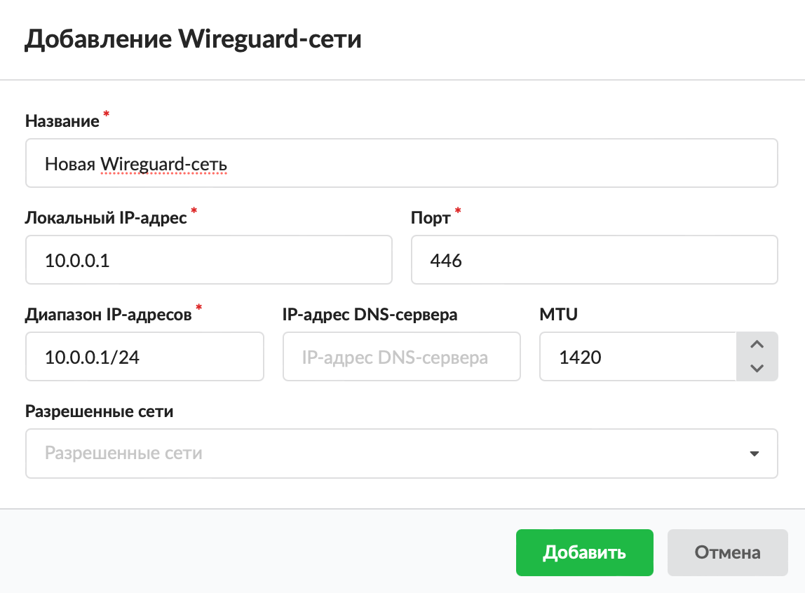
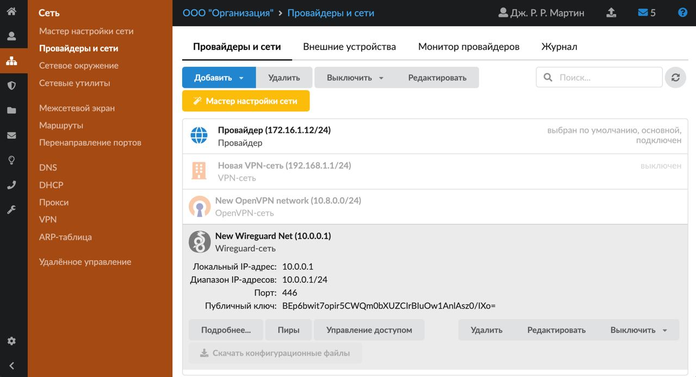
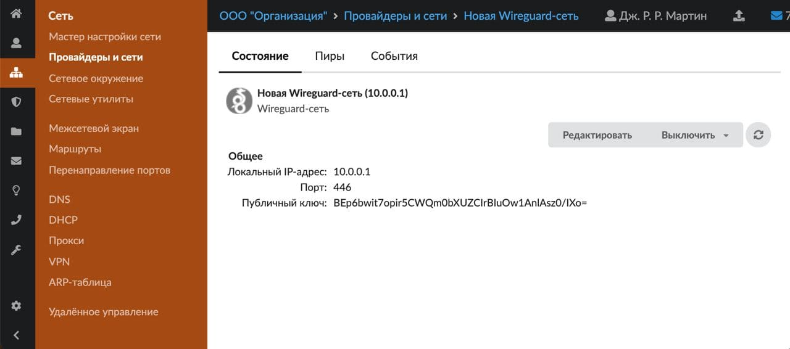
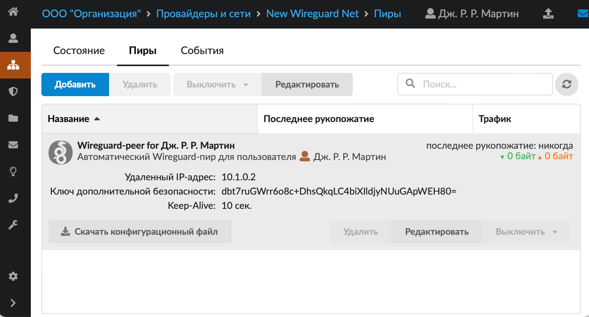
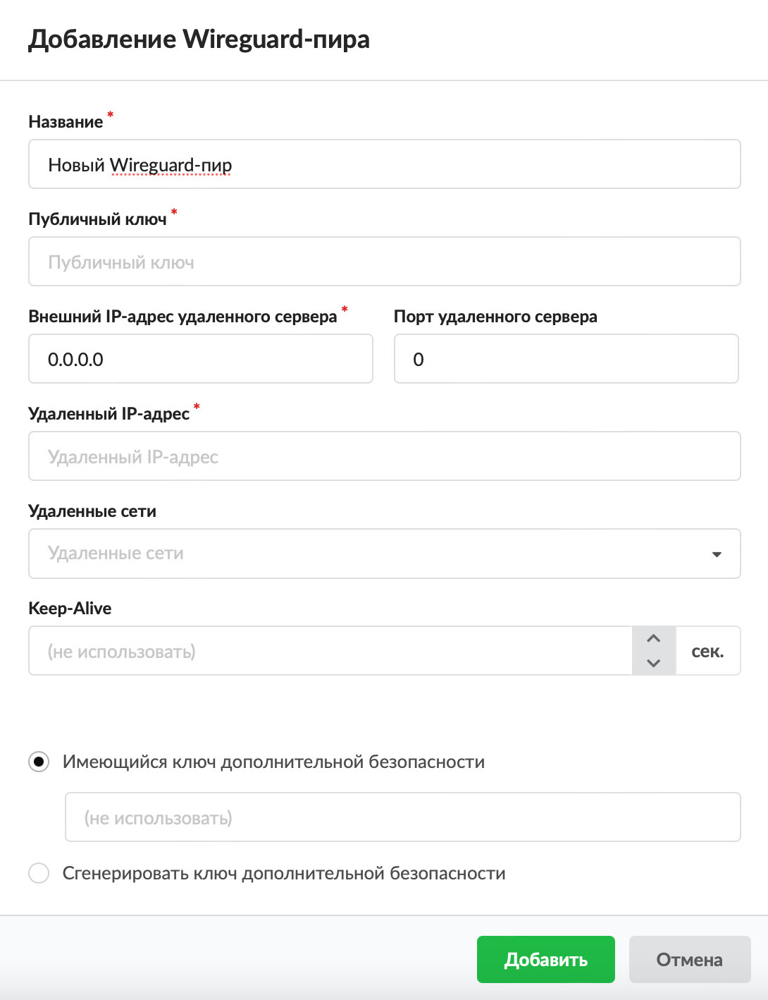
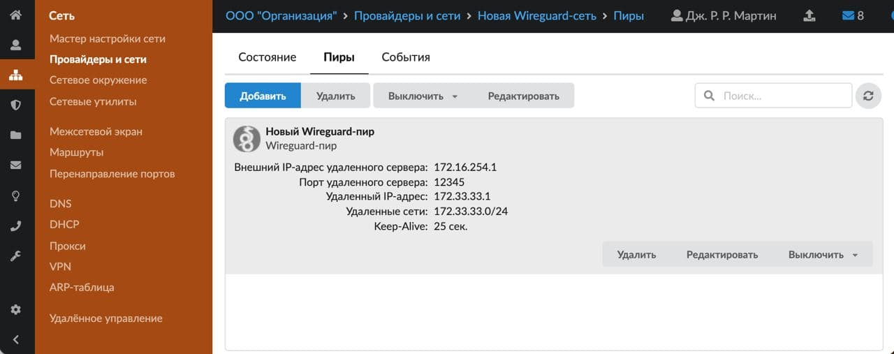
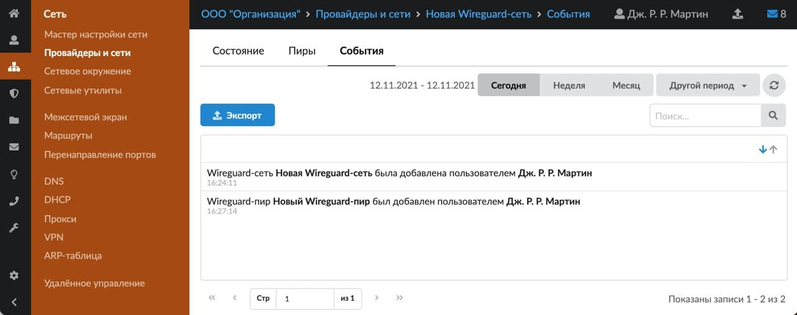
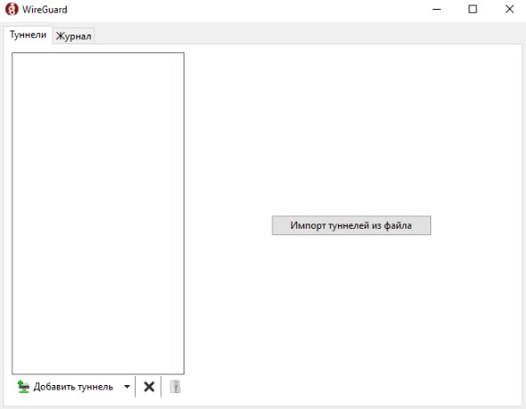
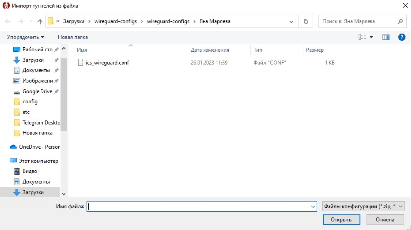
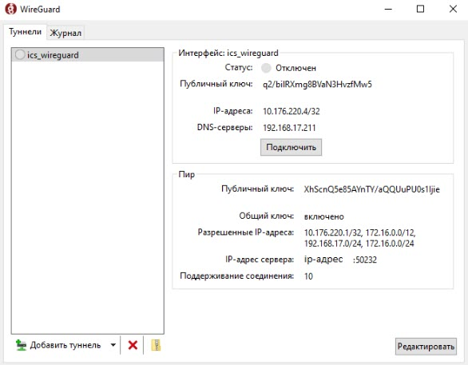

Добавить Wireguard-сеть можно в меню **Сеть > Провайдеры и сети**.

---

1. Нажмите кнопку **«Добавить»** и выберите **«Сети > Wireguard-сеть»**.

2. Введите **название** сети.

3. Укажите **локальный IP-адрес** и **порт**.

4. Укажите **диапазон IP-адресов**. Это диапазон, из которого пользовательским пирам будет динамически выдаваться IP-адрес. Диапазон можно прописать через «-» или через «/». Если диапазон прописан через «-» (10.0.0.1—10.0.0.5), то для пользователей будут свободны для использования все адреса в диапазоне, кроме адреса самой Wireguard-сети, если он будет занят. Если диапазон прописан через «/», то первый (адрес сети) и последний (широковещательный адрес) адреса будут заняты и пользователям выдаваться не будут.

5. Укажите **IP-адрес DNS-сервера**.

6. Укажите MTU.

7. Выберите **разрешенные сети**. В данном поле указывается список сетей на ИКС, до которых будет разрешен доступ пользователям.

8. Нажмите **«Добавить»** — новая сеть появится в списке.

При нажатии на Wireguard-сеть отображаются различные **кнопки управления сетью**: «Подробнее...», «Пиры», «Управление доступом» (переход на вкладку «Пользователи» модуля «VPN»), а также стандартные кнопки «Удалить», «Редактировать», «Выключить».

По кнопке **«Скачать конфигурационные файлы»** будет скачан файл, в котором есть все необходимые настройки для Wireguard-клиента (например, на Windows Wireguard-клиенту достаточно указать путь до конфигурационного файла, выгруженного с ИКС). Данная кнопка активна, только если в этой сети у какого-нибудь пользователя активен Wireguard-доступ.

В архиве с конфигурационными файлами также есть QR-код для удобства работы пользователей на смартфонах.

Wireguard работает как через резервного провайдера, так и через провайдера по умолчанию.

## Индивидуальный модуль Wireguard-сети

Для перехода в индивидуальный модуль Wireguard-сети нажмите на нее, а затем — на кнопку **«Подробнее...»**.

В данном модуле можно посмотреть состояние сети, пиры и события модуля.

**Состояние**

На данной вкладке отображается состояние Wireguard-сети и основная информация о ней (в том числе публичный ключ, который потребуется для настройки пиров на других устройствах), а также кнопки управления сетью: редактировать, выключить (включить), обновить.

**Пиры**

На данной вкладке отображается список Wireguard-пиров. Его можно отсортировать по следующим параметрам:

- название (по возрастанию и убыванию);
- последнее рукопожатие (по возрастанию и убыванию);
- объем трафика (по возрастанию входящий, по убыванию входящий, по возрастанию исходящий, по убыванию исходящий).

Для добавления Wireguard-пира выполните следующие действия:

1. Нажмите кнопку **«Добавить»**.

2. Укажите **название** пира.

3. Введите **публичный ключ** удаленного устройства (44 символа, включая обязательное «=» в конце).

4. Укажите **внешний IP-адрес** и **порт удаленного сервера**, а также **удаленный IP-адрес** и **удаленные сети**.

5. При необходимости установите значение **Keep-Alive** (в секундах). По умолчанию Keep-Alive не используется.

6. Для пользовательских сетей доступен выбор разрешенных сетей. В список разрешенных сетей пира попадают сети из одноименного поля Wireguard-сети, его можно редактировать для каждого пользователя индивидуально.

7. Установите переключатель выбора **ключа дополнительной безопасности**, который нужен для усиления защиты:

- Имеющийся ключ дополнительной безопасности — введите ключ в поле ниже. Если поле пустое, ключ не используется.
- Сгенерировать ключ дополнительной безопасности.

8. Нажмите **«Добавить»** — новый пир появится в списке.

При выборе пира отобразятся кнопки управления: удалить, редактировать, выключить.

Для подключения пользователя необходимо выполнить ряд действий.

**События**

На данной вкладке отображается сводка всех системных сообщений модуля с указанием даты и времени.

По аналогии с журналом данная вкладка является стандартным элементом веб-интерфейса ИКС.

## Подключение клиента Wireguard

Для подключения пользователя выполните следующие действия:

1. В меню **«Сеть > VPN > Пользователи»** отметьте флагами пользователей, которым будет разрешено подключаться по Wireguard.

2. Перейдите на вкладку **«Сеть > Провайдеры и Сети > Wireguard-сеть > Пиры»**.

3. Выберите требуемый **пир**.

4. Скачайте **конфигурационный файл** и распакуйте архив.

5. Пользователь должен установить на своем компьютере [утилиту Wireguard](https://www.wireguard.com/install/) и запустить ее.

6. Выберите **Импорт туннелей** из файла и добавьте конфигурационный файл.

7. Далее можно подключаться.

[Видео](https://vk.com/video_ext.php?oid=-18503994&oid=-18503994&id=456239332&hd=2)
