Модуль «Сетевые утилиты» расположен в меню **Сеть > Сетевые утилиты**.

---

Модуль **«Сетевые утилиты»** расположен в меню **Сеть > Сетевые утилиты**.

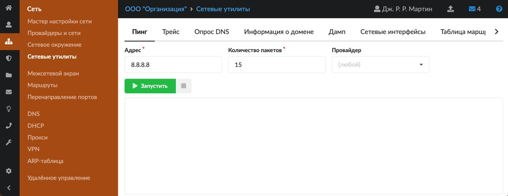

В состав ИКС входят несколько сетевых утилит, которые помогают выполнять диагностику сети:

- Пинг
- Трейс
- Опрос DNS
- Информация о домене
- Дамп
- Сетевые интерфейсы
- Таблица маршрутизации
- Тест скорости канала
- Сканирование сети
- Прокси access.log

Запуск работы утилиты производится кнопкой **«Запустить»**, остановка — кнопкой .

### Пинг

Утилита пинг ([ping](../o-dokumentacii/slovar-terminov-3.md)) отправляет [ICMP](../o-dokumentacii/slovar-terminov-3.md)-запросы указанному узлу сети и фиксирует поступающие ответы. Время между отправкой запроса и получением ответа позволяет определять двусторонние задержки по маршруту и средний уровень потери пакетов, то есть определять стабильность и качество связи, а также косвенно определять загруженность на каналах передачи данных и промежуточных устройствах.

Кроме того, пингом называют время, затраченное на передачу пакета информации в компьютерных сетях от одного хоста до другого и обратно. Это время также называется лагом или задержкой и измеряется в миллисекундах. Задержка зависит от загруженности и количества узлов в пути между хостами.

Для запуска утилиты введите доменное имя или [IP-адрес](../o-dokumentacii/slovar-terminov-3.md) и укажите количество пакетов.

Если требуется, предварительно выберите провайдера. При этом, если в поле «Провайдер» установлено значение «любой» (по умолчанию), утилита пойдет по текущей таблице маршрутизации.

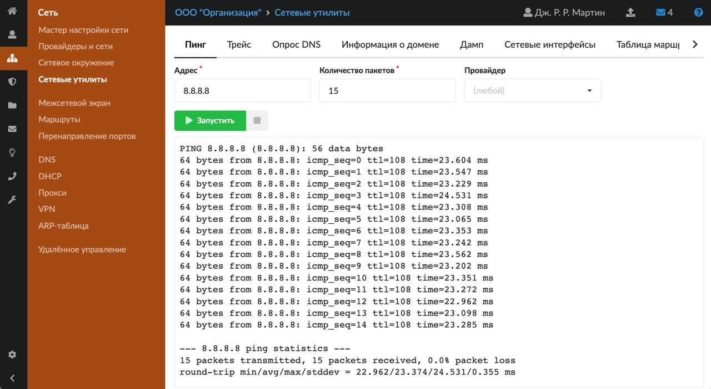

### Трейс

Утилита трейс (traceroute) предназначена для вывода маршрута прохождения запроса до выбранного хоста. Она выполняет отправку данных указанному узлу сети, при этом отображая сведения о всех промежуточных маршрутизаторах, через которые прошли данные на пути к нему.

Данная утилита позволяет определить проблемы с маршрутизацией трафика, а также в случае проблем при доставке данных до какого-либо узла — определить, на каком именно участке сети возникли неполадки.

> ⚠️ **Внимание!** Программа работает только в направлении от источника пакетов и является весьма грубым инструментом для выявления неполадок в сети.

Из-за особенностей работы протоколов маршрутизации в сети Интернет обратные маршруты часто не совпадают с прямыми, причем это справедливо для всех промежуточных узлов в пути. Поэтому ICMP-ответ от каждого промежуточного узла может идти своим собственным маршрутом, затеряться или прийти с большой задержкой, хотя в реальности с пакетами, которые адресованы конечному узлу, этого не происходит. Кроме того, на промежуточных маршрутизаторах часто стоит ограничение числа ответов ICMP в единицу времени, что приводит к появлению ложных потерь.

Для запуска утилиты введите адрес нужного хоста.

Если требуется, предварительно выберите провайдера. При этом, если в поле «Провайдер» установлено значение «любой» (по умолчанию), утилита пойдет по текущей таблице маршрутизации.

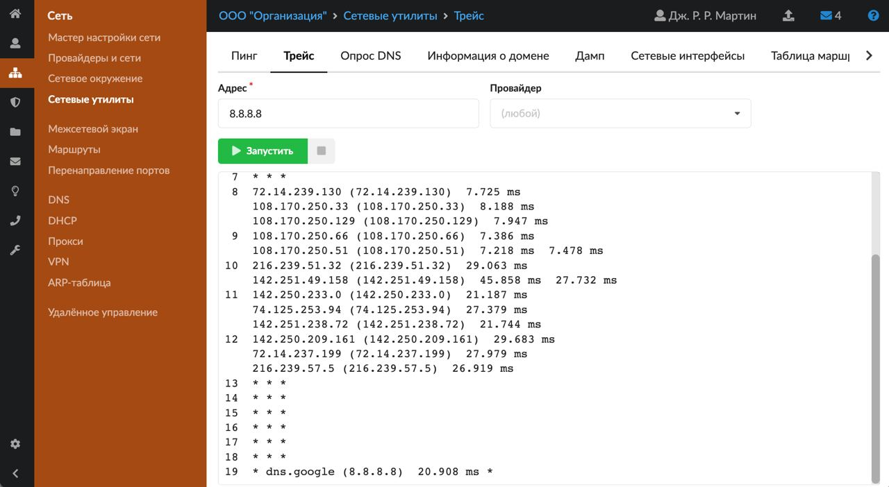

### Опрос DNS

Утилита «Опрос DNS» (dig) позволяет посылать различные запросы к [DNS](../o-dokumentacii/slovar-terminov-3.md)-серверам и определять ошибки в их конфигурации.

Для запуска утилиты введите домен и выберите [тип записи](dns/zapisi-dnszony-4.md). Также можно указать конкретный DNS-сервер для опроса.

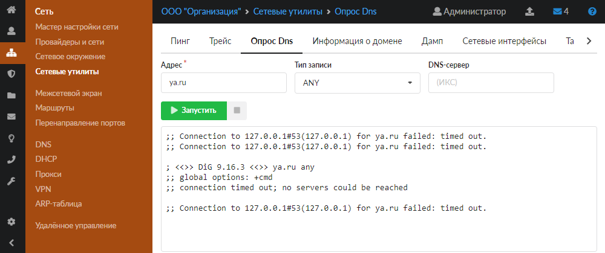

### Информация о домене

Утилита «Информация о домене» (whois) позволяет получить информацию о владельце домена или диапазона IP-адресов, а также сопутствующую информацию (дата регистрации, контактные данные, тип домена, регистратор и т. д.) из базы данных WHOIS.

Для запуска утилиты введите домен или диапазон IP-адресов.

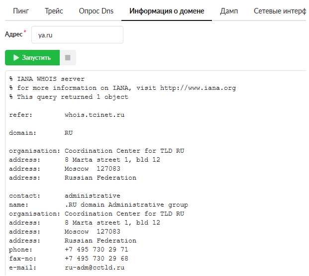

### Дамп

Утилита дамп (tcpdump) отображает заголовки пакетов, проходящих через выбранный сетевой интерфейс. Позволяет диагностировать проблемы, связанные с настройкой [межсетевого экрана](mezhsetevoy-ekran/mezhsetevoy-ekran-obzor-3.md), маршрутизацией и работой сетевых сервисов.

Для запуска утилиты выберите сетевой интерфейс, на котором будет выполняться сбор данных.

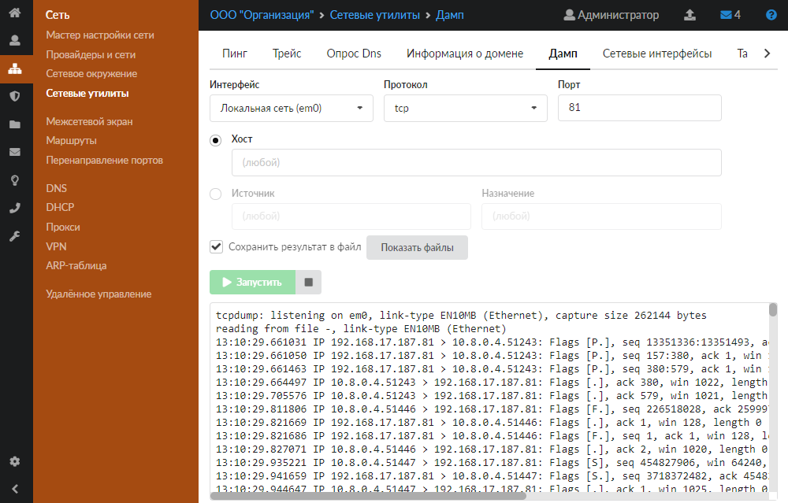

Для фильтрации сообщений можно указать следующие данные: протокол, порт, направление сетевого трафика для указываемого IP-адреса (хост либо источники и назначение).

Также при использовании утилиты можно установить флаг **«Сохранить результат в файл»** и просмотреть сохраненные файлы dump. Для этого нажмите на кнопку **«Показать файлы»**. Откроется диалоговое окно, в котором есть возможность скачать либо удалить файлы dump с расширением *.pcap.

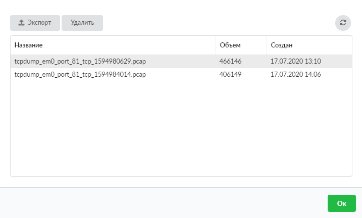

Для открытия данных файлов используйте специальную программу (например, Wireshark).

Удаление dump-файлов можно организовать по времени или по объему в [модуле](../obsluzhivanie/sistema-2.md) **«Система»**.

> ⚠️ **Внимание!** Если запустить сбор дампа в файл и оставить вкладку открытой на долгое время, то файл с дампом может занять все свободное место на жестком диске.

### Сетевые интерфейсы

Утилита «Сетевые интерфейсы» позволяет получить сведения о состоянии всех интерфейсов ИКС. Она выводит результат команды ifconfig и таким образом позволяет узнать, какие IP-адреса назначены каждому интерфейсу, какие виртуальные интерфейсы созданы, а также проверить наличие сигнала в подключенном кабеле.

Для запуска утилиты не требуется вводить никакие параметры.

### Таблица маршрутизации

Данная утилита выводит текущую таблицу маршрутизации ИКС. С ее помощью можно увидеть все маршруты, созданные в системе.

Для запуска утилиты не требуется вводить никакие параметры.

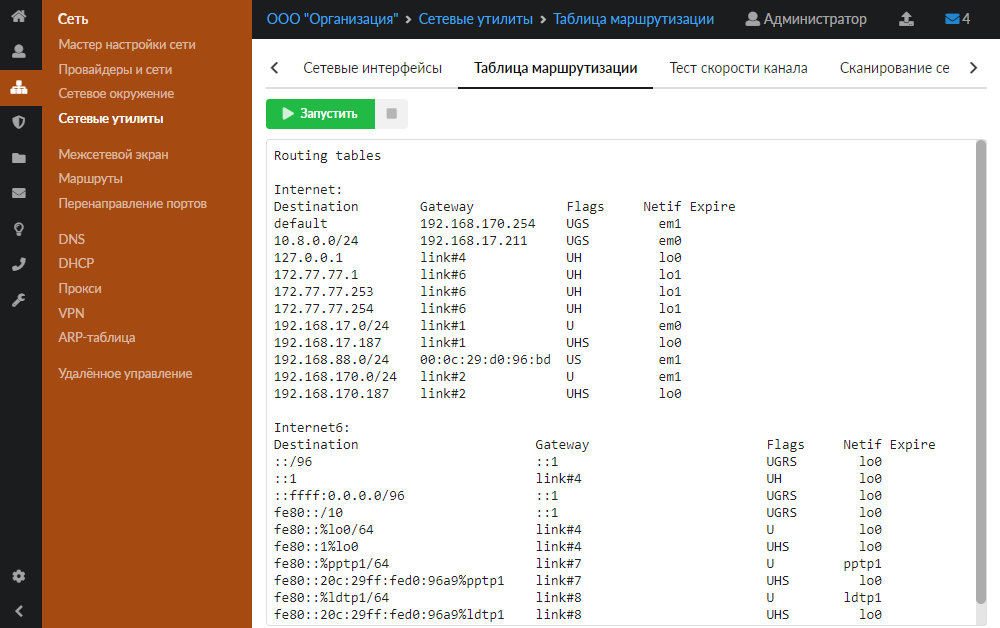

### Тест скорости канала

Данная утилита позволяет измерить пропускную способность канала.

Для измерения выберите сервер и запустите тест.

Если требуется, предварительно выберите провайдера. При этом, если в поле «Провайдер» установлено значение «любой» (по умолчанию), утилита пойдет по текущей таблице маршрутизации.

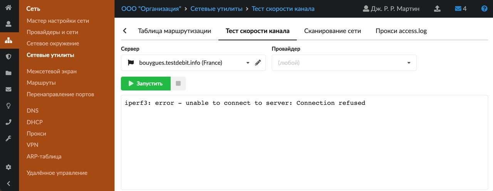

> ⚠️ **Внимание!** Не все сервера могут быть доступны. Также не все сервера могут показать подлинную скорость вашего канала из-за удаленности, количества промежуточных узлов и их нагруженности.

### Сканирование сети

С помощью сканирования сети можно тестировать безопасность локальной сети предприятия. Она позволяет проверить доступность локальных компьютеров, а также определить открытые в сети порты. Кроме того, при указании в качестве исследуемого хоста сам ИКС есть возможность дополнительно проверить безопасность системы на предмет доступных портов.

Для запуска утилиты выберите ее режим работы (поле **«Действие»**):

- доступность адресов — ИКС проверяет, находятся ли в сети выбранные компьютеры. В качестве аргумента может быть указан как отдельный хост, так и подсеть. В последнем случае ИКС проверит доступность всего указанного диапазона перебором;
- сканирование портов — ИКС проверяет, какие порты открыты для доступа на указанном хосте либо на всех компьютерах указанной подсети;
- информация о версии — ИКС проверяет версию службы каждого открытого порта на указанном хосте либо на всех компьютерах указанной подсети.

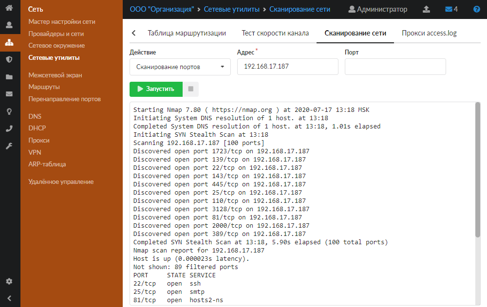

### Прокси access.log

Данная утилита позволяет посмотреть в реальном времени логи запросов пользователей на [прокси-сервере](proksi/proksi-obzor.md). Запросы можно отфильтровать с помощью одноименного поля (например, по логину пользователя или его IP-адресу). Также удобно выводить запросы только с определенным кодом http. (например, 403).

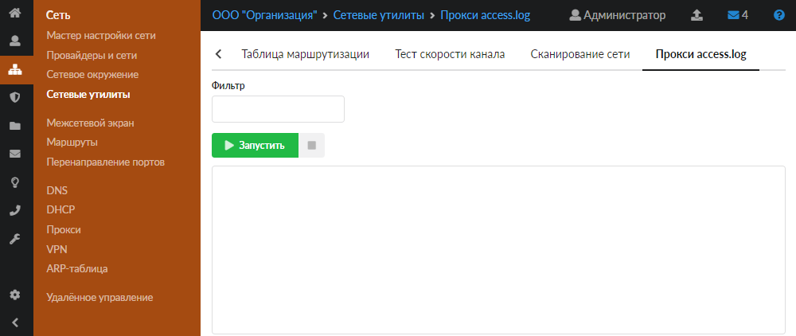
