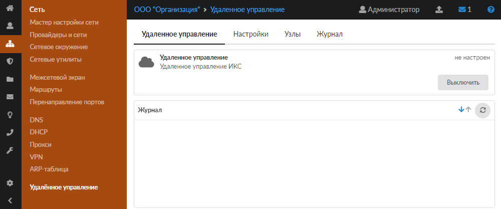
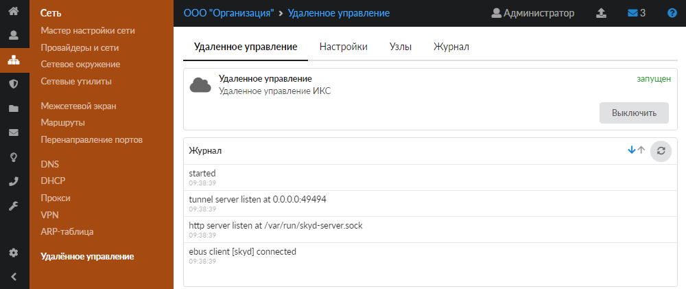
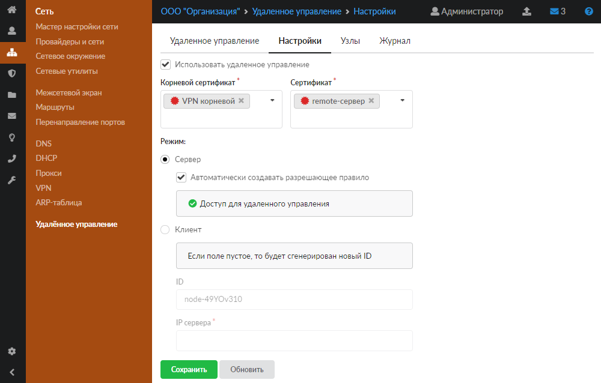
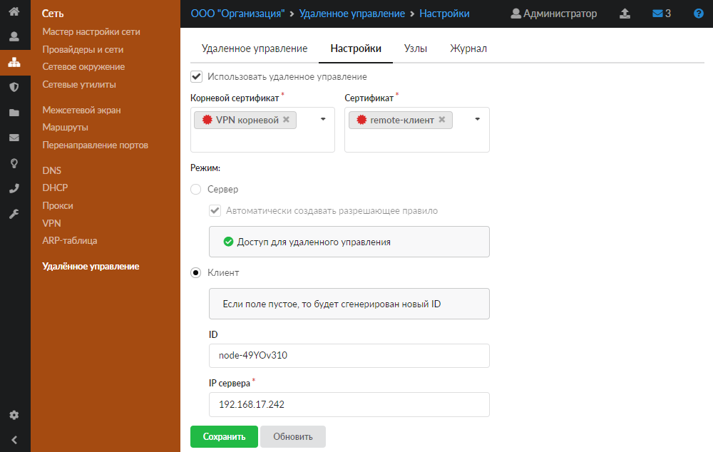
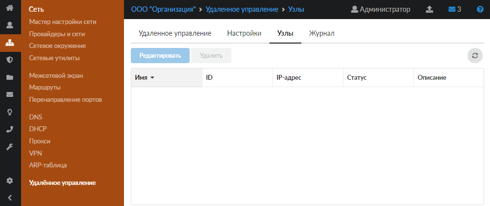
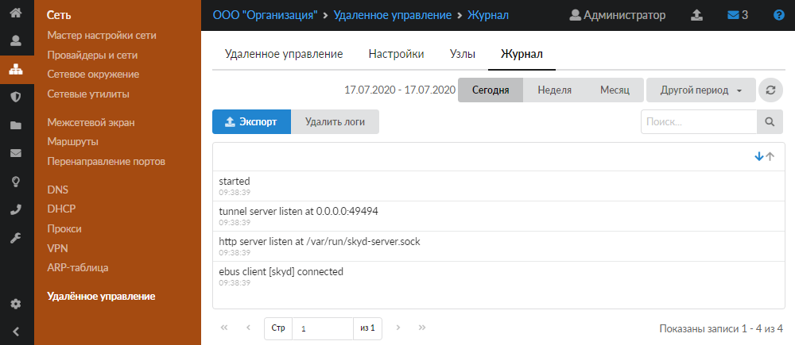

Модуль «Удаленное управление» позволяет из веб-интерфейса главного ИКС заходить по защищенному каналу на веб-интерфейсы подчиненных ИКС.

---

Модуль **«Удаленное управление»** позволяет из веб-интерфейса главного ИКС заходить по защищенному каналу на веб-интерфейсы подчиненных ИКС.

Для открытия данного модуля перейдите в меню **Сеть &gt; Удаленное управление**.

В модуле расположены следующие вкладки:

- [Удаленное управление](#tab1)
- [Настройки](#tab2)
- [Узлы](#tab3)
- [Журнал](#tab4)

## Удаленное управление

На данной вкладке отображаются следующие сведения о модуле:

- статус службы (запущен, остановлен, выключен, не настроен);
- кнопка **«Включить»** (**«Выключить»**) — позволяет запустить или остановить службу;
- журнал последних событий.

## Настройки

На данной вкладке можно включить удаленное управление и настроить его параметры.

1. Предварительно создайте [сертификаты](../zaschita/sertifikaty/sertifikaty-obzor-4.md) в меню **Защита &gt; Сертификаты**. В общем случае для функционирования удаленного управления необходимо создать три сертификата на ИКС с ролью «Сервер»: корневой сертификат, конечный сертификат для сервера, конечный сертификат для клиента.

   При создании **корневого сертификата** выберите тип «CA».

   При создании **конечного сертификата для сервера** в поле «Имя или адрес хоста» укажите доменное имя системы либо внешний [IP-адрес](../o-dokumentacii/slovar-terminov-3.md) ИКС с ролью «Сервер». Выберите тип сертификата «Конечный сертификат». В качестве шаблона рекомендуется выбрать «[VPN](../o-dokumentacii/slovar-terminov-3.md)-сервер».

   При создании **конечного сертификата для клиента** укажите тип сертификата «Конечный сертификат». В качестве шаблона рекомендуется выбрать «VPN-клиент».

2. В меню **Сеть &gt; Удаленное управление &gt; Настройки** установите флаг **«Использовать удаленное управление»**.

3. Выберите режим работы ИКС: сервер либо клиент.

   **Режим сервера**

   Если выбран режим «Сервер», данный ИКС будет выступать в роли сервера, а остальные ИКС будут подключаться к нему. Также станет доступен флаг **«Автоматически создавать разрешающее правило»** для создания [разрешающего правила](mezhsetevoy-ekran/razreshayuschee-pravilo-mezhsetevogo-ekrana-2.md) в наборе правил [межсетевого экрана](mezhsetevoy-ekran/mezhsetevoy-ekran-obzor-3.md). Для данного режима работы выберите корневой сертификат и конечный сертификат для сервера, созданные в **Шаге 1**.

   

   **Режим клиента**

   Если выбран режим «Клиент», данный ИКС будет выступать в роли клиента и им можно будет управлять с ИКС, который выступает в роли сервера. Также станут доступными для заполнения поля «ID» и «IP сервера». В поле **«ID»** указывается уникальный идентификатор клиента, генерируемый автоматически, но его можно изменить. [ID](../o-dokumentacii/slovar-terminov-3.md) устанавливается в формате `node- * * * * * * * *`, где `*` — это цифра или любой латинский символ (регистр учитывается). В поле **«IP сервера»** можно указать как IP-адрес, так и доменное имя сервера. Для данного режима работы выберите корневой сертификат и конечный сертификат для клиента, созданные в **Шаге 1**.

   

4. Нажмите **«Сохранить»**.

> ⚠ Экспорт сертификатов рекомендуется производить в формате PKCS 12.

В связи с особенностью реализации [TLS](../o-dokumentacii/slovar-terminov-3.md) существует два **режима взаимодействия между клиентом и сервером**:

- Частично защищенный. Если на ИКС с ролью «Клиент» в меню **Сеть &gt; Удаленное управление &gt; Настройки** в поле «IP сервера» указать IP-адрес, то защита канала будет односторонней. То есть ИКС с ролью «Клиент» не будет проверять сертификат ИКС с ролью «Сервер», при этом сервер будет проверять клиентский сертификат. Данная особенность открывает доступ к [MITM-атаке](../o-dokumentacii/slovar-terminov-3.md): злоумышленник может подменить сертификат сервера и перехватывать трафик.

- Полная защита. Для обеспечения полной защиты выполните следующие действия:
  1. При создании конечного сертификата для сервера в поле «Имя или адрес хоста» укажите ИМЯ_ХОСТА.
  2. На ИКС с ролью «Клиент» [создайте DNS-зону](dns/dnszona-2.md) для ИМЯ_ХОСТА, которая будет ссылаться на IP-адрес ИКС с ролью «Сервер».
  3. На ИКС с ролью «Клиент» в меню **Сеть &gt; Удаленное управление &gt; Настройки** в поле «IP сервера» укажите ИМЯ_ХОСТА.

  При таком взаимодействии клиента с сервером обе стороны проверяют передаваемые сертификаты, а MITM-атака невозможна.

## Узлы

В ИКС с ролью «Сервер» на данной вкладке содержится перечень всех ИКС с ролью «Клиент», которые были подключены к удаленному управлению.

Перечень представлен в виде таблицы с указанием следующих данных о клиентах: имя, ID, IP-адрес, статус (подключен, не подключен), описание (для занесения пометок от системного администратора).

На вкладке также можно редактировать либо удалять доступные поля клиентов. Чтобы перейти в веб-интерфейс удаленного клиента, дважды нажмите на него левой кнопкой мыши.

## Журнал

На данной вкладке отображается сводка всех системных сообщений модуля с указанием даты и времени.

[Журнал](https://doc.a-real.ru/index.php?article=196#summary) является стандартным элементом веб-интерфейса ИКС.
