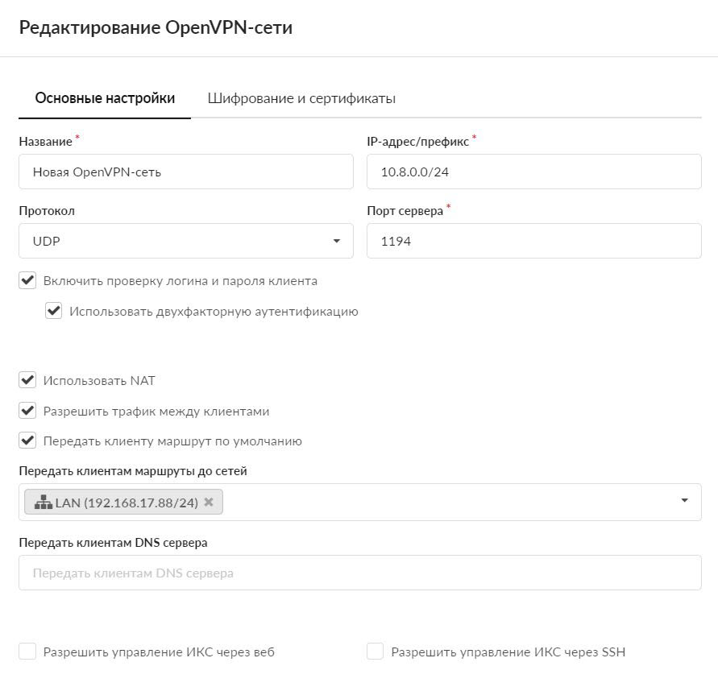
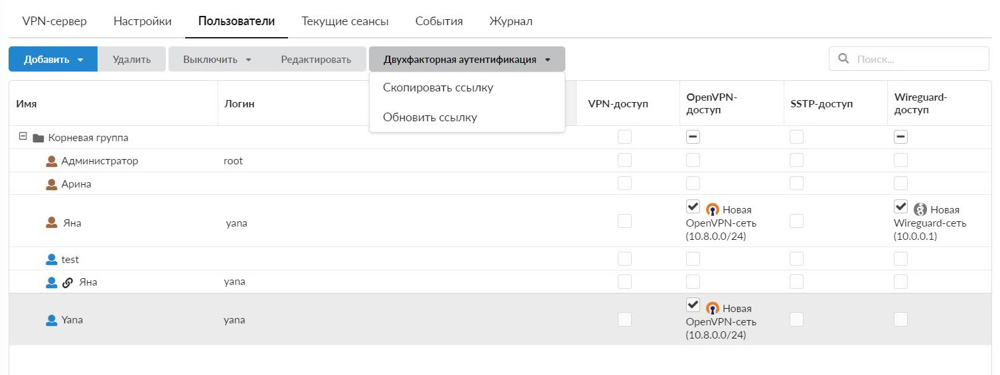
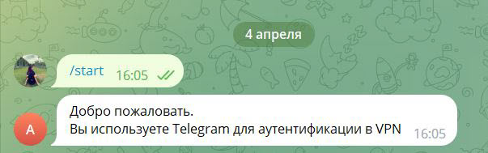
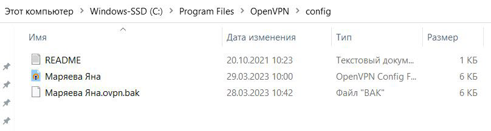
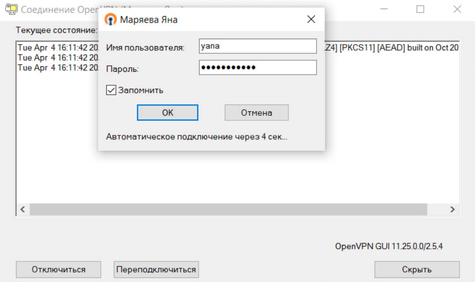
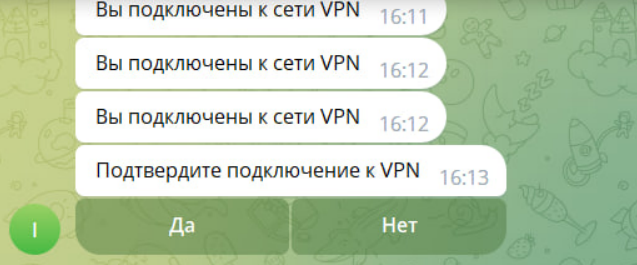
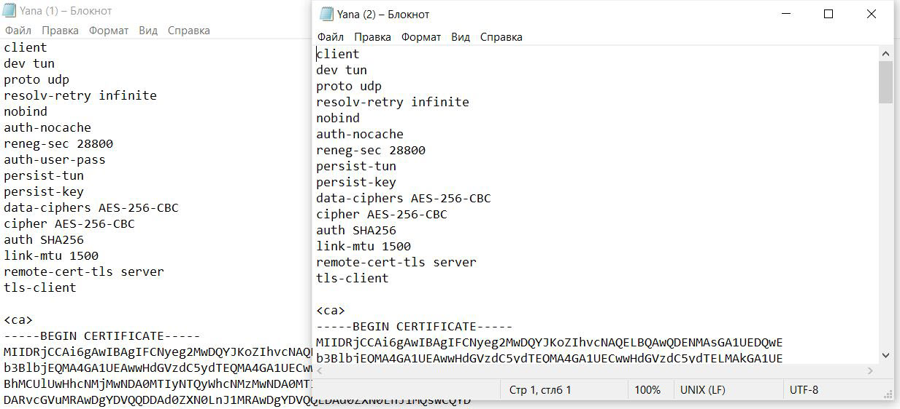

Для того чтобы настроить многофакторную (двухфакторную) аутентификацию для OpenVPN, выполните следующие действия:

---

1. При создании OpenVPN-сети установите флаги **«Включить проверку логина и пароля клиента»** и **«Использовать двухфакторную аутентификацию»**.

2. В модуле **VPN > Пользователи** выделите строку с нужным пользователем, нажмите кнопку **«Двухфакторная аутентификация»** и в выпадающем меню выберите **«Скопировать ссылку»**. Передайте ссылку пользователю удобным способом.

> ⚠ Внимание! Должен быть запущен [Telegram-bot](/index.php?article=115#tab5).

3. Пользователь должен перейти по ссылке и запустить бота через кнопку **«start»**.

4. Из индивидуального модуля пользователя выгрузите новый **конфигурационный файл** для подключения по OpenVPN. Добавьте его в папку `config` на конечном хосте пользователя.

5. Убедитесь, что пользователь знает свои логин и пароль. Теперь при подключении OpenVPN система будет запрашивать эти учетные данные.

6. После успешного ввода логина и пароля пользователю в Telegram будет приходить сообщение: «Подтвердите подключение к VPN». Для подключения необходимо нажать **«Да»**.

> ⚠ Внимание! Если включать двухфакторную аутентификацию на уже существующей настроенной сети, необходимо выгрузить новые сертификаты пользователям либо вручную добавить в конфигурацию строку: `auth-user-pass` и `reneg-sec 28800`.

