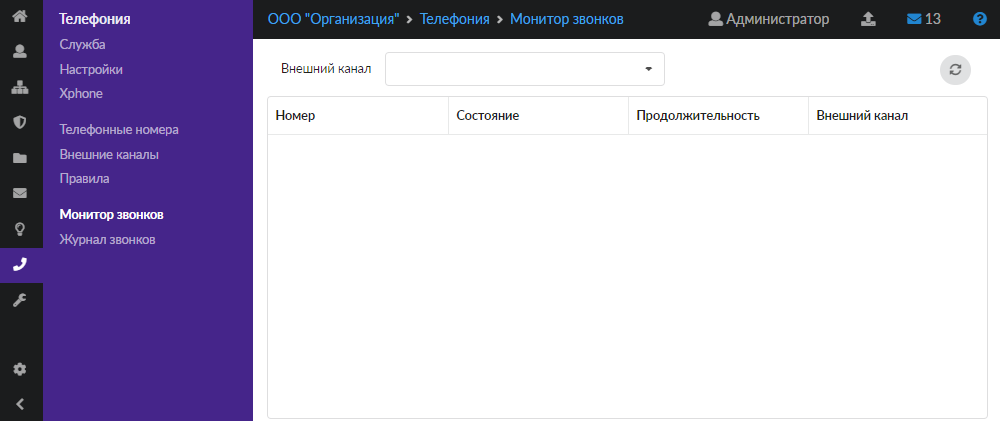
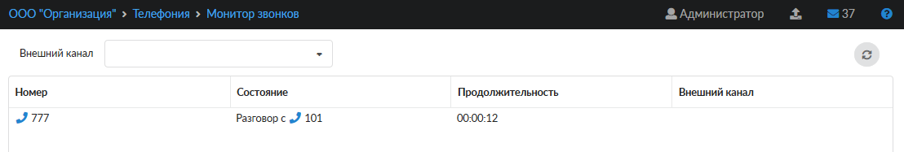

Модуль «Монитор звонков» отображает в онлайн-режиме все входящие и исходящие телефонные переговоры, проходящие через ИКС.

---

Модуль **«Монитор звонков»** отображает в онлайн-режиме все входящие и исходящие телефонные переговоры, которые проходят через ИКС. Для открытия модуля перейдите в меню **Телефония > Монитор звонков**.

На странице модуля отображается таблица с текущими звонками, а также поле **«Внешний канал»**. В данном поле можно установить фильтр отображения звонков по имени [внешнего канала](vneshnie-kanaly/vneshnie-kanaly-obzor-2.md), заведенного в ИКС.

В таблице выводится следующая информация о каждом текущем вызове:

- номер звонящего;
- состояние звонка;
- продолжительность вызова;
- внешний канал, через который осуществляется данный звонок. При внутреннем звонке поле остается пустым.

В столбце **«Состояние»** могут отображаться следующие статусы:

- На удержании — если абонент ни с кем не соединен;
- Разговор — номер находится в состоянии разговора;
- Разговор c (далее перечислены номера, с которыми идет разговор) — перечислены номера, с которыми разговаривает источник;
- Звонок — телефон совершает звонок;
- Вызов — локальный номер осуществляет вызов другого абонента;
- Ожидание ввода добавочного номера — звонящий абонент находится в голосовом меню;
- Очередь (объект ИКС) — в очереди.

> ⚠ Внимание! Если в ИКС заведено несколько [IAX](../o-dokumentacii/slovar-terminov-3.md)-провайдеров с одинаковым логином, провайдер может быть определен ошибочно.
