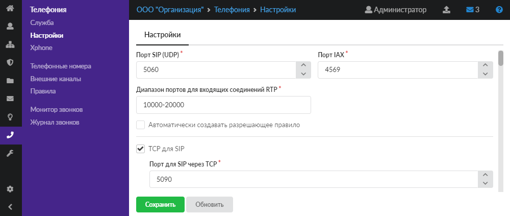
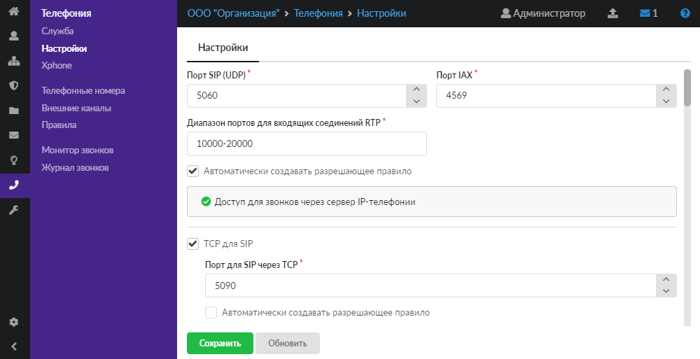
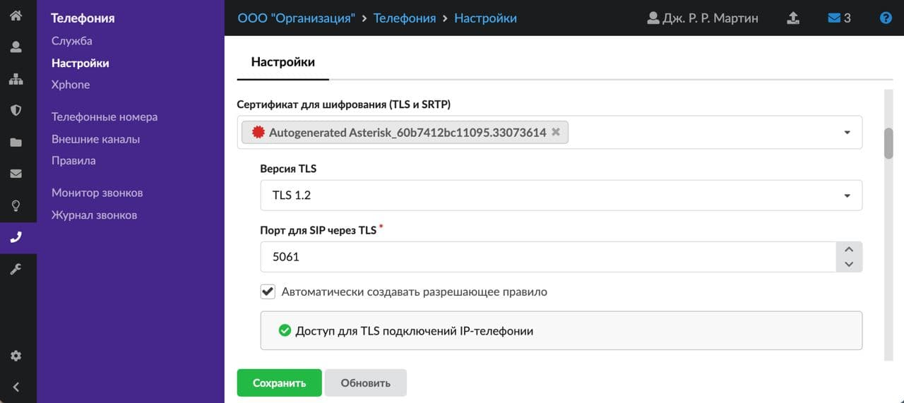
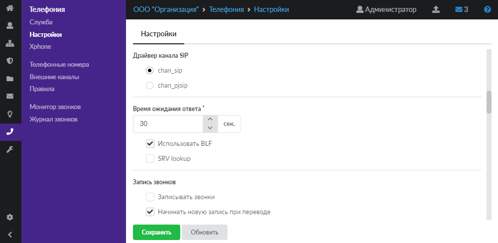
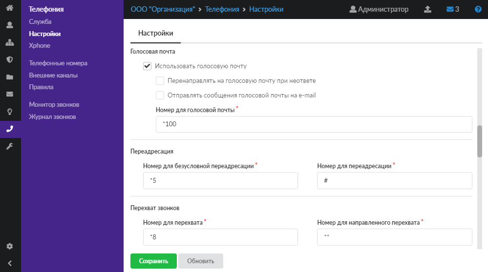
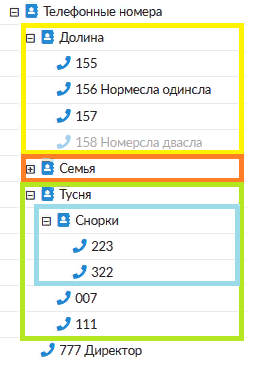
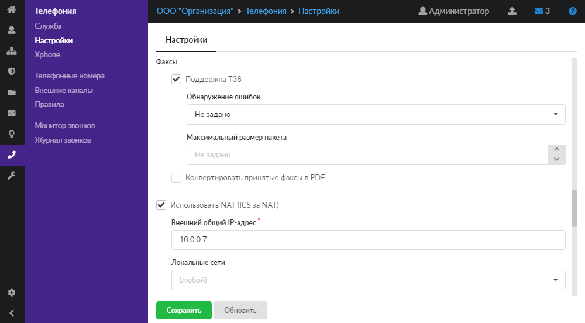
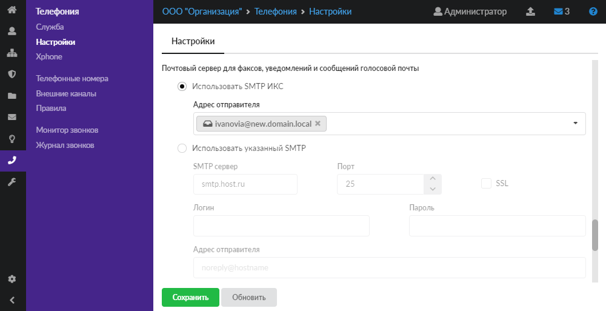
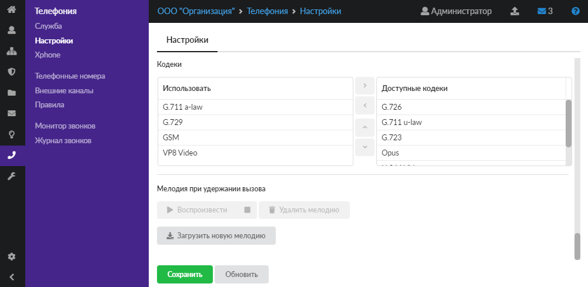

Модуль «Настройки» предназначен для установки параметров работы сервера телефонии. Для открытия модуля перейдите в меню **Телефония > Настройки**.

---



Параметры сервера телефонии разделены на несколько блоков:

- [Настройки портов](#настройки-портов)
- [TCP для SIP](#tcp-dlya-sip)
- [Шифрование](#шифрование)
- [Общие настройки сервера телефонии](#общie-настройки-сервера-telefonii)
- [Голосовая почта](#golovaya-pochta)
- [Переадресация вызовов](#pereadresaciya-vyzovov)
- [Перехват вызовов](#perehvat-vyzovov)
- [Факсы](#faksy)
- [NAT](#nat)
- [Почтовый сервер](#pochtovyy-server)
- [Кодеки](#kodeki)
- [Мелодия при удержании вызова](#melodiya-pri-uderzhanii-vyzova)

## Настройки портов

В блоке можно изменить настройки портов [SIP](../o-dokumentacii/slovar-terminov-3.md) (через [UDP](../o-dokumentacii/slovar-terminov-3.md)) и [IAX](../o-dokumentacii/slovar-terminov-3.md), а также диапазон портов для входящих соединений [RTP](../o-dokumentacii/slovar-terminov-3.md). По умолчанию используются следующие значения:

```
SIP  5060
IAX  4569
RTP  10000-20000
```



При установке флага **«Автоматически создавать разрешающее правило»** в межсетевом экране добавится [разрешающее правило](../set/mezhsetevoy-ekran/razreshayuschee-pravilo-mezhsetevogo-ekrana-2.md) для указанных портов. Перейти к правилу можно нажатием на ссылку в его названии.

## TCP для SIP

Флаг **«TCP для SIP»** включает поддержку отправки и получения SIP-пакетов по протоколу TCP на выбранном порту. Включите данную опцию, если у вас используются внешние или внутренние номера, которые настроены для работы через тип подключения **«Без Шифрования (TCP)»**.

При установке флага **«Автоматически создавать разрешающее правило»** в межсетевом экране добавится разрешающее правило для указанного порта. Перейти к правилу можно нажатием на ссылку в его названии.

## Шифрование

В поле **«Сертификат для шифрования (TLS и SRTP)»** можно выбрать, изменить или удалить [сертификат](../zaschita/sertifikaty/sertifikaty-obzor-4.md) шифрования для телефонии. По умолчанию выбран автоматически сгенерированный конечный сертификат (самоподписанный).

После выбора сертификата активируются обязательные поля **«Версия TLS»** и **«Порт для SIP через TLS»**. Порт для SIP через TLS по умолчанию установлен 5061, но его можно изменить. Поле «Версия TLS» предназначено для выбора версии шифрования (TLS 1.0, 1.1, 1.2) и доступно только при использовании драйвера канала chan_pjsip. Для драйвера chan_sip может быть использована только версия TLS 1.0.

При установке флага **«Автоматически создавать разрешающее правило»** в межсетевом экране добавится разрешающее правило для указанного порта. Перейти к правилу можно нажатием на ссылку в его названии.



> ⚠️ Внимание! Чтобы использовать шифрование, в настройках конкретного [телефонного номера](telefonnye-nomera/telefonnye-nomera-obzor-2.md) необходимо выбрать тип подключения **«С шифрованием (TLS и SDES sRTP)»**, а также настроить шифрование на стороне абонента.
>
> ⚠️ После изменения настроек **«Порт SIP через UDP/TCP/TLS»** сервер телефонии перезапустится, текущие вызовы будет прерваны.

## Общие настройки сервера телефонии

В блоке **«Драйвер канала SIP»** можно выбрать модуль реализации протокола SIP, который будет использоваться сервером телефонии ИКС. Доступно два канальных драйвера: chan_sip и chan_pjsip.

Chan_pjsip — это более новый канальный драйвер канала SIP в [Asterisk](../o-dokumentacii/slovar-terminov-3.md). При переключении на данный драйвер часть настроек IP-телефонии поменяется.



Отличия в настройке [внешних каналов](vneshnie-kanaly/vneshnie-kanaly-obzor-2.md):

- Опции `insecure`, `canreinvite` и строка регистрации доступны только для модуля chan_sip.
- Опция `direct_media` доступна только для модуля chan_pjsip. Эта опция определяет, могут ли медиаданные передаваться напрямую между конечными точками. Если нет (no), то все RTP-потоки проходят через Asterisk.

Отличия в общих настройках телефонии:

- Опция `SRV lookup` доступна только для модуля chan_sip.

Конференции с режимом распределения видео SFU и [Xphone](https://doc.a-real.ru/index.php?article=101) работают только на канальном драйвере pjsip.

> ⚠️ Внимание! После изменения настройки **«Драйвер канала SIP»** сервер телефонии перезапустится, текущие вызовы будут прерваны либо не обработаны. Текущие регистрации транков (каналов связи) не будут прерваны, всем внутренним и внешним транкам необходимо заново переподключиться и перерегистрироваться на сервере (то есть всем внутренним телефонам необходимо заново подключиться к ИКС, а в случае проблем с провайдером телефонии — переподключить его).

Поле **«Время ожидания ответа»** позволяет задать период времени, по истечении которого сервер телефонии посчитает абонента не ответившим на звонок и переведёт звонящего абонента в следующий набор [правил](pravila-telefonii/pravila-telefonii-obzor-2.md) (в секундах). По умолчанию установлен период 30 секунд. Некоторые правила телефонии позволяют переопределить это время для конкретного правила. Данная настройка общая. Если требуется, чтобы время ожидания ответа отличалось от стандартного для конкретных внутренних номеров, то у каждого внутреннего добавочного номера можно переопределить эту опцию.

При установке флага **«Использовать BLF»** включится поддержка функции Busy Lamp Field, позволяющая в реальном времени отслеживать состояния абонентов АТС (занят/свободен). **Важно: конечное устройство должно поддерживать данную функцию**.

Флаг **«SRV lookup»** активирует [DNS](../o-dokumentacii/slovar-terminov-3.md)-поиск [SRV-записей](../o-dokumentacii/slovar-terminov-3.md). Данный флаг недоступен при выборе chan_pjsip в качестве драйвера канала SIP.

## Голосовая почта

Чтобы включить голосовую почту, установите флаг **«Использовать голосовую почту»**. При помощи соответствующих флагов можно установить перенаправление на голосовую почту при неответе и (или) отправление сообщения голосовой почты на e-mail. Данный e-mail указывается в настройках внутренних номеров.

> ⚠️ Флаг **«Отправлять сообщения голосовой почты на e-mail»** — глобальная настройка данной опции. Если флаг не установлен, то опция «Отправлять сообщения голосовой почты на почту» в настройках [телефонного номера](telefonnye-nomera/telefonnyy-nomer-2.md) работать не будет. При этом для конкретного телефонного номера можно отдельно отключить отправку на e-mail. Если же оставить данную настройку включенной только у внутренних номеров, то не будет возможности отключить ее у всех номеров сразу.
>
> Таким образом, флаг «Отправлять сообщения голосовой почты на e-mail» в настройках телефонии является глобальной опцией. Флаг «Отправлять сообщения голосовой почты на почту» в настройках номера — отдельной опцией для каждого номера.

Если требуется, измените **номер** для голосовой почты. По умолчанию установлен номер \*100.

Чтобы прослушать оставленное на внутреннем номере голосовое сообщение, позвоните с него на номер голосовой почты.

### Пример

На номере 777 было оставлено голосовое сообщение. При звонке с 777 на \*100 пользователь услышит данное голосовое сообщение.



## Переадресация вызовов

В данном блоке устанавливаются **номера** для:

- Безусловной переадресации — позволяет перевести входящий звонок без подтверждения.

  ### Пример

  Входящий звонок поступает на номер 777. 777 набирает \*5 (по умолчанию) и переводит на номер 888. Звонок сразу же переключается на 888, вне зависимости от доступности 888. Обратно на 777 звонок не придёт никогда.

- Обычной переадресации — позволяет перевести входящий звонок, предназначенный одному абоненту, на другого абонента, пока происходит звонок. Для этого необходимо набрать номер для переадресации, а затем номер другого абонента, дождаться ответа второго абонента и затем положить трубку у себя.

## Перехват вызовов

**Перехват в рамках группы** предназначен для ответа на входящий звонок, предназначенный одному абоненту, другим абонентом, пока происходит звонок и трубка не снята. Это удобно в том случае, если второй абонент видит, что первого нет на месте. Чтобы перехватить вызов, предназначенный другому абоненту, необходимо ввести во время звонка специальную комбинацию клавиш (по умолчанию это \*8). Комбинацию можно изменить в поле **«Номер для перехвата»**.

> ⚠️ Перехват вызова осуществляется только в пределах одной группы телефонных номеров.

### Пример



Перехват вызовов на изображенной структуре номеров:

- вызов, поступивший на номер 155, могут перехватить **только** 156 и 157;
- вызов, поступивший на номер 223, могут перехватить **только** 322, 007 и 111;
- номер 777, находящийся на верхнем уровне, может перехватывать все номера.

**Направленный перехват** звонков предназначен для перехвата входящего звонка на конкретный внутренний номер вне зависимости от группы внутренних номеров.

Чтобы перехватить вызов, предназначенный другому абоненту, на своем телефоне необходимо ввести во время звонка специальную комбинацию (по умолчанию \*\*) и внутренний номер вызываемого абонента. Комбинацию клавиш для направленного перехвата вызова можно изменить в поле **«Номер для направленного перехвата»**.

## Факсы

В данном блоке задаются настройки работы с факсимильными сообщениями.



При установке флага **«Поддержка Т38»** включится поддержка стандарта Т.38 для передачи факсимильных сообщений.

В поле **«Обнаружение ошибок»** можно выбрать тип корректировки входящих сообщений:

- «Redundancy» (Redundancy error correction) — исправление ошибок избыточности;
- «FEC» (Forward error correction) — прямое исправление ошибок;
- «Не задано» — не проверять сообщения на наличие ошибок.

Поле **«Максимальный размер пакета»** позволяет определить максимальный размер сообщения.

Флаг **«Конвертировать принятые факсы в PDF»** предназначен для определения формата файлов (возможность конвертировать файлы в PDF-формат). По умолчанию все факсимильные сообщения будут иметь формат `courier new, courier, monospace`.

## NAT

Данный блок отвечает за настройку поведения модуля телефонии, если он находится за [NAT](../o-dokumentacii/slovar-terminov-3.md).

Флаг **«Использовать NAT (ICS за NAT)»** включает преобразование [IP-адресов](../o-dokumentacii/slovar-terminov-3.md) внутри пакетов телефонии.

Для корректной работы данного блока необходимо указать внутренние локальные сети и внешний IP-адрес. В поле **«Внешний общий IP-адрес»** укажите внешний IP-адрес, который используется для преобразования IP-адресов в обработке SIP (если пункт назначения SIP-сообщений находится за пределами IP-сети, определенной в поле **«Локальные сети»**). Таким образом все указанные в данном поле сети сервер телефонии будет считать локальными, для них не будут применяться правила преобразования IP-адресов внутри пакетов IP-телефонии.

## Почтовый сервер

Данный блок отвечает за настройку пересылки факсов, уведомлений и сообщений голосовой почты.



Выберите, какой **сервер** будет использоваться для отправки писем:

- почтовый сервер ИКС — в поле **«Адрес отправителя»** укажите один из почтовых адресов, созданных в ИКС;
- внешний [SMTP](../o-dokumentacii/slovar-terminov-3.md)-сервер — заполните поля **«SMTP-сервер»**, **«Порт»**, **«Логин»**, **«Пароль»** и **«Адрес отправителя»**, а также при необходимости установите флаг **«SSL»**.

## Кодеки

В данном блоке можно выбрать заданные по умолчанию [кодеки](../o-dokumentacii/slovar-terminov-3.md), которые будут использоваться модулем телефонии для всех номеров.

В столбце **«Использовать»** расположены кодеки, которые используются всеми номерами, если не задано иное в настройках отдельных номеров. Порядок следования кодеков в данном столбце имеет следующее значение: чем выше расположен кодек, тем выше его приоритет. Список кодеков будет представлен удалённой стороне во время установления сеанса связи в порядке их следования в данном списке.

В столбце **«Доступные кодеки»** расположены доступные, но не используемые модулем телефонии кодеки.



Модуль телефонии в ИКС поддерживает следующие кодеки:

Аудио:

- G.711 a-law
- G.711 u-law
- G.722 HD
- G.723
- G.726
- G.729
- Opus
- GSM

Видео:

- H.264
- VP8
- VP9

> ⚠️ Для работы видеозвонков добавьте в столбец «Использовать» хотя бы один видеокодек.
>
> ⚠️ Для работы [Xphone](https://doc.a-real.ru/index.php?article=101) рекомендуется использовать следующий набор кодеков: G.711 a-law, Opus, VP8, VP9.

## Мелодия при удержании вызова

В данном блоке можно задать мелодию, которая будет воспроизводиться звонящему при удержании вызова.

Для загрузки мелодии нажмите кнопку **«Загрузить новую мелодию»** и выберите аудиофайл. После загрузки мелодию можно прослушать или удалить с помощью соответствующих кнопок.

Для применения заданных настроек нажмите кнопку **«Сохранить»**.
