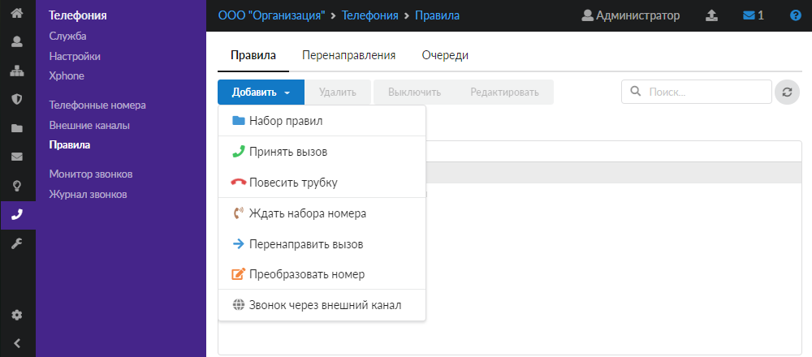
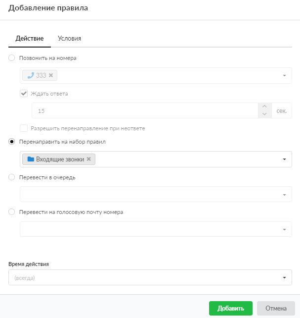

Данное правило предназначено для перенаправления вызова на конкретные номера, в набор правил, очередь или на голосовую почту.

---

Чтобы добавить правило **«Перенаправить вызов»**, выполните следующие действия:

1. Перейдите в меню **Телефония > Правила**.

2. Выберите папку с набором правил и нажмите кнопку **«Добавить»** и выберите **«Перенаправить вызов»**.

   

3. На вкладке **«Действие»** при помощи переключателя выберите один из блоков с **действием**:

   - **Позвонить на номера** — выберите номер или группу из списка телефонных номеров ИКС, при этом вызов будет поступать на все указанные номера одновременно. Чтобы указать время ожидания ответа, прежде чем сервер перейдет к проверке следующего правила, установите флаг **«Ждать ответа»**. Если выбран один конкретный номер, становится возможным установить флаг **«Разрешить перенаправление при неответе»** — тогда при неответе данного номера и наличии у него перенаправлений вызов будет перенаправлен на указанные номера.

     Начиная с версии ИКС 9.0 действует новый режим работы правил телефонии — **LUA**:

     - Если в поле «Позвонить на номера» указана только группа номеров, которая может включать в себя иные группы, телефонные номера, факсы, конференции, то при срабатывании перенаправления звонить будут только телефонные номера.

     - Если в поле «Позвонить на номера» указаны любые сочетания объектов группа номеров, телефонный номер, факс, конференция, то приоритет следующий: конференция, факс, телефонный номер и группа номеров имеют одинаковый приоритет. Попав в конференцию или в факс, звонок считается совершенным и далее не пойдет по правилам.

     - Если на номер будет поступать большое количество одновременных вызовов, вызывающему абоненту будет передано голосовое сообщение о том, что вызываемый абонент занят.

   - **Перенаправить на набор правил** — выберите набор правил в соответствующем поле. Если не произойдет приема или прекращения вызова, то переход к следующему правилу произойдет после перебора всех правил указанного набора.

   - **Перевести в очередь** — выберите очередь в соответствующем поле. Если в настройках очереди указано, в какой набор правил необходимо выйти, то вызов перейдет к первому правилу данного набора.

   - **Перевести на голосовую почту номера** — выберите телефонный номер ИКС в соответствующем поле. Следующие правила не будут выполнены.

   

4. Если требуется, укажите [время действия](https://doc.a-real.ru/index.php?article=196#time) правила.

5. На вкладке **«Условия»** задайте условия срабатывания правила по аналогии с [правилом](povesit-trubku-2.md) «Повесить трубку».

6. Нажмите **«Добавить»** — новое правило появится в списке.

> ⚠ Внимание! Телефонный номер должен состоять как минимум из трех цифр.
