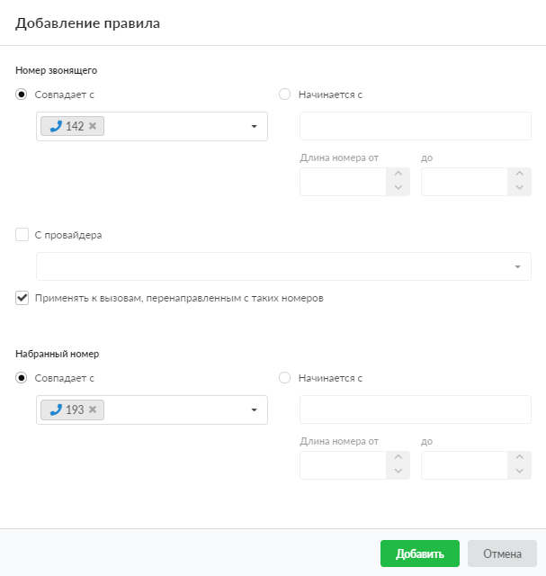

Правило предназначено для отключения звонящего абонента, если он совпадает с указанными условиями. Все правила, идущие после него, не будут учитываться.

---

Чтобы добавить правило **«Повесить трубку»**, выполните следующие действия:

1. Перейдите в меню **Телефония > Правила**.

2. Выберите папку с набором правил и нажмите кнопку **«Добавить»** и выберите **«Повесить трубку»**.

3. Укажите параметры **номера звонящего**. При помощи переключателя выберите, должен ли номер совпадать с указанным либо начинаться с определенных цифр.

4. Если требуется, установите флаг **«С провайдера»** и выберите провайдера, с которого будет приходить звонящий номер.

5. При необходимости установите флаг **«Применять к вызовам, перенаправленным с таких номеров»**.

6. Укажите параметры **набранного номера**. При помощи переключателя выберите, должен ли номер совпадать с указанным либо начинаться с определенных цифр.

7. Нажмите **«Добавить»** — новое правило появится в списке.

> ⚠ Внимание! Телефонный номер должен состоять как минимум из трех цифр.
