Модуль «Правила» предназначен для управления логикой обработки и маршрутизации входящих и исходящих вызовов.

---

Модуль **«Правила»** предназначен для управления логикой обработки и маршрутизации входящих и исходящих вызовов.

Для открытия модуля перейдите в меню **Телефония > Правила**.

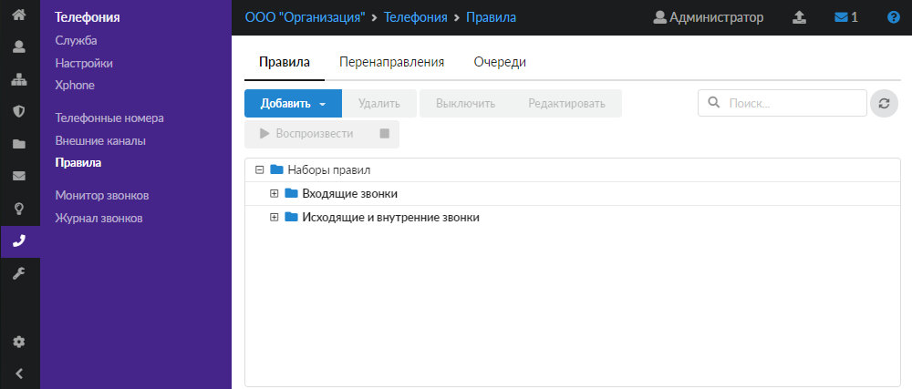

В модуле расположены следующие вкладки:

- Правила
- Перенаправления
- Очереди

## Правила

На данной вкладке отображаются наборы правил телефонии.

Все звонки по умолчанию разделяются на две группы:

- входящие — звонки, входящие на ИКС с внешних транков;
- внутренние и исходящие — исходящие и входящие звонки с внутренних телефонных номеров ИКС.

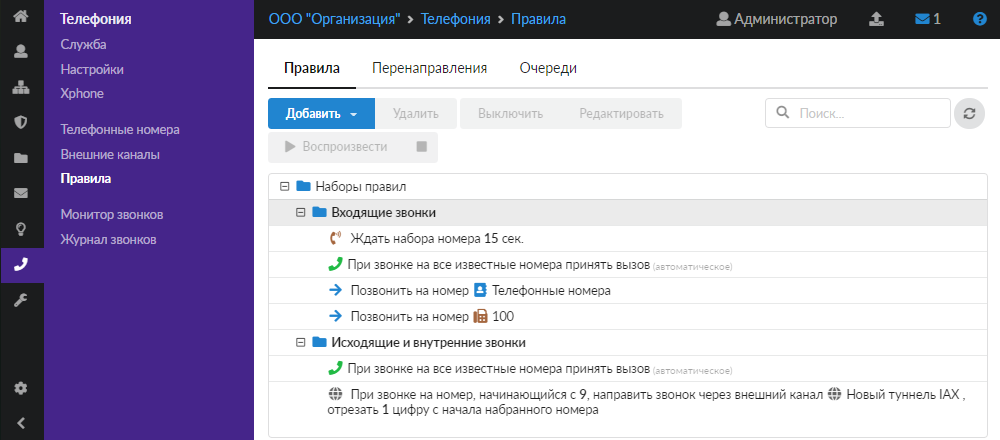

Правила в наборах выполняются друг за другом, сверху вниз.

На вкладке можно **добавить**, **выключить**, **удалить** правила или **поменять** их порядок перетаскиванием строки в нужную позицию списка в существующих наборах, либо добавить собственные **наборы правил**.

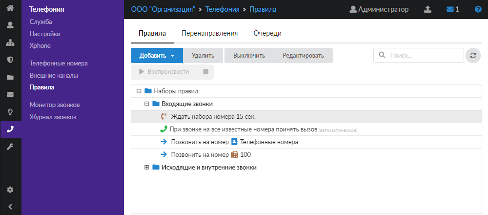

Выключенные правила отображаются в списке серым цветом.

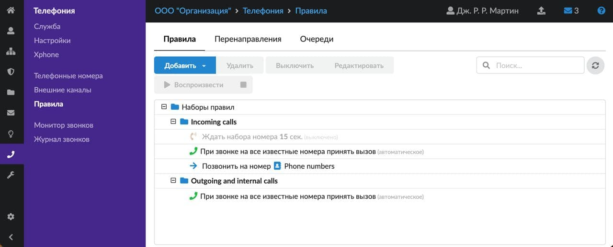

Чтобы создать новый набор правил, выполните следующие действия:

1. Нажмите кнопку **«Добавить»** и выберите **«Набор правил»**.

   

2. Введите **название** набора правил.

   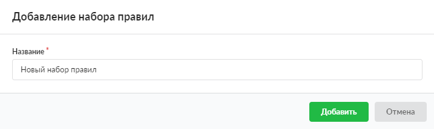

3. Нажмите **«Добавить»** — новый набор правил появится в списке.

В набор можно добавить следующие правила:

- [Принять вызов](prinyat-vyzov-2.md)
- [Повесить трубку](povesit-trubku-2.md)
- [Ждать набора номера](zhdat-nabora-nomera-2.md)
- [Перенаправить вызов](perenapravit-vyzov-2.md)
- [Преобразовать номер](preobrazovat-nomer-2.md)
- [Звонок через внешний канал](zvonok-cherez-vneshniy-kanal-2.md)

> ⚠ Внимание! Телефонный номер должен состоять как минимум из трех цифр.

## Перенаправления

На данной вкладке отображаются перенаправления телефонии при неответе вызываемого абонента. Такие правила предназначены для перенаправления звонков, если вызываемый абонент не отвечает или занят.

Также на вкладке можно **добавить**, **удалить**, **выключить** либо **отредактировать** перенаправления при помощи соответствующих кнопок. Выключенные перенаправления отображаются в списке серым цветом.

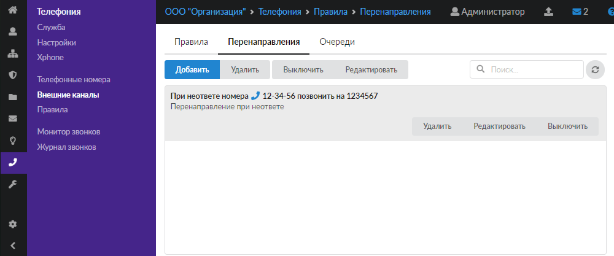

Чтобы создать новое перенаправление, выполните следующие действия:

1. Нажмите кнопку **«Добавить»**.
2. Введите вызываемый номер и **номера**, на которые будет перенаправлен вызов. В качестве телефонных номеров в обоих полях также можно указать группу номеров — тогда будут подразумеваться номера, которые находятся в этой группе. В поле **«Позвонить на»** также можно указать внешний номер, не созданный на ИКС.
3. В качестве **описания** можно ввести текст, который будет отображаться в интерфейсе ИКС рядом с названием правила.

   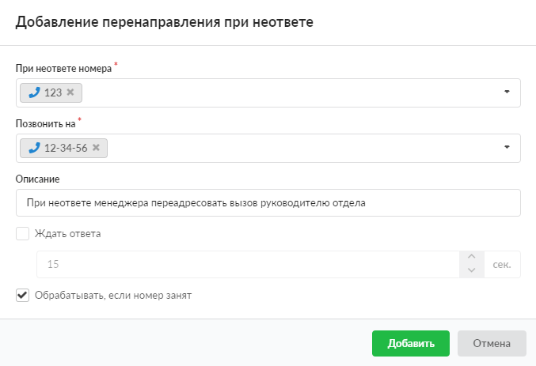

4. При установке флага **«Ждать ответа»** можно задать время ожидания (в секундах).
5. Если установлен флаг **«Обрабатывать, если номер занят»**, то правило перенаправления будет применяться также при занятости указанных номеров.
6. Нажмите **«Добавить»** — новое перенаправление появится в списке.

Перенаправления при неответе также можно просматривать в [индивидуальном модуле пользователя](../../polzovateli-i-statistika/polzovateli/individualnyy-modul-polzovatelya-gruppy-2.md) на вкладке **«Перенаправления»**.

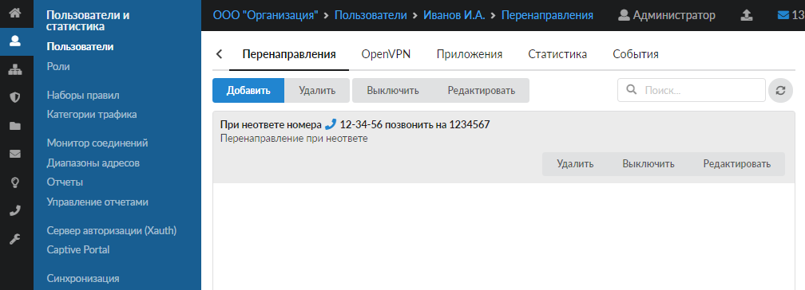

Если у пользователя создан телефонный номер и в ИКС добавлены перенаправления, в которых данный номер указан в поле **«При неответе номера»**, то на вкладке будут отображаться все такие перенаправления. При этом те перенаправления, в которых данный номер указан как единственный, будут доступны к редактированию.

> ⚠ Внимание! По умолчанию в модуле телефонии ИКС действует следующее правило: если нажать \* при ручной переадресации входящего звонка на внутренний номер другого абонента, переадресация будет прервана.

## Очереди

На данной вкладке отображаются очереди телефонии. Они предназначены для удержания вызовов, пока какой-либо номер не ответит либо инициатор вызова не положит трубку.

Также на вкладке можно **добавить**, **удалить**, **отредактировать** очередь либо **воспроизвести** при помощи соответствующих кнопок.

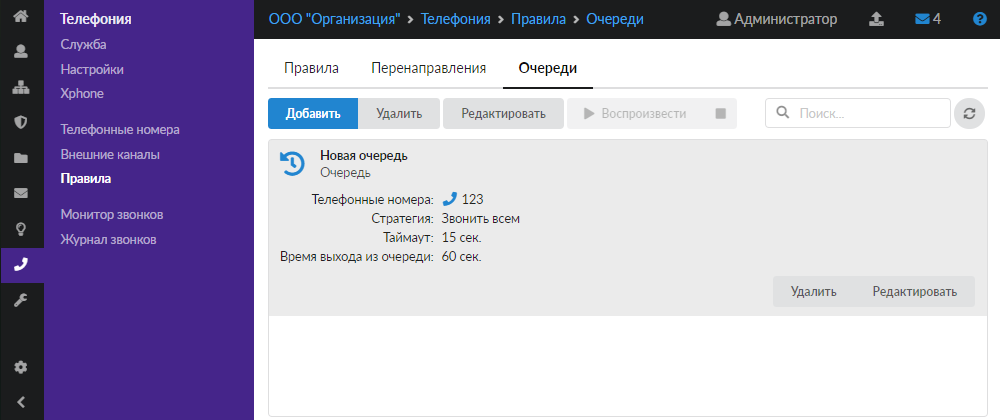

Чтобы создать новую очередь, выполните следующие действия:

1. Нажмите кнопку **«Добавить»**.
2. Введите **название** очереди.
3. Укажите телефонные **номера**, на которые будет производиться вызов. В качестве телефонных номеров также можно указать группу номеров — тогда вызов будет перенаправлен номерам, которые находятся в этой группе.

   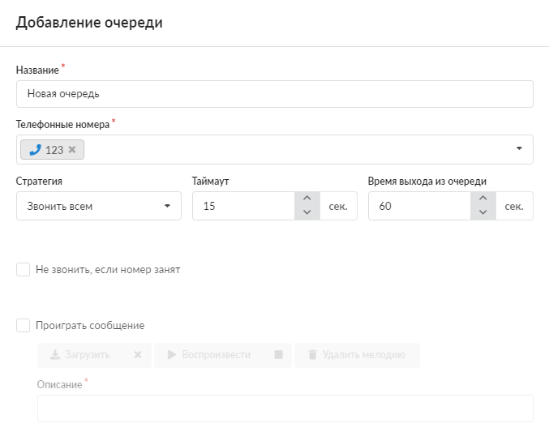

4. Поле **«Стратегия»** предназначено для указания распределения вызовов в очереди:

   - звонить всем — происходит вызов всему списку указанных номеров одновременно;
   - звонить по очереди — вызов начинается с первого указанного номера и при неответе происходит вызов следующему номеру;
   - случайно — телефонные номера будут перебираться в случайном порядке;
   - с наименьшей нагрузкой — обзвон начинается с номера, принявшего меньше всего вызовов.

5. Поле **«Таймаут»** указывает, в течение какого промежутка времени будет вызываться телефон пользователя, прежде чем система посчитает, что он не ответил (в секундах).
6. Поле **«Время выхода из очереди»** предназначено для указания времени, по истечении которого звонок попадет обратно в исходный список правил и будет обрабатываться следующим правилом (в секундах).
7. При установке флага **«Проиграть сообщение»** можно загрузить, воспроизвести или удалить мелодию ожидания. После загрузки файла в поле **«Описание»** по умолчанию будет подставлено его название.
8. Поле **«Оповещать в очереди»** предназначено для выбора оповещений о статусе абонента в очереди. Возможен выбор оповещений о времени ожидания, о номере в очереди либо обо всем сразу, а также отключение оповещений. Если выбран тип оповещений, можно указать частоту оповещений (в секундах).

   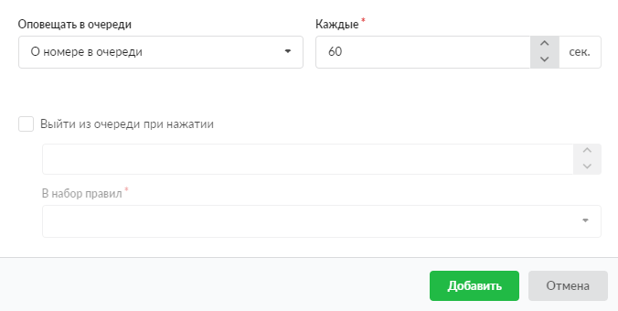

9. При установке флага **«Выйти из очереди при нажатии»** можно указать комбинацию цифр для выхода и набор правил, в который необходимо выйти. При этом звонок перейдет к первому правилу в указанном наборе.
10. Нажмите **«Добавить»** — новая очередь появится в списке.

<https://vk.com/video_ext.php?oid=-18503994&id=456239339&hd=2>

<https://vk.com/video_ext.php?oid=-18503994&id=456239340&hd=2>
