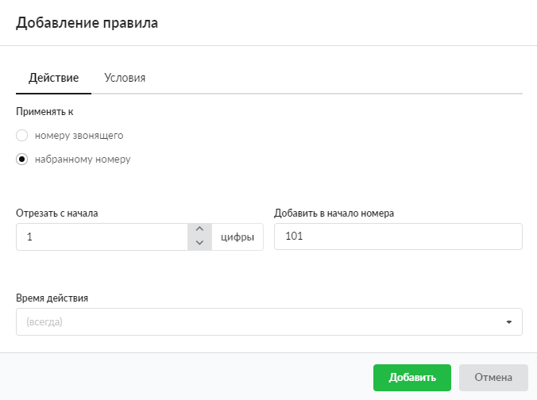

# Преобразовать номер

Данное правило предназначено для преобразования номера звонящего или набранного номера.

---

Чтобы добавить правило **«Преобразовать номер»**, выполните следующие действия:

1. Перейдите в меню **Телефония &gt; Правила**.

2. Выберите папку с набором правил и нажмите кнопку **«Добавить»** и выберите **«Преобразовать номер»**.

3. На вкладке **«Действие»** выберите, к какому номеру применять правило: к источнику (номеру звонящего) или назначению (набранному номеру).

4. В соответствующих полях можно указать, **сколько** цифр с начала номера необходимо заменить и на **какие**.

5. Если требуется, укажите [время действия](https://doc.a-real.ru/index.php?article=196#time) правила.

6. На вкладке **«Условия»** задайте условия срабатывания правила по аналогии с [правилом](https://doc.a-real.ru/index.php?article=250) «Повесить трубку».

7. Нажмите **«Добавить»** — новое правило появится в списке.

> ⚠ Внимание! Телефонный номер должен состоять как минимум из трех цифр.

---

**Источник:** [Документация ИКС — Преобразовать номер](https://doc.a-real.ru/index.php?article=253)
