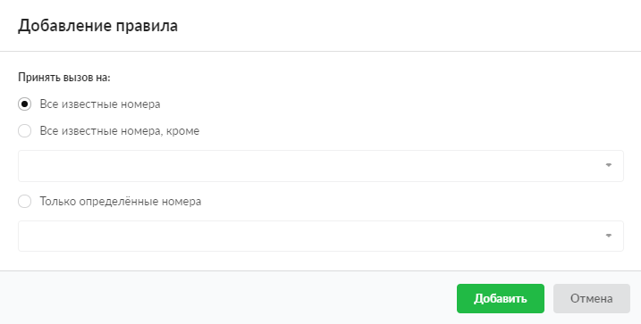

# Принять вызов

Правило предназначено для приема звонка. Все правила, идущие после него, не будут учитываться.

---

Чтобы добавить правило **Принять вызов**, выполните следующие действия:

1. Перейдите в меню **Телефония &gt; Правила**.

2. Выберите папку с набором правил и нажмите кнопку **Добавить** и выберите **Принять вызов**.

3. При помощи переключателя выберите, на какие именно номера следует принять вызов: все известные номера, все номера, кроме указанных, либо только определенные номера.

4. Нажмите **Добавить** — новое правило появится в списке.

Внимание! Телефонный номер должен состоять как минимум из трех цифр.

---

**Источник:** [Документация ИКС — Принять вызов](https://doc.a-real.ru/index.php?article=249)
