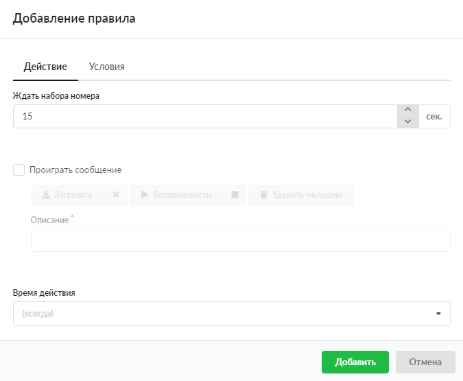

Данное правило включает ожидание в течение указанного промежутка времени, пока абонент не наберет номер полностью. Это делается для предотвращения быстрого звонка на внутренний номер, который совпадает с началом внешнего номера. Также возможна установка проигрывания сообщения (например, для голосового меню).

---

Чтобы добавить правило **«Ждать набора номера»**, выполните следующие действия:

1. Перейдите в меню **Телефония &gt; Правила**.

2. Выберите папку с набором правил и нажмите кнопку **«Добавить»** и выберите **«Ждать набора номера»**.

3. На вкладке **«Действие»** в поле **«Ждать набора номера»** можно изменить время ожидания ввода пользователем номера (в секундах). По умолчанию установлено значение 15 секунд.

4. При установке флага **«Проиграть сообщение»** можно загрузить, воспроизвести или удалить мелодию ожидания. После загрузки файла в поле **«Описание»** по умолчанию будет подставлено его название.

> ⚠ Внимание! Для корректной загрузки следует выбирать файлы с расширениями `.mp3` и `.wav` в нижнем регистре (все буквы строчные). При попытке загрузить файл с другим расширением, на экране появится предупреждение: «Не удалось загрузить данные, неверный формат файла», а файл не будет загружен.

5. Если требуется, укажите [время действия](../../vebinterfeys-iks/standartnye-elementy-vebinterfeysa.md) правила. Оно устанавливается следующим образом: время установленной мелодии ожидания + время, указанное в поле «Ждать набора номера». Если за отведенное время пользователь не введет номер, то обработка звонка продолжится по набору правил, но **назначение звонка станет пустым**.

6. На вкладке **«Условия»** задайте условия срабатывания правила по аналогии с [правилом](povesit-trubku-2.md) «Повесить трубку».

7. Нажмите **«Добавить»** — новое правило появится в списке.

> ⚠ Внимание! Телефонный номер должен состоять как минимум из трех цифр.
