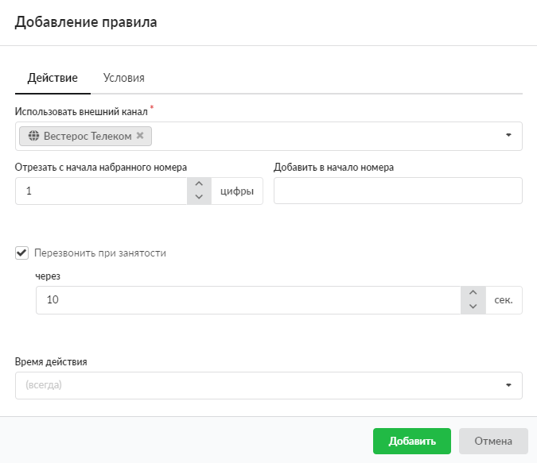

# Звонок через внешний канал

Данное правило предназначено для маршрутизации вызова через конкретного провайдера и преобразования набранного номера.

---

Чтобы добавить правило **«Звонок через внешний канал»**, выполните следующие действия:

1. Перейдите в меню **Телефония > Правила**.
2. Выберите папку с набором правил и нажмите кнопку **«Добавить»** и выберите **«Звонок через внешний канал»**.

3. На вкладке **«Действие»** в поле **«Использовать внешний канал»** укажите провайдера или туннель, созданные на ИКС.
4. В соответствующих полях можно указать, **сколько** цифр с начала номера необходимо заменить и на **какие**.

5. Если установлен флаг **«Перезвонить при занятости»**, можно задать время, по истечении которого вызов будет совершен повторно при недоступности провайдера (в секундах).
6. Если требуется, укажите [время действия](https://doc.a-real.ru/index.php?article=196#time) правила.
7. На вкладке **«Условия»** задайте условия срабатывания правила по аналогии с [правилом](https://doc.a-real.ru/index.php?article=250) **«Повесить трубку»**.
8. Нажмите **«Добавить»** — новое правило появится в списке.

> ⚠ Внимание! Телефонный номер должен состоять как минимум из трех цифр.

### Особенности функционирования

В ИКС может быть настроено несколько провайдеров и (или) несколько туннелей. Тогда при создании правила с несколькими внешними каналами (провайдеры и (или) туннели) либо при создании нескольких правил (для каждого канала свое правило) в рамках одного набора правил ИКС будет вести себя следующим образом:

- не будет производиться попытка вызова на выключенные каналы;
- попытка вызова будет производиться в зависимости от порядка занесения каналов в правило;
- если звонок завершился хорошо, то считается, что набор правил был выполнен и закончен. Хорошие завершения вызова: 16, 17, 18, 19, 32, 31, 45 (найти значения можно [здесь](https://wiki.merionet.ru/ip-telephoniya/31/hangupcause-v-asterisk-ih-znachiya/)

---

**Источник:** [Документация ИКС — Звонок через внешний канал](https://doc.a-real.ru/index.php?article=254)
