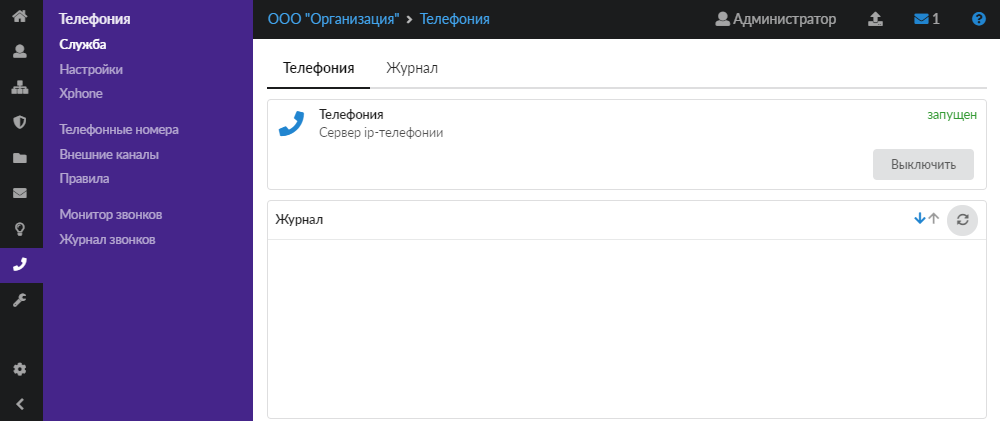
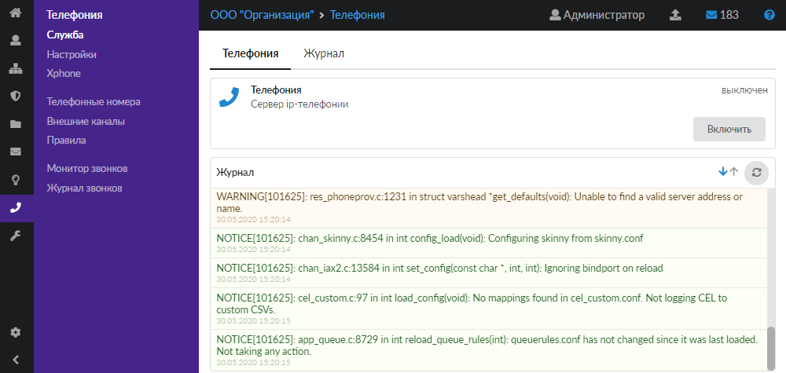
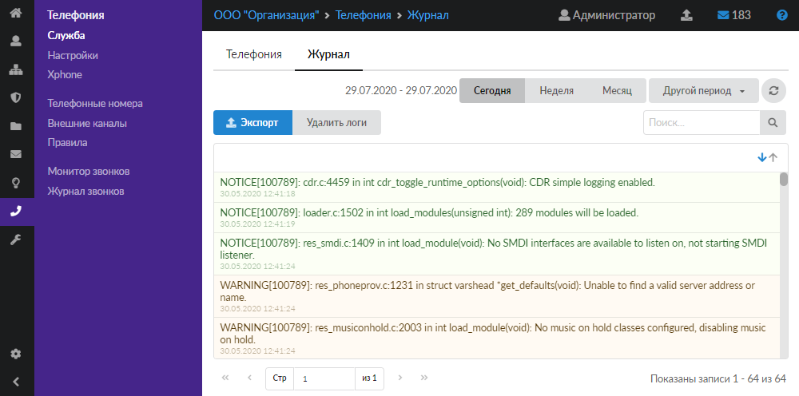

За обработку VoIP-данных в ИКС отвечает служба «Телефония», разработанная на базе сервера IP-телефонии Asterisk.

Для открытия модуля перейдите в меню **Телефония > Служба**.

В модуле расположены следующие вкладки:

- Телефония
- Журнал

## Телефония

На данной вкладке отображаются сведения о службе телефонии.

- статус службы (запущен, остановлен, выключен, не настроен);
- кнопка **Включить** (**Выключить**) — позволяет запустить или остановить службу;
- журнал последних событий.

> ⚠ Внимание! Службу телефонии можно запустить только при наличии хотя бы одного [телефонного номера](/index.php?article=102) или [внешнего канала](/index.php?article=103).

## Журнал

На данной вкладке отображается сводка всех системных сообщений модуля с указанием даты и времени.

[Журнал](/index.php?article=196#summary) является стандартным элементом веб-интерфейса ИКС.
