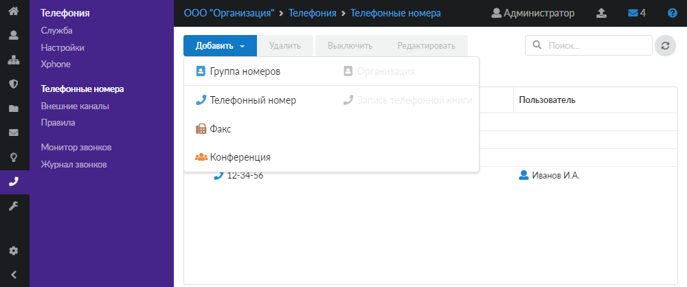
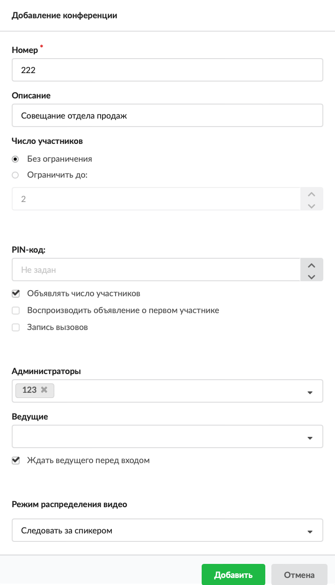

# Конференция

Объект «Конференция» предназначен для определения телефонного номера, при звонке на который каждый абонент будет слышать всех подключенных абонентов, также позвонивших на данный номер.

---

Объект **«Конференция»** предназначен для определения телефонного номера, при звонке на который каждый абонент будет слышать всех подключенных абонентов, также позвонивших на данный номер.

Чтобы добавить конференцию, выполните следующие действия:

1. Перейдите в меню **Телефония &gt; Телефонные номера**.

2. Нажмите на папку с телефонными номерами, а затем — на кнопку **«Добавить»** и выберите **«Конференция»**.

3. Введите **номер** конференции.

4. Укажите **описание** конференции.

5. Определите, требуется ли **ограничивать** количество участников (можно указать значение от 2 до 9999). Установите соответствующий переключатель.

6. В поле **«PIN-код»** можно задать числовой код для доступа в конференцию (значения от 1 до 9999).

7. Если требуется, установите **флаги**:

   - «Объявлять число участников» — определяет, оповещать ли вызывающую сторону о количестве пользователей в конференции;
   - «Воспроизводить объявление о первом участнике» — отвечает за объявление пользователю о том, что он входит в пустую конференцию. Язык диктора зависит от [выбранного языка](https://doc.a-real.ru/index.php?article=113) системы в ИКС;
   - «Запись вызовов» — определяет, включать ли запись аудиозвонка конференции.

8. Поле **«Администраторы»** предназначено для указания номеров пользователей ИКС, которые будут являться [администраторами](#admin) конференции. Они имеют расширенный доступ к [DTMF](#dtmf-menu)-меню.

9. В поле **«Ведущие»** можно указать номера пользователей ИКС, которые будут являться источниками видеосигнала для всех остальных участников конференции (если в **Шаге 10** в блоке **«Режим распределения видео»** выбрано значение «Источник видео — последний вошедший ведущий» либо «Источник видео — первый вошедший ведущий»). Ведущие [имеют](#leading) расширенный доступ к DTMF-меню.

   Пользователи, добавленные как администраторы или ведущие, имеют право добавить нового участника в конференцию, если номер заведен на ИКС. Для этого необходимо нажать * и в течение 15 секунд набрать номер добавляемого участника. Участнику придет вызов, который он должен принять (при этом вызов будет обозначен как вызов от анонима). Если добавленный участник был задан как администратор или ведущий, он добавится как обычный участник и **не сможет управлять конференцией** (в том числе добавлять других участников). Чтобы получить возможности администратора или ведущего, ему необходимо подключиться к конференции самостоятельно.

10. Флаг **«Ждать ведущего перед входом»** определяет, будут ли обычные пользователи, которые зашли в конференцию, ожидать, пока не присоединится хотя бы один ведущий конференции: как только ведущий зайдет в конференцию, она начнет работать и все участники будут слышать друг друга.

11. Поле **«Режим распределения видео»** предназначено для настройки способа распределения видео между участниками конференции. При этом участники видеоконференции должны использовать одинаковый видеокодек. Можно выбрать одно из следующих значений:

    - **«Источник видео не задан»** — указывает, что нет источника видеосигнала по умолчанию, который увидят участники конференции, и источник видеосигнала будет выбран позже при помощи [DTMF-меню](#dtmf-menu);
    - **«Следовать за спикером»** — переключает видеосигнал на говорящего в данный момент участника конференции;
    - **«Источник видео — последний вошедший ведущий»** — выбирает последнего вошедшего в конференцию пользователя, от которого есть видеосигнал и который отмечен как ведущий в качестве единственного источника видео для всех участников конференции. Если данный пользователь покидает конференцию, предыдущий ведущий, от которого поступает видеосигнал, становится источником видео для всех участников конференции;
    - **«Источник видео — первый вошедший ведущий»** — выбирает первого вошедшего в конференцию пользователя, от которого есть видеосигнал и который отмечен как ведущий в качестве единственного источника видео для всех участников конференции. Если данный участник выходит из конференции, то следующий пользователь, отмеченный как ведущий и от которого поступает видеосигнал, становится источником видеосигнала всех участников конференции;
    - **«Источники видео — все пользователи конференции (SFU, pjsip only)»** — включает полноценную видеоконференцию, где каждый участник может транслировать свое видео и видеть несколько видеопотоков других участников. Для корректной работы данного режима в [настройках сервера телефонии](https://doc.a-real.ru/index.php?article=100#block4) необходимо выбрать драйвер канала chan_pjsip. Это рекомендуемый режим работы видеоконференции для использования [Xphone](https://doc.a-real.ru/index.php?article=101).

12. Нажмите **«Добавить»** — новый объект появится в списке.

## DTMF-меню

По умолчанию **всем участникам** конференции доступно следующее DTMF-меню:

1. Выключить свой микрофон
2. Выйти из конференции
3. Уменьшить громкость входящего звука
4. Вернуть громкость к значению по умолчанию
5. Увеличить громкость

Для **администратора** во время конференции доступно расширенное DTMF-меню:

1. Выключить свой микрофон
2. Выйти из конференции
3. Уменьшить громкость входящего звука
4. Вернуть громкость к значению по умолчанию
5. Увеличить громкость
6. Стать единственным источником видео
7. Отменить предыдущий пункт
8. Закрыть/открыть конференцию
9. Удалить из конференции последнего вошедшего

Для **ведущих** во время конференции доступно расширенное DTMF-меню:

1. Выключить свой микрофон
2. Выйти из конференции
3. Уменьшить громкость входящего звука
4. Вернуть громкость к значению по умолчанию
5. Увеличить громкость
6. Стать единственным источником видео
7. Отменить предыдущий пункт

---

**Источник:** [Документация ИКС — Конференция](https://doc.a-real.ru/index.php?article=244)
