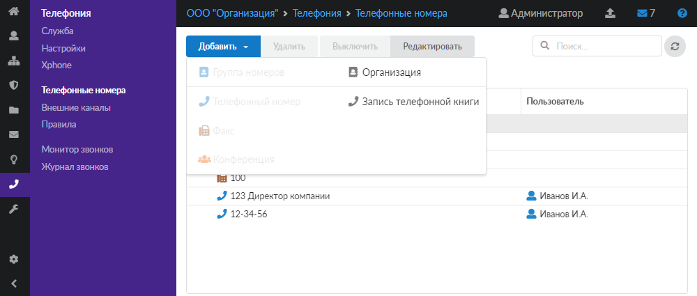
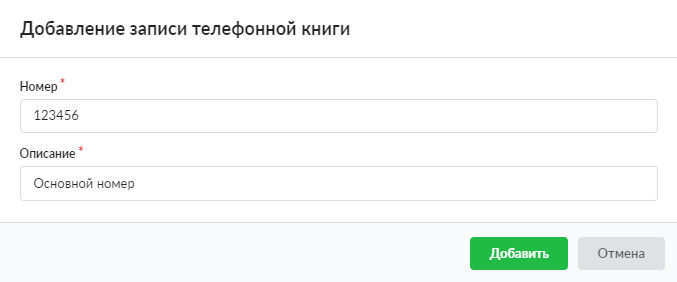

# Телефонная книга

Телефонная книга содержит номера, которые заведены на ИКС, но не являются внутренними. При входящем звонке номер сопоставляется с адресной книгой, и имя передаётся как Caller ID.

---

Телефонная книга содержит номера, которые заведены на ИКС, но не являются внутренними. Когда на ИКС поступает звонок из внешнего канала, номер телефона сопоставляется с данной адресной книгой. Если входящий номер есть в книге, имя будет передано как Caller ID на конечное устройство.

В телефонную книгу можно добавить следующие объекты:

- Запись телефонной книги
- Организация

Записи телефонной книги можно импортировать и экспортировать.

## Добавить запись телефонной книги

Чтобы добавить запись телефонной книги, выполните следующие действия:

1. Перейдите в меню **Телефония > Телефонные номера**.
2. Нажмите на телефонную книгу, а затем — на кнопку **Добавить** и выберите **Запись телефонной книги**.

3. Введите **номер** телефона абонента, не входящего в состав подопечных ИКС (внешний номер абонента).
4. Добавьте **описание**, которое будет отображаться на конечном устройстве принимающего вызов абонента и журнале звонков рядом с соответствующим номером.

5. Нажмите **Добавить** — новый объект появится в списке.

## Добавить организацию

Для объединения внешних абонентов в группу добавьте организацию. Выполните следующие действия:

1. Перейдите в меню **Телефония > Телефонные номера**.
2. Нажмите на телефонную книгу, а затем — на кнопку **Добавить** и выберите **Организация**.

3. Введите **название** организации.

4. Нажмите **Добавить** — новый объект появится в списке.

Созданные ранее номера телефонной книги можно перенести в нужную группу простым перетаскиванием.

## Импорт записей

Для импорта телефонных номеров нажмите одноименную кнопку и выберите файл. Формат данных в файле должен соответствовать формату данных при экспорте либо иметь следующий формат: «телефонный номер, описание», каждый новый абонент с новой строки.

## Экспорт записей

Для экспорта телефонной книги нажмите кнопку . Будет создан файл `ics-<дата-время>-phonebook.txt`. В файле `.txt` используется формат данных JSON.

> ⚠ Экспортируются только телефонные номера, добавленные в телефонную книгу. Внутренние номера ИКС не экспортируются.

---

**Источник:** [Документация ИКС — Телефонная книга](https://doc.a-real.ru/index.php?article=246)
