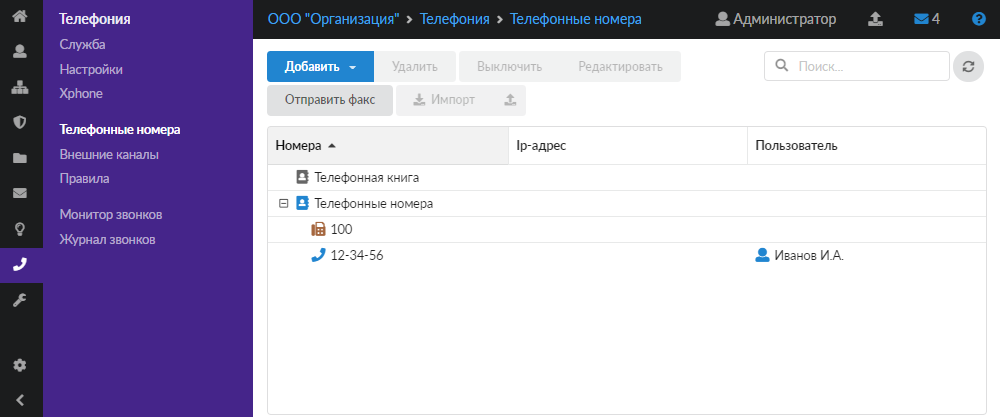

Модуль «Телефонные номера» предназначен для присвоения пользователям ИКС внутренних телефонных номеров и создания телефонной книги.

---

Модуль **«Телефонные номера»** предназначен для присвоения пользователям ИКС внутренних телефонных номеров и создания телефонной книги. Для открытия модуля перейдите в меню **Телефония > Телефонные номера**.

На странице модуля отображается дерево групп и телефонных объектов. В дереве можно добавлять, удалять, выключать или редактировать объекты, отправлять факсы, осуществлять импорт и экспорт при помощи соответствующих кнопок.

В корне дерева расположены две группы объектов:

- [Телефонные номера](#numbers)
- [Телефонная книга](#book)

## Телефонные номера

Данная группа предназначена для занесения телефонных объектов, которые являются внутренними:

- [Телефонный номер](/index.php?article=242)
- [Факс](/index.php?article=243)
- [Конференция](/index.php?article=244)
- [Группа номеров](/index.php?article=245)

> ⚠ **Внимание!** Регистрация некоторых устройств (отображение IP-адреса) может сохраняться до 1 часа, даже если устройство было отключено.

Если количество включенных телефонных номеров достигнет лимита лицензии ИКС Lite, то в нижнем левом углу появится соответствующее сообщение: «Достигнут лимит включенных номеров, разрешенных лицензией: 9».

## Телефонная книга

Данная группа используется для номеров, которые заведены на ИКС, но не являются внутренними. Номера телефонов тех звонков, которые приходят на ИКС из внешних каналов, сопоставляются с записями [телефонной книги](/index.php?article=246). Если входящий номер есть в данной книге, имя будет передано как [Caller ID](/index.php?article=24#caller_id) на конечное устройство.

> ⚠ Видео: [https://vk.com/video_ext.php?oid=-18503994&id=456239337&hd=2](https://vk.com/video_ext.php?oid=-18503994&id=456239337&hd=2)
