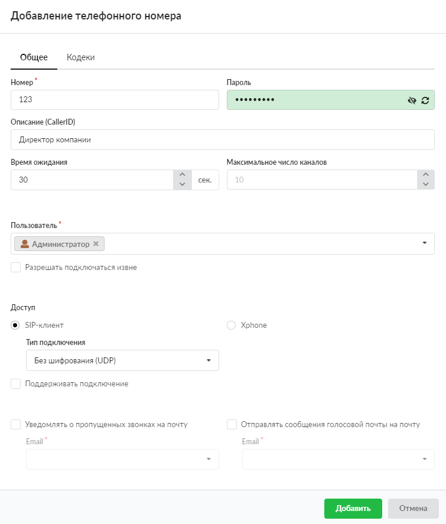
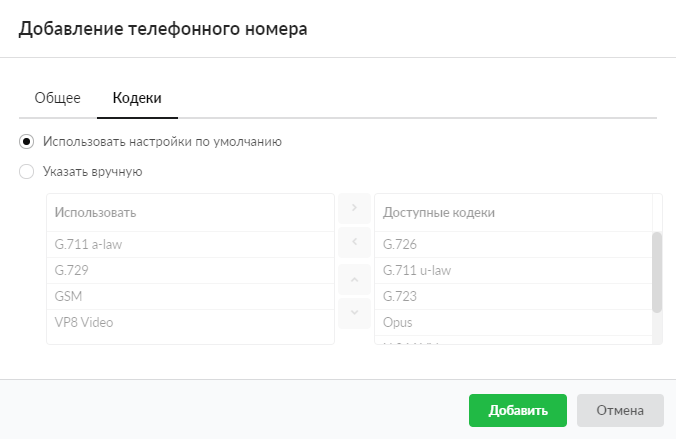

Объект «Телефонный номер» используется для совершения звонков через сервер телефонии.

---

Для телефонных номеров в списке отображаются IP-адреса, на которые зарегистрированы номера и пользователи, закрепленные за данными номерами.

Чтобы добавить телефонный номер, выполните следующие действия:

1. Перейдите в меню **Телефония &gt; Телефонные номера**.

2. Нажмите на папку с телефонными номерами, а затем — на кнопку **«Добавить»** и выберите **«Телефонный номер»**.

3. На вкладке **«Общее»** введите **номер** (не менее трех цифр) и **пароль**. Пароль можно сгенерировать автоматически — просто нажмите на кнопку . Если введенный пароль будет слабым, поле ввода подсветится красным цветом, а телефонный номер невозможно будет добавить. Для добавления номера пароль должен иметь средний либо высокий уровень сложности (поля ввода подсвечиваются бледно-зеленым либо ярко-зеленым цветом соответственно).

4. Если требуется, введите краткое **описание** телефонного номера, которое будет отображаться в [правилах телефонии](../pravila-telefonii/pravila-telefonii-obzor-2.md) и в [журнале звонков](../zhurnal-zvonkov-2.md) рядом с соответствующим номером, а также будет использоваться как [Caller ID](../../o-dokumentacii/slovar-terminov-3.md).

5. В поле **«Время ожидания»** можно задать период времени, по истечении которого сервер телефонии посчитает абонента не ответившим на звонок. По умолчанию данный параметр задается в [настройках сервера телефонии](../nastroyki-servera-telefonii-3.md).

6. Поле **«Максимальное число каналов»** определяет число каналов, которые номер может использовать.

7. В поле **«Пользователь»** выберите пользователя ИКС, к которому будет прикреплен номер.

8. Флаг **«Разрешать подключаться извне»** определяет, будет ли доступен номер для подключения из внешних сетей.

> ⚠ Внимание! Если флаг «Разрешить подключаться извне» установлен для телефонного номера, рекомендуется установить сложный пароль, чтобы он не был подобран злоумышленниками.

9. При помощи переключателя выберите, как будет осуществляться **доступ**.

**SIP-клиент**

В поле **«Тип подключения»** можно выбрать, использовать ли шифрование [SIP](../../o-dokumentacii/slovar-terminov-3.md)-пакетов и медиаданных ([RTP](../../o-dokumentacii/slovar-terminov-3.md)) для выбранного номера с помощью сертификата, который установлен при [настройке сервера телефонии](../nastroyki-servera-telefonii-3.md) в поле **«Сертификат для шифрования (TLS и SRTP)»**. Возможны следующие варианты подключения:

- без шифрования ([UDP](../../o-dokumentacii/slovar-terminov-3.md)) — выбрано по умолчанию;
- без шифрования ([TCP](../../o-dokumentacii/slovar-terminov-3.md));
- с шифрованием (TLS и SDES-sRTP) — включает шифрование. Активирует одновременное шифрование SIP-сигнализации через [TLS](../../o-dokumentacii/slovar-terminov-3.md) и sRTP-медиаданных.

Каждый тип подключения требует соответствующей установки своего транспорта. Данная установка задается в [настройках сервера телефонии](../nastroyki-servera-telefonii-3.md).

При установке флага **«Поддерживать подключение»** ИКС будет отправлять SIP-сообщение типа OPTIONS для проверки, что SIP-устройство работает и доступно к совершению вызовов. Если устройство не отвечает, ИКС считает его выключенным и недоступным для совершения вызовов. Данный функционал также может использоваться для сохранения UDP-сессии, если SIP-устройство расположено за [NAT](../../o-dokumentacii/slovar-terminov-3.md).

**Xphone**

Отвечает за доступ к внутреннему номеру веб-софтфона [Xphone](https://doc.a-real.ru/index.php?article=101).

> ⚠ Внимание! В данном режиме работы доступ к номеру будет только для веб-софтфона Xphone. Для всех остальных SIP-телефонов данный номер не будет доступен. Xphone использует шифрование медиаданных только DTLS-sRTP, поэтому добавочный номер конфигурируется с использованием только данного типа шифрования.

10. При установке флагов **«Уведомлять о пропущенных звонках на почту»** и **«Отправлять сообщения голосовой почты на почту»** активируются поля для указания соответствующих адресов.

> ⚠ Внимание! Флаг **«Отправлять сообщения голосовой почты на почту»** будет доступен только в том случае, если в [настройках сервера телефонии](../nastroyki-servera-telefonii-3.md) включена опция **«Отправлять сообщения голосовой почты на e-mail»**.

11. Перейдите на вкладку **«Кодеки»**. По умолчанию для номера используются кодеки, указанные в [настройках сервера телефонии](../nastroyki-servera-telefonii-3.md). Если требуется, укажите кодеки вручную: установите соответствующий переключатель и выберите кодеки из списка доступных.

> ⚠ Внимание! Если с данного номера будут совершаться видеозвонки, необходимо выбрать хотя бы один из следующих кодеков: VP8, VP9, H.264.

> ⚠ Внимание! Начиная с версии ИКС 11.2 появился новый кодек G.722 HD. При звонках с использованием этого кодека заметно улучшается качество голоса.

12. Нажмите **«Добавить»**. Если ранее не была создана [DNS-зона](../../set/dns/dnszona-2.md) с соответствующими записями относительно [имени системы](../../obsluzhivanie/sistema-2.md) и создается первый телефонный номер, ИКС предложит добавить соответствующие записи и включить [Fail2ban](https://doc.a-real.ru/index.php?article=77) для защиты сервера телефонии — нажмите **«Ок»**.

> ⚠ Внимание! В случае отказа от создания DNS-зоны и включения Fail2ban сервер телефонии ИКС будет запущен. При этом считается, что **пользователь с ролью администратора берет ответственность на себя**.
