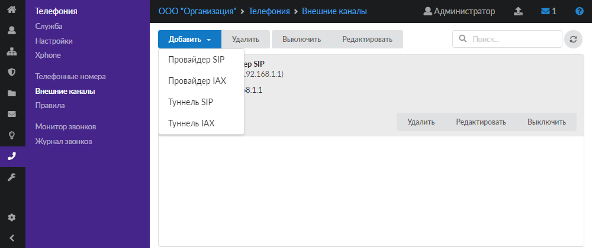
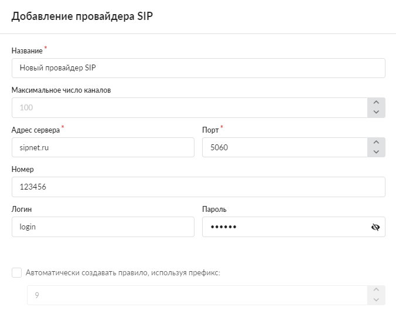
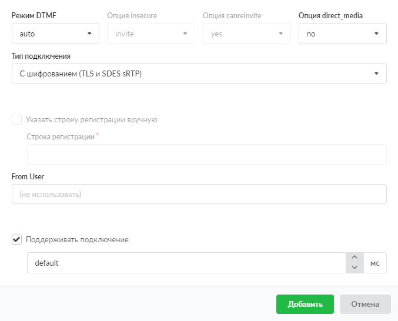
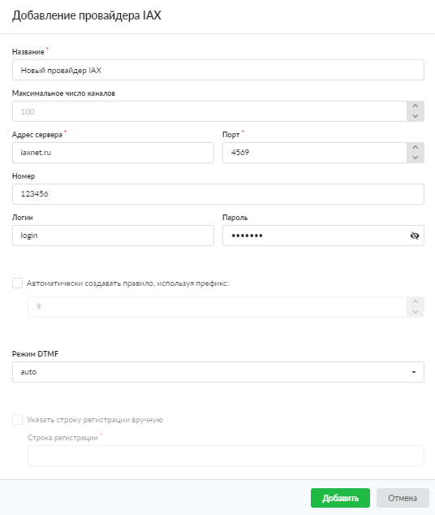

В ИКС поддерживаются следующие виды внешних каналов: провайдер SIP и провайдер IAX.

---

В ИКС поддерживаются следующие виды внешних каналов:

- Провайдер SIP
- Провайдер IAX

## Провайдер SIP

Данный провайдер предназначен для установки соединения с использованием протокола [SIP](../../o-dokumentacii/slovar-terminov-3.md).

Чтобы настроить новый канал, выполните следующие действия:

1. Перейдите в меню **Телефония > Внешние каналы**.
2. Нажмите на кнопку **«Добавить»** и выберите **«Провайдер SIP»**.

3. Введите **название** канала.
4. Поле **«Максимальное число каналов»** предназначено для указания максимального числа одновременных соединений через провайдера. По умолчанию установлено значение 100.

5. Укажите **адрес сервера** и **порт** провайдера IP-телефонии для подключения.

> ⚠ Внимание! При выборе порта необходимо учитывать значение поля **«Тип подключения»**, так как обычно провайдеры предоставляют возможность подключения для разных протоколов на разных портах.

6. Если требуется, введите внешний **номер** для совершения звонков через сервер телефонии ИКС.
7. В полях **«Логин»** и **«Пароль»** можно задать данные для авторизации при подключении ИКС к серверу провайдера.
8. При установке флага **«Автоматически создавать правило, используя префикс»** укажите префикс внешнего звонка по умолчанию. Данный префикс представляет собой цифру, по которой модуль ориентируется, направлять ли звонок во внешнюю сеть. Например, звонок на номер 555-3333 при указанном префиксе 9 будет набираться клиентом как 9-555-3333.
9. Поля **«Режим DTMF»**, **«Опция insecure»**, **«Опция canreinvite»** позволяют настроить режимы тонального набора, при этом два последних поля доступны только при выборе драйвера chan_sip в [настройках телефонии](../nastroyki-servera-telefonii-3.md). Поле **«Опция direct_media»** доступно только для драйвера chan_pjsip и определяет, могут ли медиаданные передаваться напрямую между конечными точками. Если нет (значение no), то все RTP-потоки проходят через [Asterisk](../../o-dokumentacii/slovar-terminov-3.md).

10. В поле **«Тип подключения»** можно выбрать, использовать ли шифрование SIP-пакетов и медиаданных (RTP) для выбранного номера с помощью сертификата, который установлен при [настройке сервера телефонии](../nastroyki-servera-telefonii-3.md) в поле **«Сертификат для шифрования (TLS и SRTP)»**. Возможны следующие варианты подключения:

    - без шифрования ([UDP](../../o-dokumentacii/slovar-terminov-3.md)) — выбрано по умолчанию;
    - без шифрования ([TCP](../../o-dokumentacii/slovar-terminov-3.md));
    - с шифрованием (TLS и SDES-sRTP) — включает шифрование. Активирует одновременное шифрование SIP-сигнализации через [TLS](../../o-dokumentacii/slovar-terminov-3.md) и sRTP-медиаданных.

    Каждый тип подключения требует соответствующей установки своего транспорта, которая задаётся в [настройках сервера телефонии](../nastroyki-servera-telefonii-3.md).

11. ИКС создаёт автоматическую **строку регистрации** вида `register=логин:пароль@ip-адрес или домен провайдера:5060/номер`.

> Пример

> `register=login:1q2w3e@192.168.17.143:5060/123`
>
> где:
>
> `login` — логин;
>
> `1q2w3e` — пароль;
>
> `192.168.17.143` — IP-адрес провайдера;
>
> `5060` — порт;
>
> `123` — номер телефона.

Если провайдер имеет специфические настройки, следует **полностью прописать строку регистрации**, установив соответствующий флаг. При этом перед данными необходимо прописать: `register=`. Строка регистрации доступна только для драйвера chan_sip. Для драйвера chan_pjsip она создаётся автоматически.

> ⚠ Внимание! В некоторых случаях провайдер SIP-телефонии не может распознать абонента, набирающего внешний вызов. Если при регистрации провайдера работают входящие звонки, но не проходят исходящие, в поле **«From User»** укажите номер телефона либо логин подключения (в зависимости от особенностей провайдера).

12. При установке флага **«Поддерживать подключение»** ИКС будет отправлять SIP-сообщение типа OPTIONS для проверки, что SIP-устройство работает и доступно к совершению вызовов. Если устройство не отвечает, ИКС считает его выключенным и недоступным для совершения вызовов. Данный функционал также может использоваться для сохранения UDP-сессии, если SIP-устройство расположено за [NAT](../../o-dokumentacii/slovar-terminov-3.md).
13. Нажмите **«Добавить»** — новый объект появится в списке.

## Провайдер IAX

Данный провайдер предназначен для установки соединения с использованием протокола [IAX](../../o-dokumentacii/slovar-terminov-3.md).

Чтобы настроить новый канал, выполните следующие действия:

1. Перейдите в меню **Телефония > Внешние каналы**.
2. Нажмите на кнопку **«Добавить»** и выберите **«Провайдер IAX»**.

3. Заполните поля открывшегося окна по аналогии с [провайдером SIP](provaydery-telefonii-2.md).

4. Нажмите **«Добавить»** — новый объект появится в списке.
