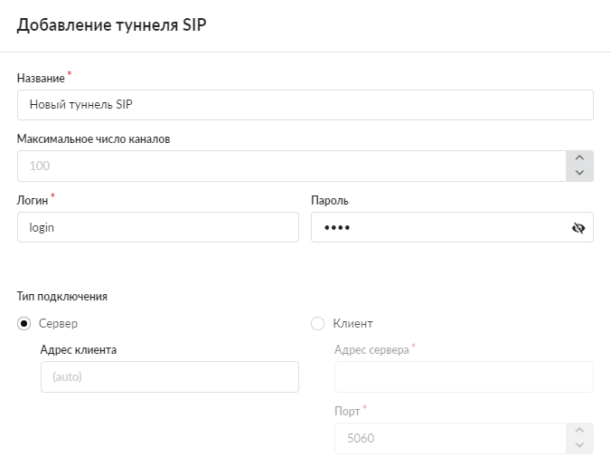
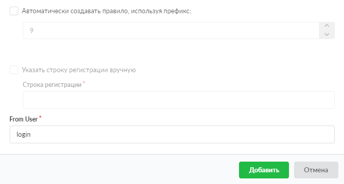
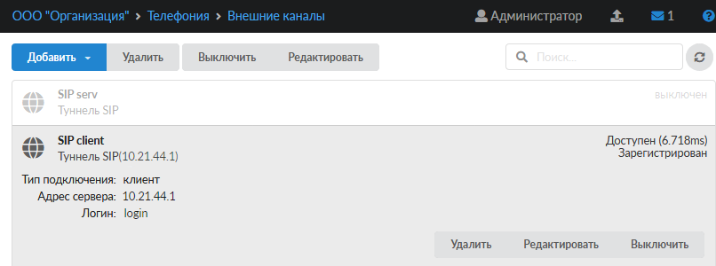
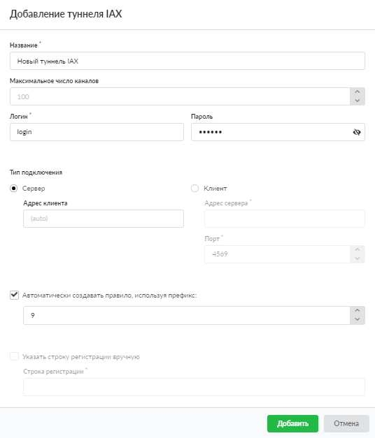

Тунели предназначены для соединения серверов телефонии нескольких ИКС.

---

Тунели предназначены для соединения серверов телефонии нескольких ИКС.

В системе поддерживаются следующие виды туннелей по аналогии с [провайдерами](provaydery-telefonii-2.md):

- [Туннель SIP](#sip)
- [Туннель IAX](#iax)

Внимание! Логины IAX-туннелей должны быть уникальными. Два и более IAX-туннеля не должны иметь один и тот же логин, также логин не должен совпадать с внутренним номером телефона. Данное утверждение верно и для SIP-туннелей.

Создаваемый телефонный номер не должен совпадать с логином туннеля.

У SIP- и IAX-туннеля логины могут совпадать, так как это два разных протокола, которые используют разные порты.

## Туннель SIP

Данный туннель предназначен для установки соединения с использованием протокола [SIP](../../o-dokumentacii/slovar-terminov-3.md).

Чтобы настроить новый туннель, выполните следующие действия:

1. Перейдите в меню **Телефония > Внешние каналы**.

2. Нажмите на кнопку **«Добавить»** и выберите **«Туннель SIP»**.

   

3. Введите **название** туннеля.

4. Поле **«Максимальное число каналов»** предназначено для указания максимального числа одновременных соединений через туннель. По умолчанию установлено значение 100.

   

5. В полях **«Логин»** и **«Пароль»** можно задать данные для авторизации при подключении ИКС к серверу провайдера.

6. В блоке **«Тип подключения»** при помощи переключателя выберите, будет ли ИКС выступать в роли внешнего сервера телефонии или подключаться к внешнему серверу SIP-телефонии без использования номера на внешнем сервере (по аналогии с настройками [SIP-провайдера](provaydery-telefonii-2.md)):

   - тип **«Сервер»** — ИКС будет ожидать подключения клиентов по внешнему каналу;
   - тип **«Клиент»** — укажите адрес и порт сервера для создания туннеля.

7. При установке флага **«Автоматически создавать правило, используя префикс»** укажите префикс внешнего звонка по умолчанию. Данный префикс представляет собой цифру, по которой модуль ориентируется, направлять ли звонок во внешнюю сеть. Например, звонок на номер 555-3333 при указанном префиксе 9 будет набираться клиентом как 9-555-3333.

   

8. Нажмите **«Добавить»** — новый объект появится в списке.

При нажатии на туннель в списке отобразится основная информация о нем. У туннеля в режиме «клиент» также будет показана доступность другого конца туннеля (другого ИКС). Статус регистрации обновляется каждый час.

## Туннель IAX

Данный туннель предназначен для установки соединения с использованием протокола [IAX](../../o-dokumentacii/slovar-terminov-3.md).

Чтобы настроить новый туннель, выполните следующие действия:

1. Перейдите в меню **Телефония > Внешние каналы**.

2. Нажмите на кнопку **«Добавить»** и выберите **«Туннель IAX»**.

   

3. Заполните поля открывшегося окна по аналогии с [туннелем SIP](#sip).

   

   
   Внимание! Логин туннеля должен быть уникальным, а также не должен совпадать с [внутренним номером](../telefonnye-nomera/telefonnyy-nomer-2.md) телефона, так как данный номер тоже может работать через IAX-подключение.
   

4. Нажмите **«Добавить»** — новый объект появится в списке.
