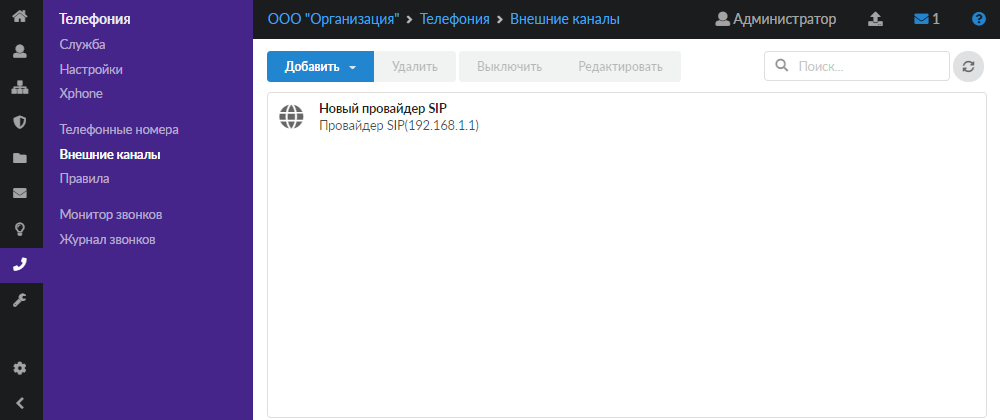
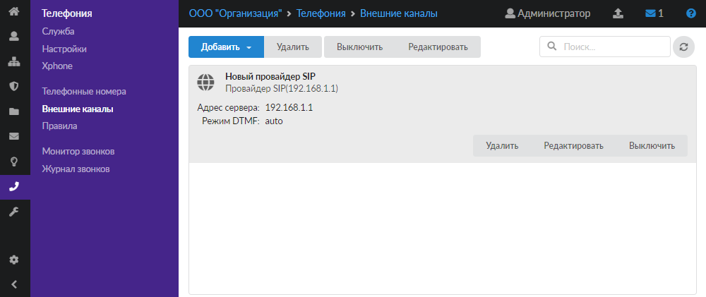

За настройку входящих и исходящих звонков во внешнюю сеть отвечает модуль «Внешние каналы».

---

Система ИКС позволяет обмениваться звонками между сотрудниками организации внутри сети без каких-либо дополнительных настроек. Чтобы настроить входящие и исходящие звонки во внешнюю сеть, необходимо добавить хотя бы один внешний канал связи.

В ИКС поддерживаются два вида [каналов](provaydery-telefonii-2.md) — [SIP](../../o-dokumentacii/slovar-terminov-3.md) и [IAX](../../o-dokumentacii/slovar-terminov-3.md), а также два вида аналогичных [туннелей](tunneli-telefonii.md), предназначенных для соединения телефонии двух ИКС.

За настройку входящих и исходящих звонков во внешнюю сеть отвечает модуль **«Внешние каналы»**. Для открытия модуля перейдите в меню **Телефония > Внешние каналы**.

На странице модуля расположен список всех внешних каналов. При нажатии на объект отображается имя канала, адрес сервера, номер, логин, правило и режим [DTMF](../../o-dokumentacii/slovar-terminov-3.md).

Любой объект списка можно **отредактировать** или **удалить**, **включить** (**выключить**) при помощи соответствующих кнопок.

