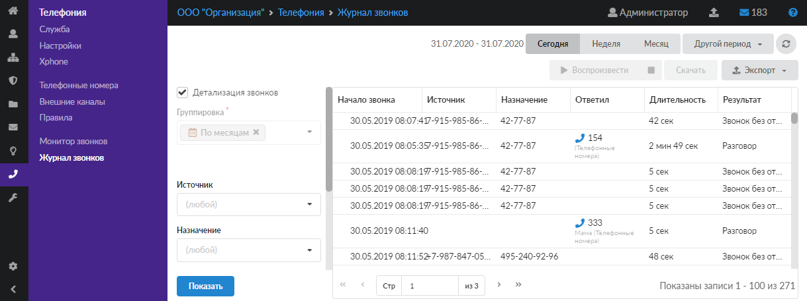
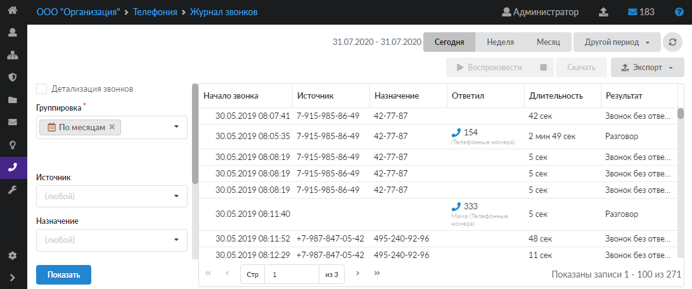
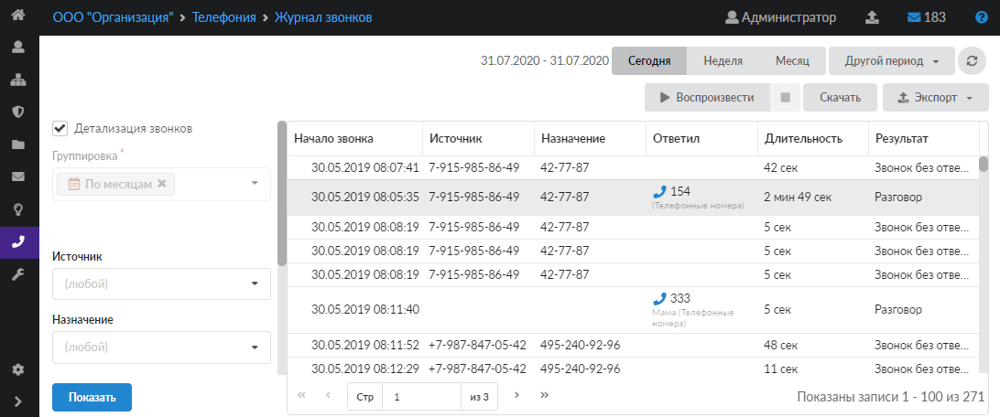

В модуле «Журнал звонков» отображаются все входящие в систему и исходящие из системы звонки, в том числе перенаправленные и неотвеченные. Чтобы открыть модуль, перейдите в меню **Телефония > Журнал звонков**.

В левой части страницы расположены инструменты для выбора параметров, по которым будет выводиться список звонков. В правой части вкладки выводятся результаты фильтрации в зависимости от заданных параметров.

Флаг **«Детализация звонков»** предназначен для просмотра всех звонков за период. При установке данного флага поле «Группировка» становится неактивным.

Поле **«Группировка»** предназначено для формирования отчета по времени (по месяцам, дням, часам), источникам либо назначениям. Возможен выбор только одного значения для группировки записей.

В полях **«Источник»**, **«Назначение»** и **«Ответил»** можно выбрать записи, соответствующие столбцы которых подходят под заданные значения. Предусмотрена возможность выбрать номер (группу номеров), заведенный в ИКС, либо указать его вручную. Также в данных полях предусмотрен выбор туннелей SIP и IAX.

Поле **«Результат»** предназначено для фильтрации записей по типу звонка: разговор, звонок без ответа, линия занята, ошибка соединения.

- Если результатом вызова является «Разговор», в столбце «Длительность» указывается время фактического разговора между сторонами А и B (учет времени начинается после поднятия трубки стороной B).
- Если результатом вызова является «Разговор», в столбце «Назначение» не указывается номер назначения.
- Если результатом вызова является «Звонок без ответа», в столбце «Длительность» указывается время вызова абонента B.

> ⚠ Внимание! Описанные выше правила результатов вызова действуют начиная с версии ИКС 9.0 при условии, что данная версия была установлена с нуля либо в [константах](../konstanty/konstanty-obzor-3.md) включен новый диалплан (номерной план).

В полях **«Время с»** и **«по»** можно указать временной промежуток для фильтрации записей.

После установки всех необходимых параметров нажмите кнопку **«Показать»** — результаты статистики будут представлены справа в виде таблицы. Столбцы таблицы варьируются в зависимости от применяемого фильтра.

Если в [настройках](nastroyki-servera-telefonii-3.md) сервера телефонии установлен флаг **«Записывать звонки»** и длительность разговора составляет более 5 секунд, такой звонок можно **воспроизвести** или **скачать** в формате `mp3`. Для этого просто нажмите на нужный звонок в списке, а затем — на соответствующую кнопку.

Выбор **временного периода** отображения и **экспорт** данных осуществляются так же, как в [стандартном журнале](../vebinterfeys-iks/standartnye-elementy-vebinterfeysa.md) ИКС.
