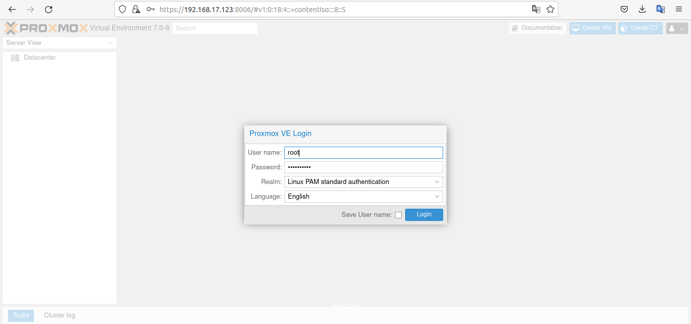
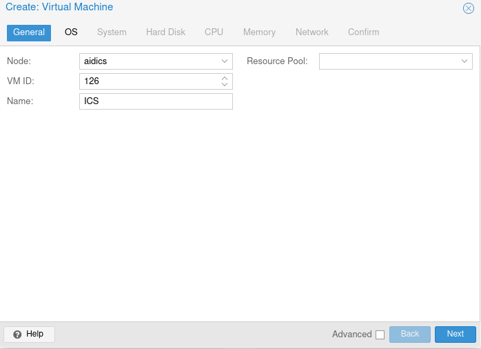
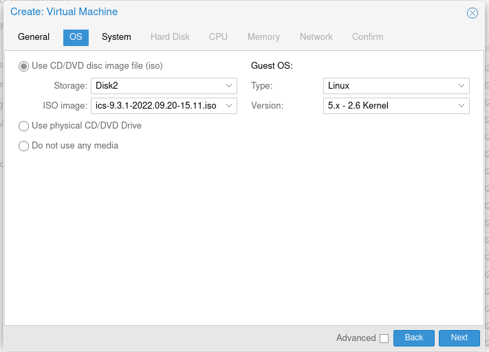
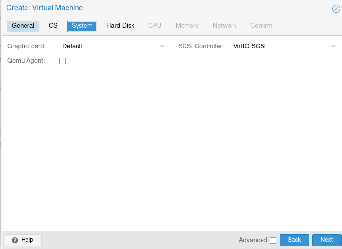
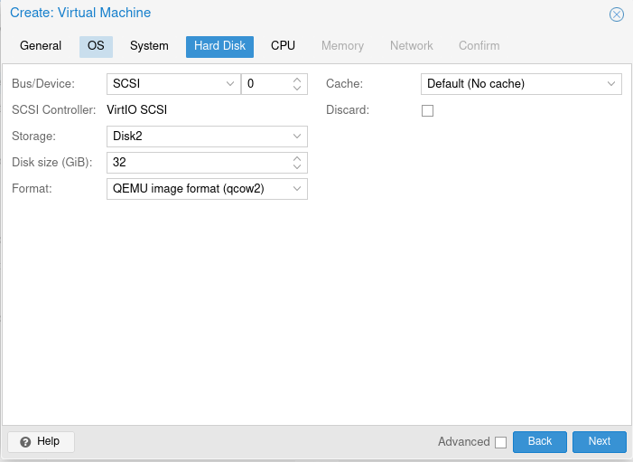
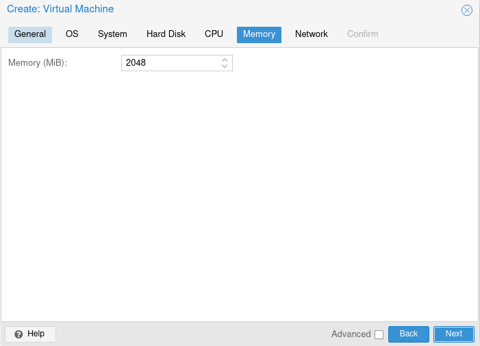
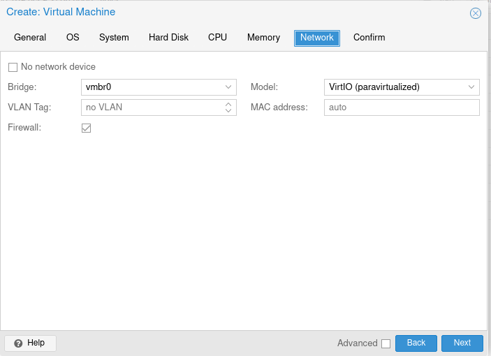
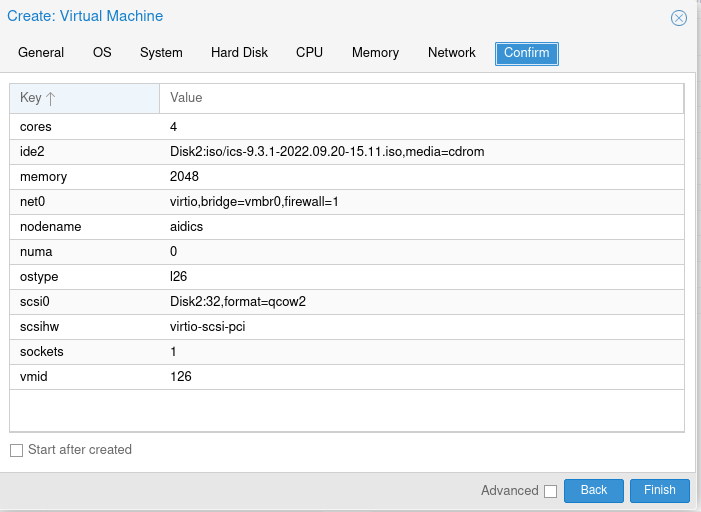
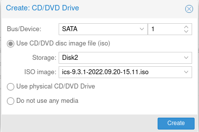
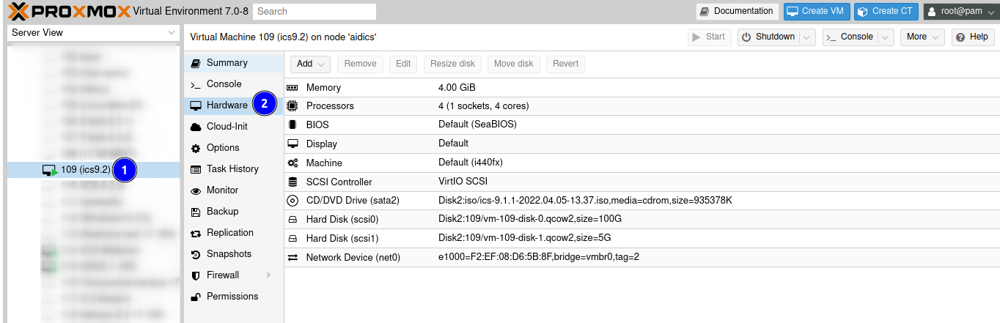

# Установка ИКС на Proxmox Virtual Environment

Proxmox Virtual Environment — это система виртуализации с открытым исходным кодом, которая основана на Debian GNU/Linux.

---

Для установки ИКС на Proxmox выполните следующие действия:

1. Авторизуйтесь в панели управления Proxmox.

   

2. Со стартовой страницы перейдите в **хранилище**. Это можно сделать через основную панель либо правую панель: кликните по пункту с иконкой жесткого диска (перед этим раскройте раскрывающийся список в правой панели). В нашем примере диск имеет название «Disk2(aidics)».

3. Выберите «Файл ISO-образа» и нажмите **«Upload»**. Файл будет загружен.

   

4. После успешной загрузки для создания новой виртуальной машины внутри гипервизора в правом верхнем углу веб-интерфейса нажмите **«Create VM»**. Откроется окно настройки.

   

5. Укажите **имя** виртуальной машины.

   

6. Перейдите на вкладку **«OS»** и выберите **«Файл ISO-образа»**, который ранее загрузили в хранилище PVE.

   

7. На вкладке **«System»** выберите **тип контроллера** дисков VirtIO SCSI. Остальные настройки можно оставить по умолчанию.

   

8. Перейдите на вкладку **«Hard Disk»** и настройте параметры диска виртуальной машины. Укажите **размер виртуального диска** (не менее 30 Гб).

9. Здесь также можно выбрать один из двух **типов виртуальных дисков**: raw (лучшая производительность) или qcow2 (расширенный функционал и поддержка снапшотов).

   

10. Укажите **количество ядер** виртуальной машины и **количество оперативной памяти**.

    

    

11. Перейдите на вкладку **«Network»**. Выберите **сетевой интерфейс** «Bridge» и **тип виртуальной карты**.

    

12. Проверьте все настройки и нажмите **«Finish»**.

    

13. После создания виртуальной машины в Proxmox откройте ее настройки (**«Hardware»**) и добавьте еще один CD/DVD-привод.

14. Выберете хранилище PVE и файл «Файл ISO-образа», нажмите **«Create»**. Вернитесь обратно в **«Console»**.

    

15. Нажмите **«Start»** — виртуальная машина будет запущена.

    

16. Начнется загрузка установщика ИКС по аналогии с обычной установкой ИКС на компьютер.

---

**Источник:** [Документация ИКС — Установка ИКС на Proxmox Virtual Environment](https://doc.a-real.ru/index.php?article=411)
