Процесс установки ИКС состоит из нескольких шагов.

## Шаг 1. Запись диска.

1. Для получения дистрибутива программы заполните специальную форму на [сайте](https://xserver.a-real.ru/#sect-download). На почту придет письмо со ссылками для скачивания. Перейдите по нужной ссылке и скачайте дистрибутив.
2. Запишите скачанный ISO-образ на компакт-диск. Сделать это можно практически любой программой для записи компакт-дисков, например: Nero Burning ROM, Alcohol 120%, CDBurnerXP, UltraISO и др.

> ⚠ Внимание: Записывать ISO-образ на диск необходимо именно в режиме «записать образ».

3. Загрузитесь с компакт-диска на том устройстве (компьютере, планшете, ноутбуке), на котором будет работать ИКС. Минимальные требования к оборудованию, на котором будет работать ИКС, можно посмотреть [здесь](/index.php?article=320). Для загрузки с установочного диска включите в BIOS оборудования опцию загрузки с CD-ROM.

> ⚠ Внимание: Установка с диска не всегда возможна. Зачастую причиной является включенный режим UEFI. Необходимо его выключить. Если данная операция не помогла, произведите установку с [флешки](/index.php?article=38).

## Шаг 2. Загрузка.

1. После загрузки с установочного диска на экране появятся сообщения загрузчика.

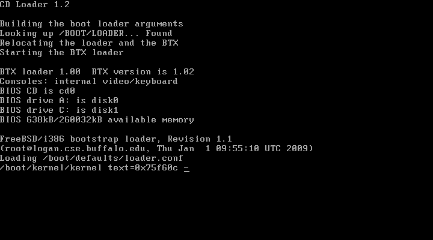

2. Дождитесь окончания процесса загрузки — на экране появится приветствие и окно выбора **языка** установки.

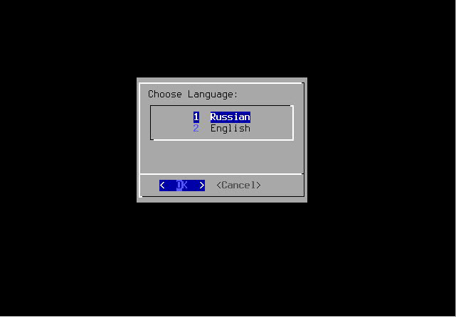

3. Примите лицензионное соглашение. Выберите вариант работы **«Установка»**.

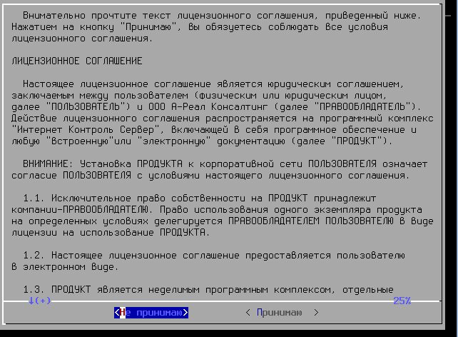

4. Выберите текущий **часовой пояс**.

> ⚠ Внимание: ИКС использует время UTC (всемирное координированное время). Перед установкой или запуском ИКС настройте время в BIOS, чтобы при старте ИКС сместил время верно в соответствии с вашим часовым поясом.

При необходимости часовой пояс можно будет изменить в [модуле](../obsluzhivanie/vremya-i-data.md) **«Время и дата»**. После изменения часового пояса перезагрузите сервер, иначе не все модули смогут логировать свои события по установленной временной зоне.

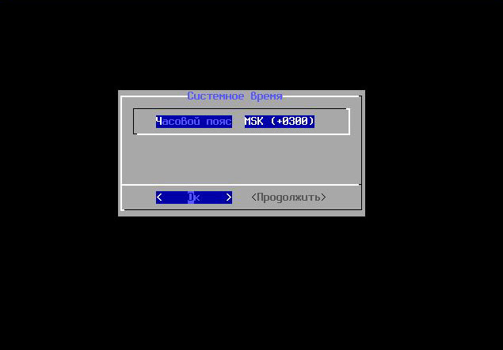

Переключение между кнопками в режиме установки системы осуществляется при помощи клавиши **<Tab>**.

## Шаг 3. Настройка сети.

1. Основное управление сервером будет осуществляться через веб-интерфейс. Для того чтобы получить доступ к **веб-интерфейсу** после установки, укажите серверу сетевой адаптер, который подключен к вашей локальной сети.

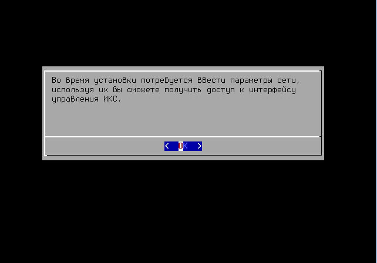

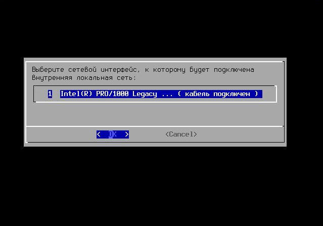

2. Задайте **настройки IPv4**: IP-адрес, маску сети и шлюз по умолчанию (необязательный параметр) для выбранного сетевого интерфейса.

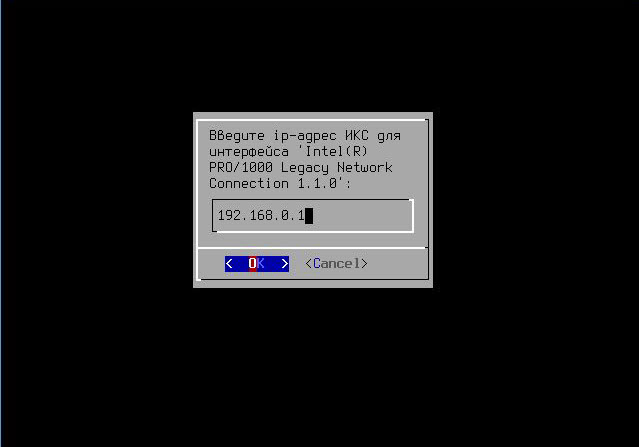

> ⚠ Внимание: Шлюз по умолчанию будет удален в случае добавления [локальной сети](/index.php?article=200) в веб-интерфейсе ИКС либо изменен в случае добавления [провайдера](/index.php?article=201).

3. Введите **имя системы (hostname)** для ИКС. В дальнейшем его можно [изменить](../obsluzhivanie/sistema-2.md).

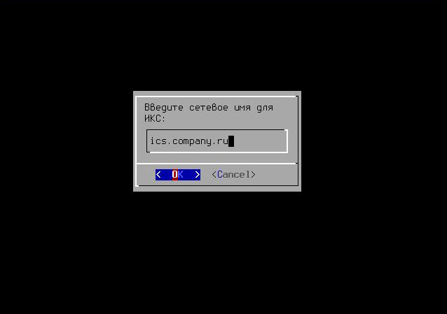

4. Если все настройки указаны верно, нажмите **«Yes»**.

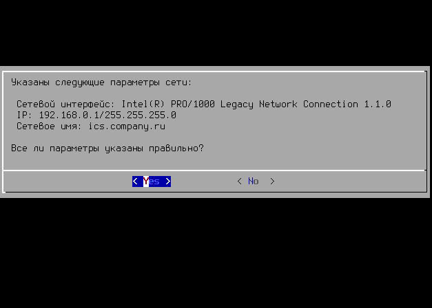

## Шаг 4. Выбор диска.

1. Выберите параметр **RAID** для ИКС. По умолчанию это RAID-1 (mirror). Параметр RAID-1 не обязывает сразу иметь несколько жестких дисков, их можно добавить позже.
2. Укажите **жесткий диск**, на который будет производиться установка. В случае установки на RAID-1 можно выбрать необходимое количество доступных жестких дисков, на которые произойдет установка ИКС, они будут объединены в mirror.

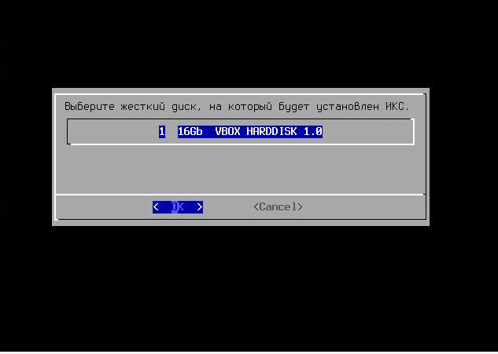

Минимальный объем жесткого диска зависит от задач, выполняемых сервером. Для большинства задач с небольшим количеством пользователей и без хранения значительного объема данных (почта, файлы, длительное хранение статистики) достаточно жесткого диска в 120 Гб.

Программа установки самостоятельно разметит и отформатирует жесткий диск. Никакая предварительная разметка не требуется.

3. Подтвердите действие.

> ⚠ Внимание: Все данные на выбранном диске будут безвозвратно удалены!

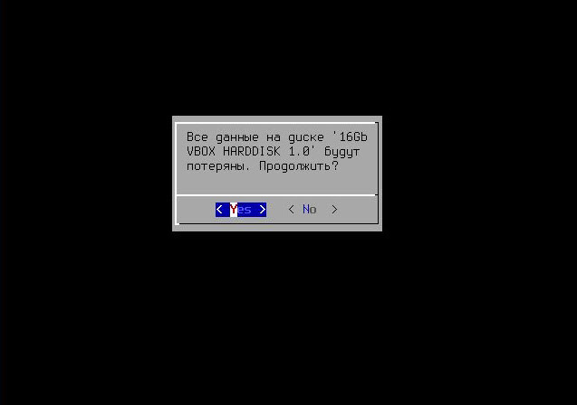

4. Запустится процесс копирования файлов на жесткий диск. Как правило, этот процесс занимает несколько минут.

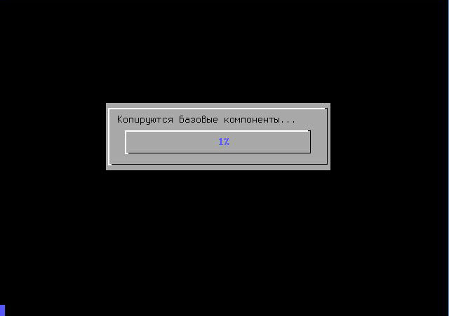

5. Устройство перезагрузится. Запустится процесс установки компонентов ИКС.

## Шаг 5. Завершение установки.

После завершения установки ИКС на экране появится следующее сообщение:

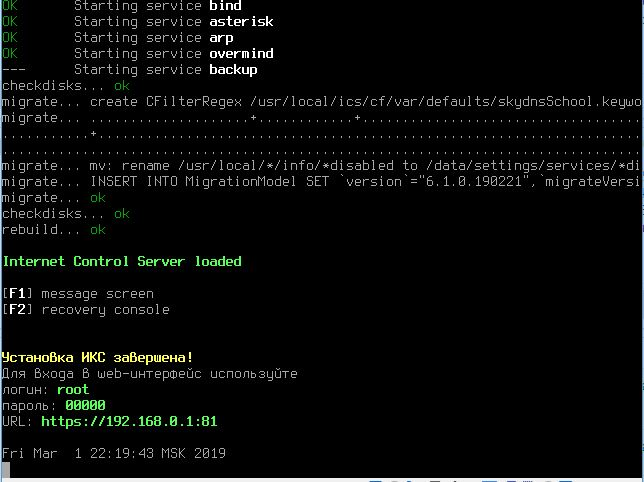

Дальнейшая настройка ИКС выполняется в [веб-интерфейсе](/index.php?article=21).
