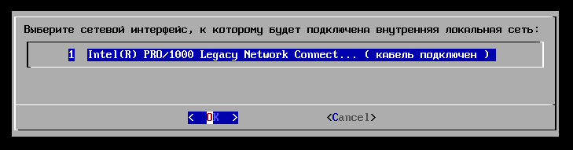
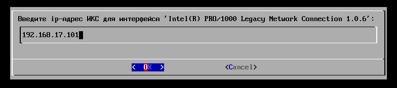
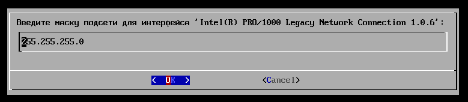
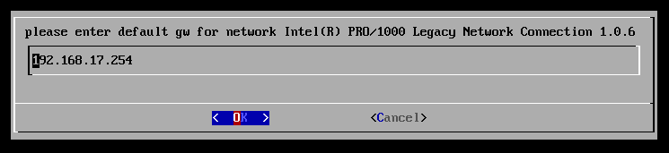

При возникновении проблем с загрузкой системы (например, в результате сбоя питания) для настройки удаленного подключения можно воспользоваться установочным диском ИКС.

---

При возникновении проблем с загрузкой системы (например, в результате сбоя питания) для настройки удаленного подключения можно воспользоваться установочным диском ИКС.

Для этого выполните следующие действия:

1. Запустите загрузку с диска.
2. Во время запуска установщика выберите **язык**.
3. Нажмите **«Support»**.
4. Укажите следующие **параметры сетевого адаптера ИКС**:
   - сетевой интерфейс, к которому будет подключена внутренняя локальная сеть;

     

   - [IP-адрес](../o-dokumentacii/slovar-terminov-3.md);

     

   - маска подсети;

     

   - шлюз по умолчанию.

     
5. После введения параметров запустится служба технической поддержки и система укажет **порт подключения**. Сообщите его специалисту службы технической поддержки ([наши контакты](https://xserver.a-real.ru/#main-footer)).

   

> ⚠️ Важно! Если вы используете PPPoE провайдера, то вам требуется подключить маршрутизатор для получения его настроек.
