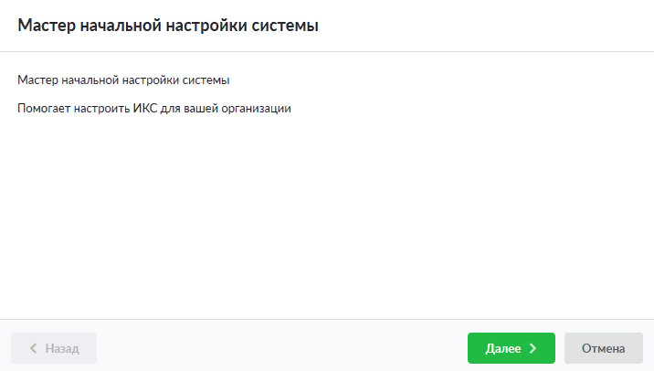
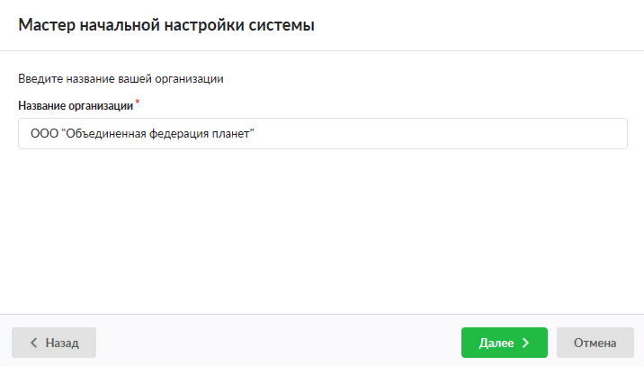

Описание мастера начальной настройки системы, запускаемого автоматически при первом входе в веб-интерфейс ИКС.

---

После первого [входа в веб-интерфейс](vhod-v-vebinterfeys-2.md) необходимо настроить основные параметры и сетевые интерфейсы сервера. Сделать это можно с помощью **мастера начальной настройки системы**. Он запускается автоматически при первом входе в веб-интерфейс.

Мастер представляет собой пошаговую настройку системы. Переход к следующему шагу осуществляется кнопкой **«Далее»**, переход к предыдущему шагу — кнопкой **«Назад»**.

1. Введите **название организации**.

   

2. Укажите имя хоста, логин и пароль администратора.

3. Нажмите кнопку **«Готово»**.

После завершения работы мастера рекомендуется [настроить сеть](../set/master-nastroyki-seti-4.md) организации.
