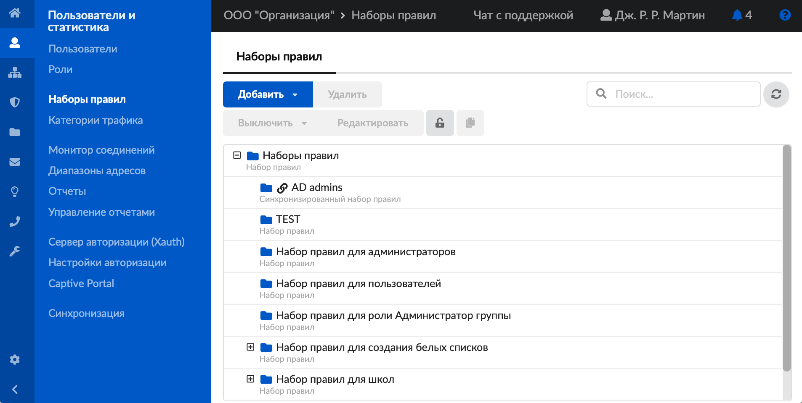
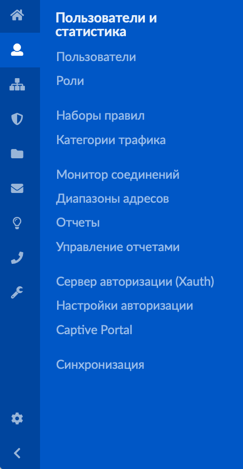
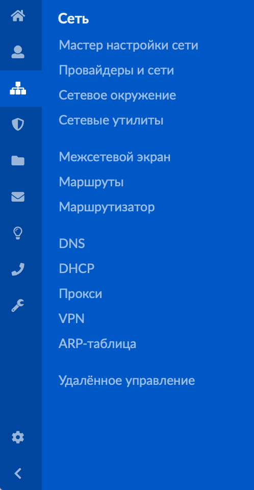
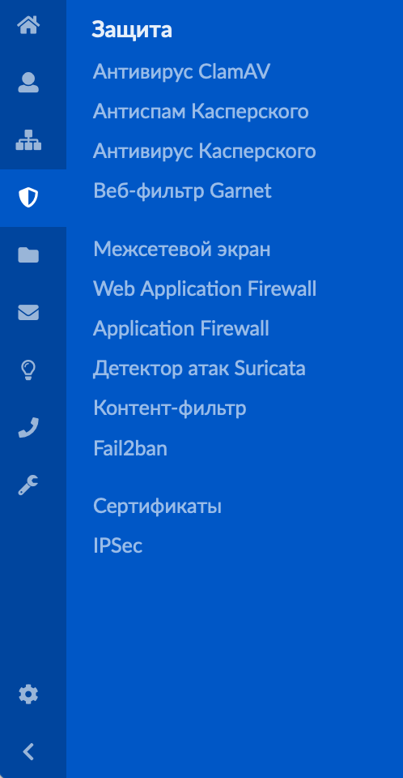
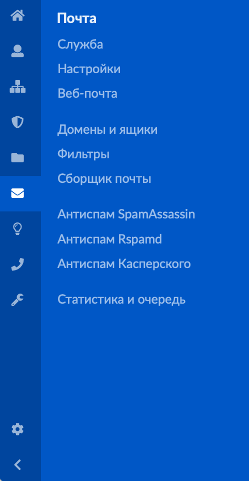
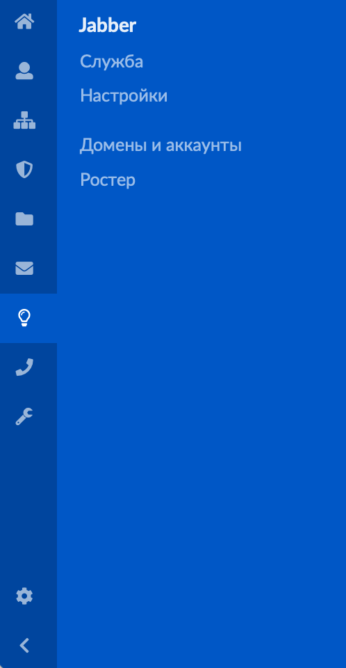
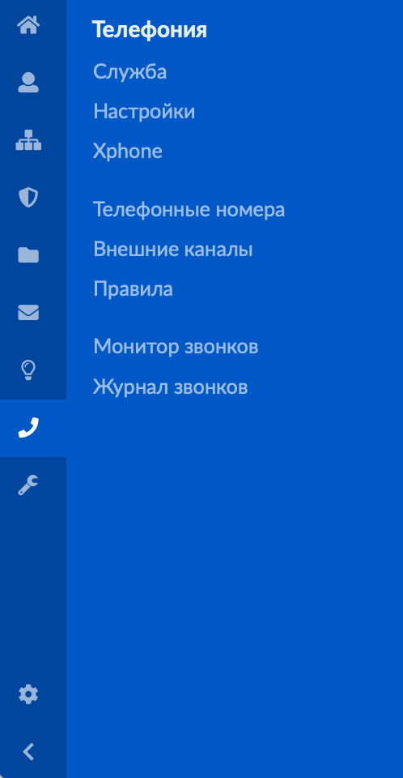
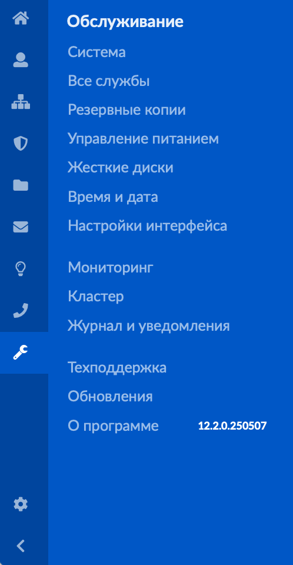
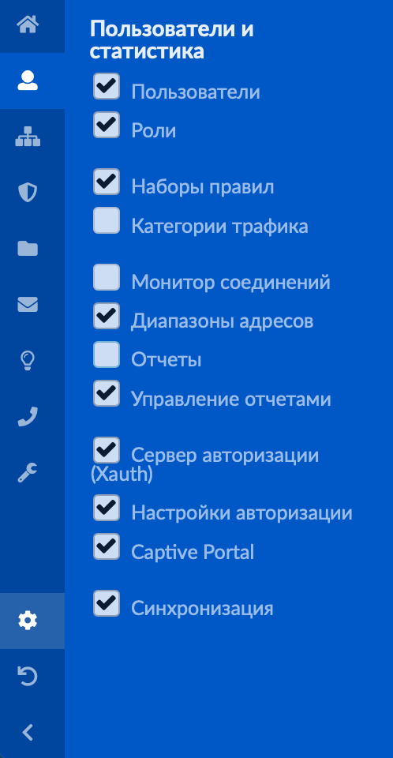

Меню ИКС представляет собой список модулей системы, разбитый на несколько основных групп. Главная функция меню — навигация.

---

Меню всегда расположено в левой части страницы. Благодаря этому можно перейти к любому пункту, на какой бы странице ни находился пользователь.

Основные группы отображаются в виде иконок. При нажатии на иконку откроется список модулей данной группы.

## Основные группы модулей

В меню расположено восемь групп модулей. Каждая группа выполняет определенные функции.

| Группа | Описание |
|--------|----------|
| **[Пользователи и статистика](https://doc.a-real.ru/index.php?category=18)** — позволяет управлять пользователями, назначать им роли, управлять наборами правил для работы системы и объектами тарификации, контролировать трафик, настраивать и просматривать отчёты. Здесь можно запустить или остановить сервер авторизации пользователей Xauth и сервер авторизации пользователей через веб-страницу (Captive Portal), а также настроить службу синхронизации ИКС |  |
| **[Сеть](https://doc.a-real.ru/index.php?category=19)** — содержит множество сетевых инструментов, которые можно использовать для создания, контроля и обслуживания сетей |  |
| **[Защита](https://doc.a-real.ru/index.php?category=20)** — содержит различные антивирусные модули для защиты от проникновения вредоносных программ в локальную сеть, проверки сообщений на спам, проверки веб-сайтов (Антивирус ClamAV, Антиспам Касперского, Межсетевой экран и т. д.). Также здесь можно управлять сертификатами, которые используются для установления защищенных SSL/TLS-соединений типа клиент-сервер |  |
| **[Файловый сервер](https://doc.a-real.ru/index.php?category=21)** — позволяет управлять хранилищем файлов, веб-сервером, FTP-сервером и удалённым доступом к файлам |  |
| **[Почта](https://doc.a-real.ru/index.php?category=22)** — позволяет работать с письмами, настраивать почтовый сервер, домены и ящики, использовать веб-почту (почтовый сервер ИКС), а также собирать почту с внешних почтовых аккаунтов пользователя. Здесь можно управлять фильтрами для входящих и исходящих писем, антиспам-службами, почтовой очередью и просматривать статистику по почтовому серверу ИКС |  |
| **Jabber** — предназначен для управления службой Jabber (или XMPP). Она является децентрализованной, расширяемой и открытой системой. Поэтому любой желающий может открыть свой сервер мгновенного обмена сообщениями, регистрировать на нем пользователей и взаимодействовать с другими серверами XMPP |  |
| **[Телефония](https://doc.a-real.ru/index.php?category=24)** — это служба, которая отвечает за обработку VoIP-данных в ИКС. Служба разработана на базе сервера IP-телефонии Asterisk, она надёжна и поддерживает передачу данных по протоколам SIP и IAX. Здесь можно выполнить настройки сервера телефонии, входящих и исходящих звонков во внешнюю сеть, использовать Xphone для совершения и приёма звонков, вести список телефонных номеров, управлять логикой обработки и маршрутизации входящих и исходящих вызовов. Информацию обо всех звонках можно посмотреть в журнале звонков |  |
| **[Обслуживание](https://doc.a-real.ru/index.php?category=25)** — позволяет управлять общими данными в системе: указывать название организации и доменное имя системы, устанавливать дату и время, просматривать текущие задачи в ИКС, создавать и удалять резервные копии, управлять источниками питания и жёсткими дисками. Здесь можно контролировать все службы ИКС и быстро переходить к ним для детальной настройки, а также настраивать некоторые параметры веб-интерфейса ИКС. Соответствующие модули позволяют просматривать статистику использования сетевых и системных ресурсов, а также различные показатели системы, системный журнал, предоставлять доступ к ИКС сотруднику техподдержки, отслеживать выходящие обновления программы и знакомиться с характеристиками текущей версии |  |

## Управление меню

**Открыть меню** можно нажатием:

- на любую группу модулей;
- на кнопку .

Чтобы **скрыть меню**, нажмите .

По умолчанию в меню выводятся все пункты (модули). **Настройки** позволяют контролировать, какие пункты будут отображаться в меню. Для этого нажмите  и снимите флаги с тех модулей, которые не должны показываться в меню.

Чтобы **восстановить** настройки по умолчанию, нажмите .
