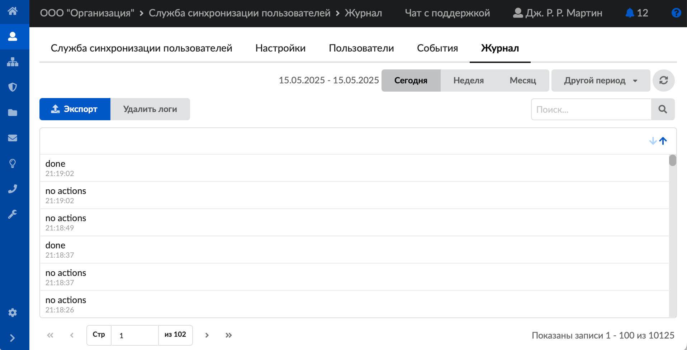
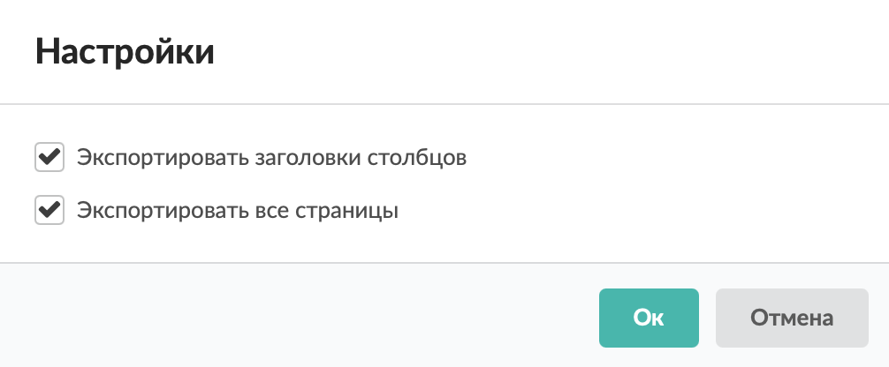
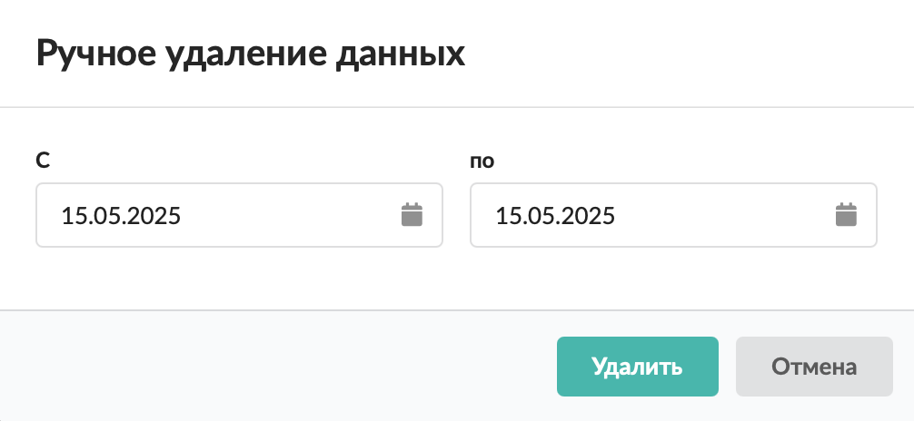
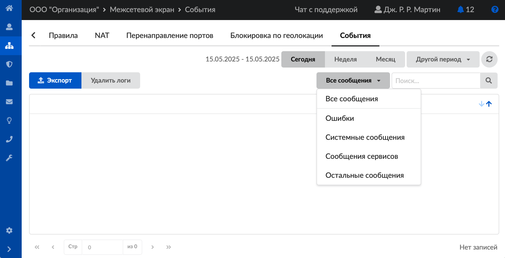
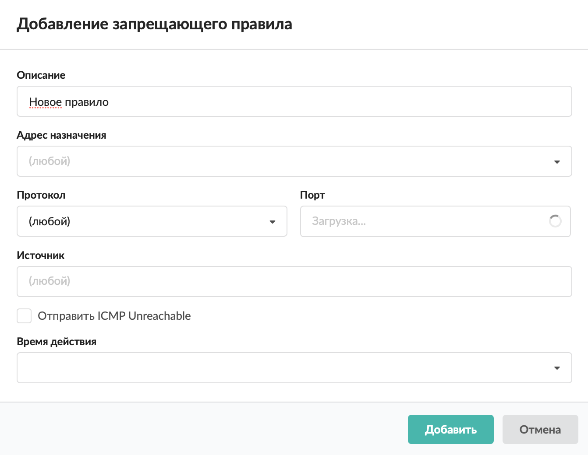
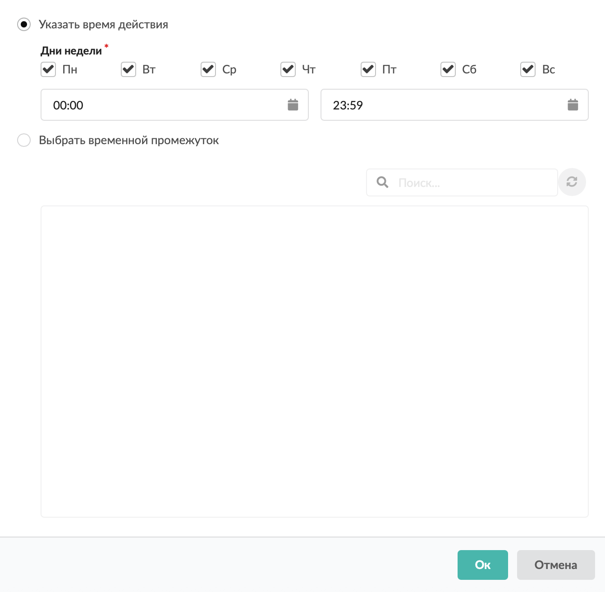

# Стандартные элементы веб-интерфейса

В веб-интерфейсе ИКС есть несколько элементов, которые имеют схожие функциональные особенности и оформление вне зависимости от модуля.

---

## Журнал

Данный элемент обычно расположен на вкладке «Журнал», «События» либо «Сводка» и представляет собой список всех системных сообщений модуля с указанием даты и времени.

В правом верхнем углу модуля находится строка **поиска**, а также возможность выбора **временного периода** отображения журнала событий. По умолчанию журнал отображает события за текущую дату.

Записи в журнале выделяются цветом в зависимости от вида сообщения:

- черный — обычные сообщения системы;
- зелёный — сообщения о состоянии системы (включение/выключение, подключение пользователя);
- жёлтый — предупреждения;
- красный — ошибки.

При необходимости можно **сохранить** данные журнала в файл. Для этого:

1. Нажмите кнопку **«Экспорт»**.
2. Если требуется, установите флаги **«Экспортировать заголовки столбцов»** и **«Экспортировать все страницы»**.

3. Нажмите **«Ок»**.

Чтобы **удалить** данные журнала за определенный период:

1. Нажмите кнопку **«Удалить логи»**.
2. Укажите **временной период**.

3. Нажмите **«Удалить»**.

В некоторых журналах доступна **фильтрация** списка событий по выбранному критерию: все сообщения (по умолчанию), системные сообщения; сервисные сообщения; ошибки; остальные сообщения.

## Время действия правила

При создании правила в ИКС можно указать его время действия.

1. Нажмите на поле **«Время действия»**.

2. Укажите время действия в появившемся окне. По умолчанию установлено значение **«всегда»**.

3. Нажмите **«Ок»**.

---

**Источник:** [Документация ИКС — Стандартные элементы веб-интерфейса](https://doc.a-real.ru/index.php?article=196)
