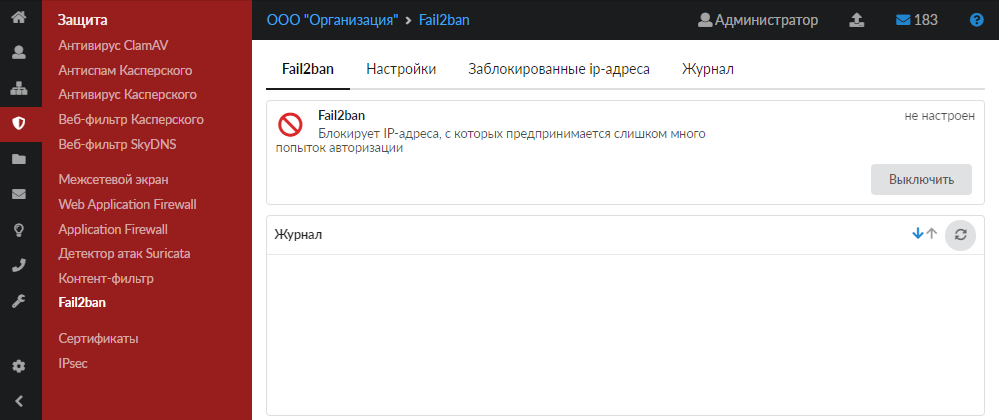
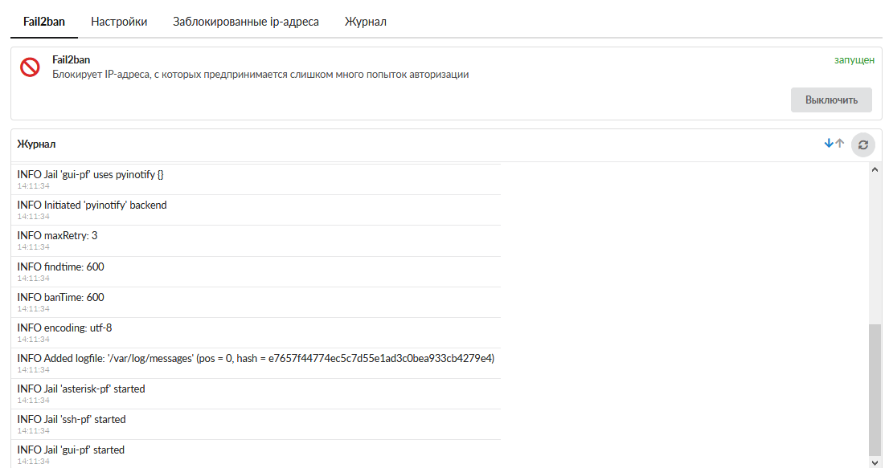
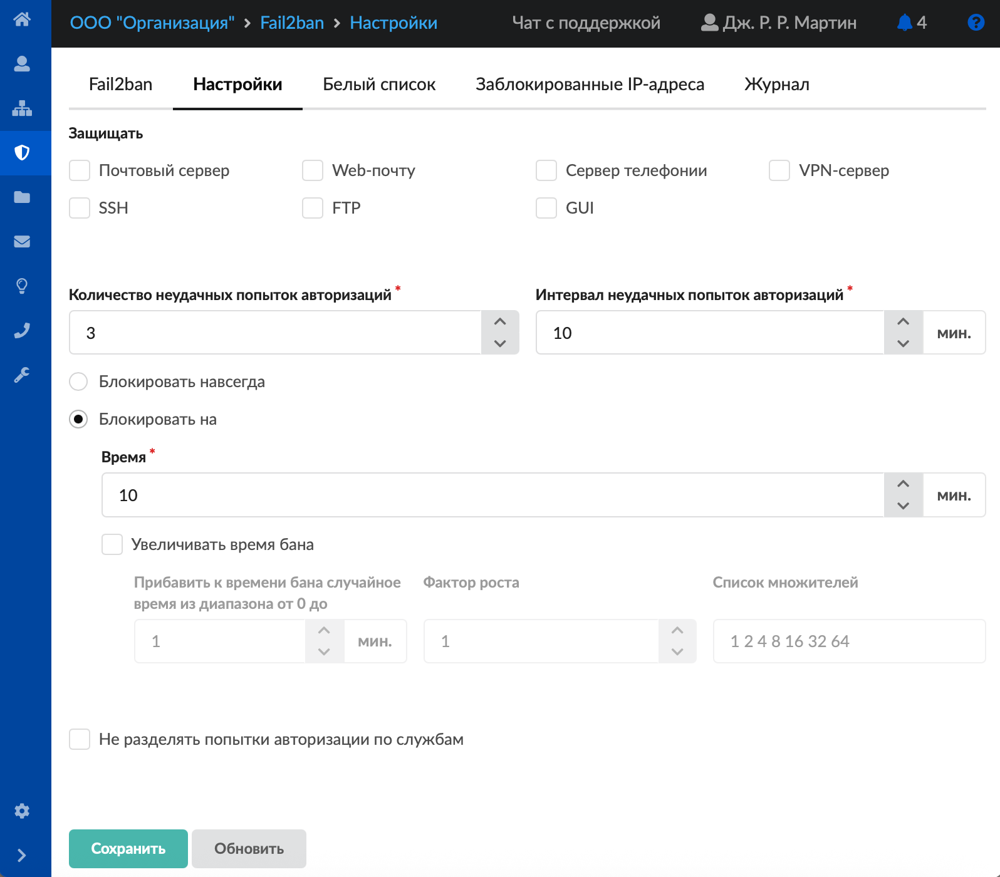
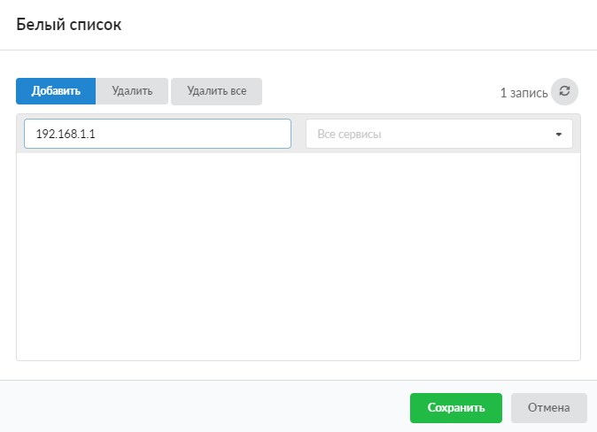
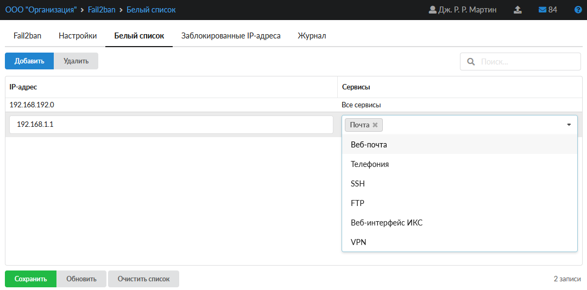
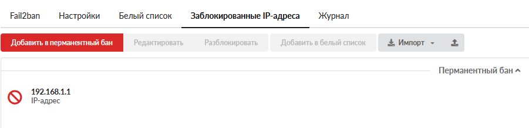
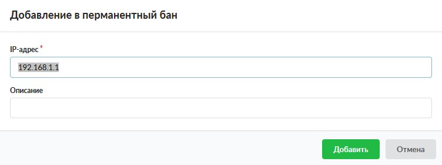
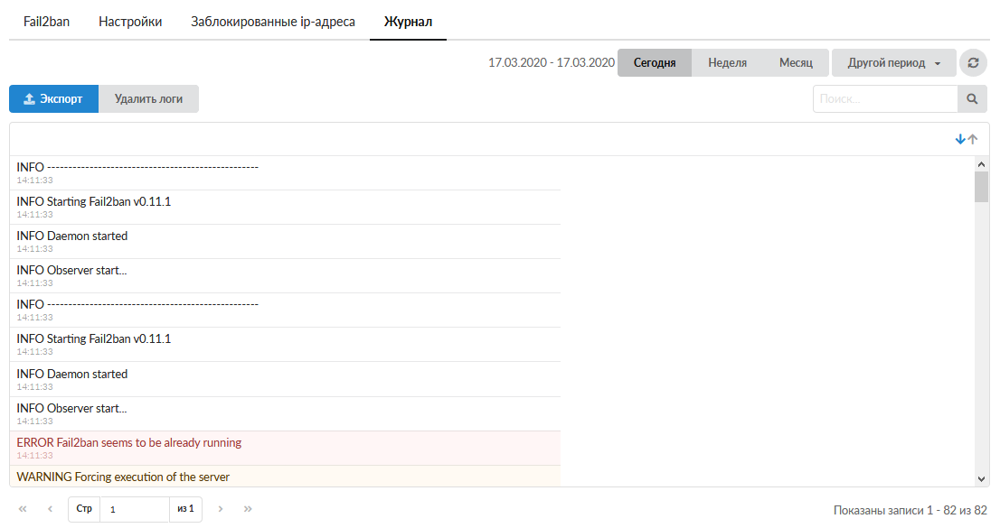

Модуль Fail2ban сканирует лог-файлы и блокирует IP-адреса, которые ведут себя подозрительно (например, делают слишком много попыток входа с неверным паролем).

Для открытия модуля перейдите в меню **Защита > Fail2ban**.

В модуле расположены следующие вкладки:

- Fail2ban
- Настройки
- Заблокированные соединения
- Журнал

## Fail2ban

На данной вкладке отображается состояние службы Fail2ban:

- статус службы (запущен, остановлен, выключен, не настроен);
- кнопка **Включить** (**Выключить**) — позволяет запустить или остановить службу;
- журнал последних событий.

## Настройки

Данная вкладка предназначена для настройки работы Fail2ban.

Флаги **Защитить почтовый сервер**, **Защитить веб-почту**, **Защитить сервер телефонии**, **Защитить VPN-сервер**, **SSH**, **FTP**, **GUI** позволяют Fail2ban анализировать логи авторизации в соответствующих модулях.

В поле **Количество неудачных попыток авторизаций** можно задать количество неудачных попыток авторизации в одном из модулей, отмеченных флагом. После этого IP-адресу будет полностью заблокирован доступ к ИКС. По умолчанию установлено 3 попытки.

В поле **Интервал неудачных попыток авторизаций** задается время, в течение которого в каждом модуле подсчитывается количество неудачных попыток авторизации (в минутах). По умолчанию установлен интервал 10 минут.

Переключатель **Блокировать навсегда** позволяет добавить IP-адрес в бан навсегда.

Переключатель и поле **Блокировать на** предназначено для установки времени, в течение которого будет действовать блокировка IP-адреса (в минутах). По умолчанию установлено значение 10 минут.

Флаг **Увеличивать время бана** позволяет включить дополнительные настройки Fail2ban для увеличения времени бана:

- **Прибавить к времени бана случайное время из диапазона от 0 до** — параметр выберет случайное значение и прибавит к стандартному времени бана (в минутах);
- **Фактор роста** — дополнительный глобальный коэффициент, на который будут умножаться все множители из списка. Увеличение фактора роста удобно использовать, когда вы хотите значительно увеличить время бана. В таком случае не потребуется переписывать список множителей;
- **Список множителей** — список, по которому будет происходить рост времени бана. Порядковый номер множителя будет соответствовать количеству раз, когда IP-адрес попал в дополнительный бан;
- флаг **Не разделять попытки авторизации по службам**.

### Пример

- первый бан = (время бана + случайное время) * первый множитель * фактор роста;
- второй бан = (время бана + случайное время) * второй множитель * фактор роста и т. д.;
- по достижении IP-адреса последнего множителя и далее время бана будет считаться по последнему множителю.

> ⚠ Внимание! IP-адреса, попадающие в бан, считаются плохими. На них будет срабатывать увеличение времени бана, пока не пройдет трехкратный промежуток времени последнего бана либо пока они не будут разбанены вручную.

Если авторизация на FTP идет через браузер, то количество попыток авторизации, указанное в поле «Количество неудачных попыток авторизаций», будет в два раза меньше, так как браузер пытается первоначально авторизоваться под учетной записью Anonymous.

На данной вкладке также можно сформировать белый список для Fail2ban. Нажмите кнопку **Белый список** и в открывшемся окне задайте соответствие IP-адреса/подсети/диапазона (192.168.1.1, либо 192.168.1.1/28, либо 192.168.1.1-192.168.1.3) и сервиса (всех сервисов), для которых Fail2ban не будет срабатывать. Нажмите **Сохранить**.

> ⚠ Внимание! Если Fail2ban заблокирует IP-адрес по одному из сервисов, то доступ с IP-адреса к другим сервисам также будет заблокирован, в том числе к сервисам, добавленным в белый список.

Чтобы изменения настроек вступили в силу, нажмите **Сохранить**.

## Белый список

Данная вкладка содержит IP-адреса, включенные в белый список.

Для **добавления** в белый список достаточно указать IP-адрес и сервисы.

Для управления записями на странице можно воспользоваться кнопками **Сохранить**, **Обновить**, **Очистить список**.

## Заблокированные соединения

На данной вкладке отображается список текущих блокировок IP-адресов. Они распределены по блокам (модулям), в которых произошла блокировка. На вкладке также можно посмотреть время, когда конкретный IP-адрес попал в бан и когда из него выйдет (кроме тех адресов, которые забанены перманентно).

При необходимости с помощью соответствующих **кнопок** пользователь с ролью Администратор может:

- редактировать перманентный бан;
- добавить IP-адрес в перманентный бан — действует всегда и по всем сервисам;
- добавить IP-адрес в белый список — произойдет разблокировка IP-адреса, и он не будет проверяться Fail2ban по сервису, добавленному в белый список;
- разблокировать IP-адрес до истечения бана.

При **добавлении в перманентный бан** можно указать: IP (например, 192.168.1.1), сеть (например, 192.168.1.1/30), диапазон IP (например, 192.168.1.1-192.168.1.4).

Также на странице вкладки есть возможность **импортировать** и **экспортировать** данные.

## Журнал

На данной вкладке отображается сводка всех системных сообщений модуля с указанием даты и времени.

[Журнал](../vebinterfeys-iks/standartnye-elementy-vebinterfeysa.md) является стандартным элементом веб-интерфейса ИКС.
