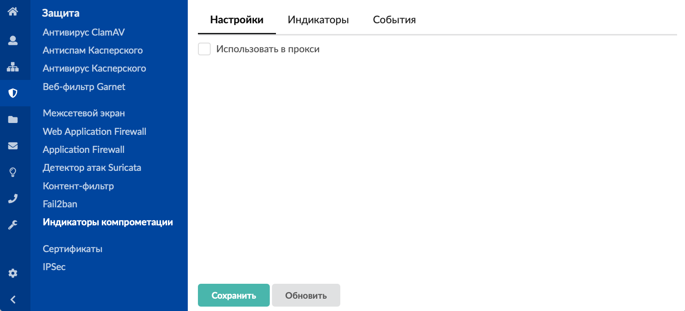
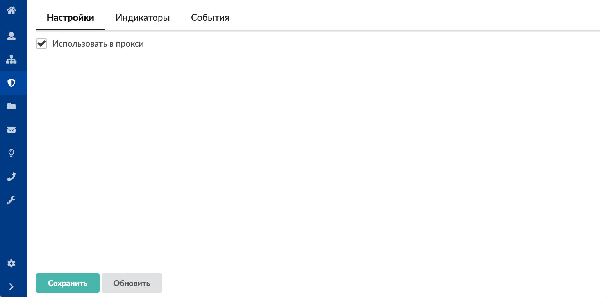
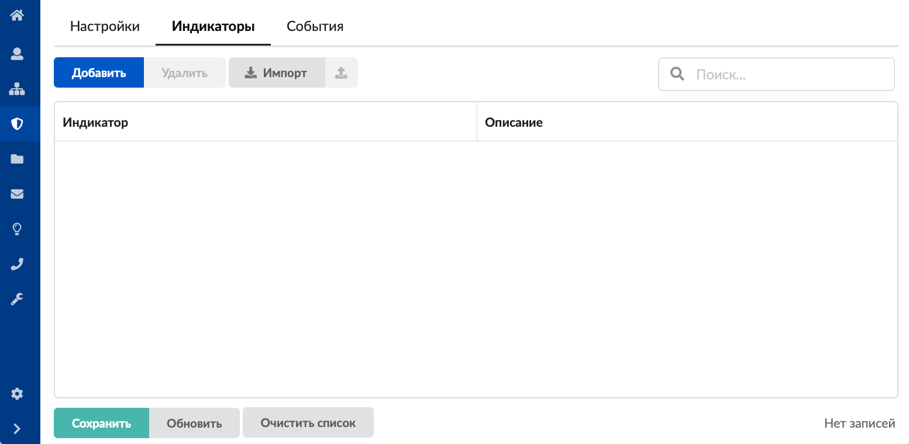
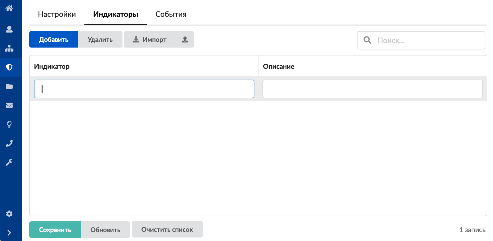
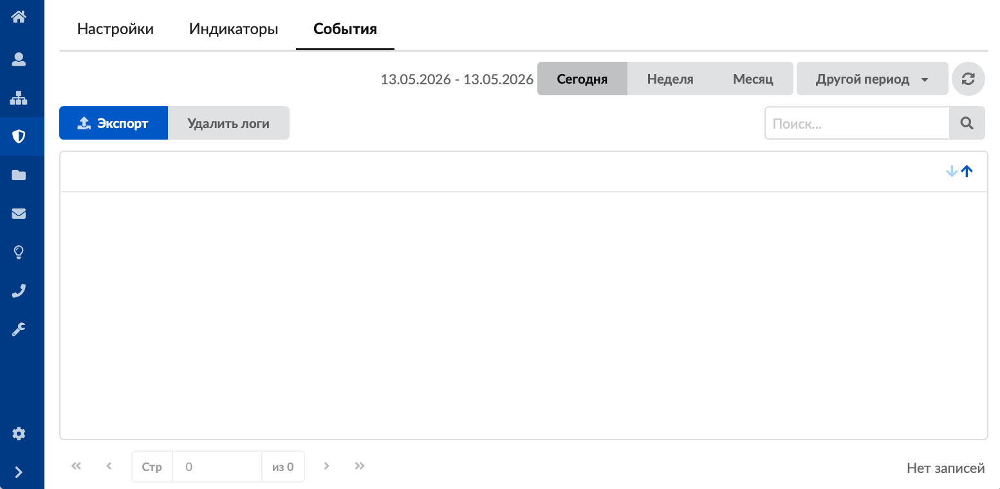

Модуль «Индикаторы компрометации» предназначен для защиты от загрузки вредоносных программ через прокси-сервер.

Для открытия модуля перейдите в меню **Защита > Индикаторы компрометации**.

В модуле расположены следующие вкладки:

- [Настройки](#tab1)
- [Индикаторы](#tab2)
- [События](#tab3)

## Настройки

На данной вкладке можно установить флаг **«Использовать в прокси»**, который позволяет активировать проверку загружаемых файлов на соответствие индикаторам компрометации. При обнаружении совпадения загрузка будет блокироваться.

Чтобы изменения вступили в силу, нажмите **«Сохранить»**.

## Индикаторы

Данная вкладка предназначена для ведения списка индикаторов. Можно добавить необходимые индикаторы компрометации, которые представляют собой либо SHA1-хэш, либо SHA256-хэш.

Для **добавления индикатора** нажмите на кнопку **«Добавить»** и введите его название и описание.

Элементы списка можно **импортировать**, **выгружать** и **удалять**. Также в программе предусмотрена возможность **очистить список индикаторов** при помощи одноименной кнопки.

> ⚠️ **Важно!** Если файл скачивается с ресурса HTTPS, то необходимо настроить в прокси расшифровку трафика HTTPS.

Чтобы изменения вступили в силу, нажмите **«Сохранить»**.

## События

На данной вкладке отображается все заблокированные загрузки с указанием даты и времени.

Вкладка является стандартным элементом веб-интерфейса ИКС.
