Модуль **«Контент-фильтр»** предназначен для настройки и блокировки интернет-страниц, содержащих в себе заданные ключевые слова или регулярные выражения.

Для открытия модуля перейдите в меню **Защита > Контент-фильтр**.

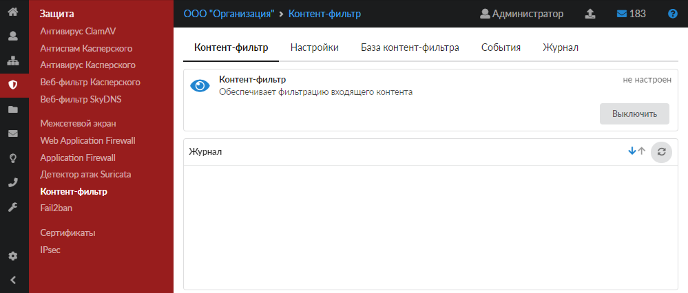

В модуле расположены следующие вкладки:

- [Контент-фильтр](#tab1)
- [Настройки](#tab2)
- [База контент-фильтра](#tab3)
- [События](#tab4)
- [Журнал](#tab5)

Для применения контентной фильтрации трафика выполните следующие действия:

1. В меню **Пользователи и статистика > Наборы правил** либо в [индивидуальном модуле](/index.php?article=142#tab4) пользователя (группы) добавьте [правила контентной фильтрации](/index.php?article=166). Данные правила можно применять как для отдельного пользователя, так и для группы.
2. Для корректного функционирования контентной фильтрации настройте полную [расшифровку трафика](/index.php?article=168).

## Контент-фильтр

На данной вкладке отображается состояние службы «Контент-фильтр»:

- статус службы (запущен, остановлен, выключен, не настроен);
- кнопка **«Включить»** (**«Выключить»**) — позволяет запустить или остановить службу;
- журнал последних событий.

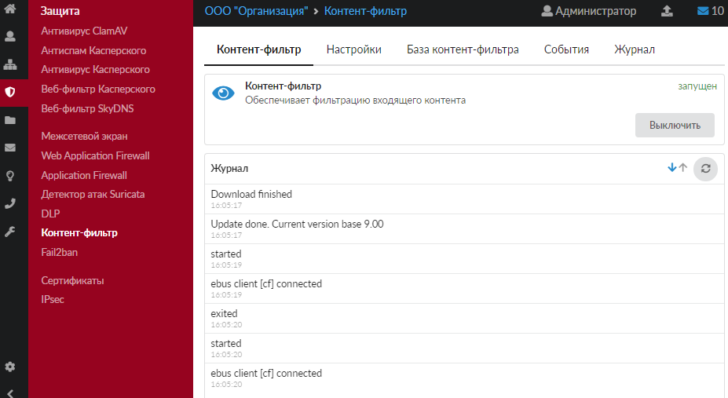

## Настройки

Данная вкладка предназначена для настройки работы контент-фильтра.

Установка флага **«Использовать контент-фильтр»** автоматически включает флаги **«Проверять шаблоны»** и **«Проверять ключевые слова»**.

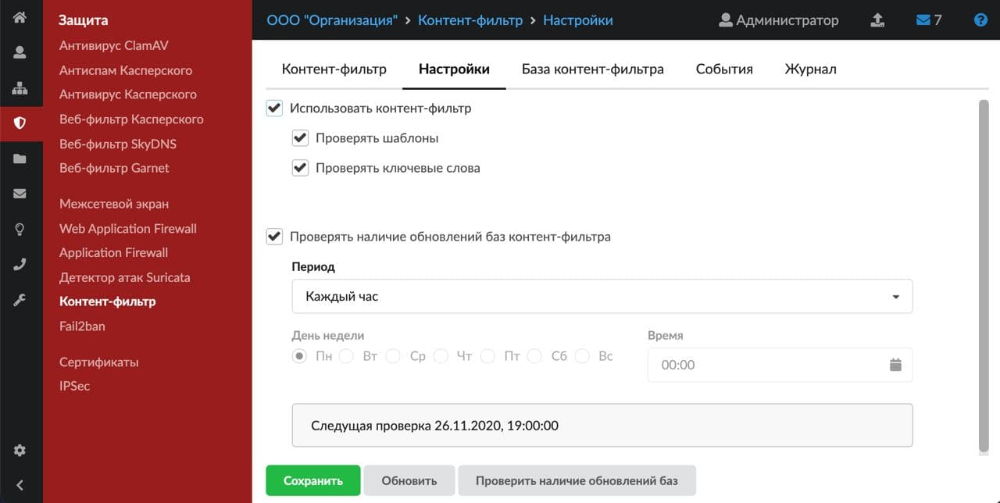

Флаг **«Проверять наличие обновлений баз контент-фильтра»** можно установить отдельно при необходимости.

Внимание! После установки ИКС списки баз контент-фильтра пустые. Если флаг «Проверять наличие обновлений баз контент-фильтра» не включен, то для фильтрации необходимо создать и заполнить списки баз вручную.

Рекомендуется устанавливать флаг «**Проверять наличие обновлений баз контент-фильтра**» для использования уже готовых баз Минюста. Модуль подключится к облачному сервису и загрузит последнюю версию списков (при этом обновления загружаются с серверов ООО А-Реал Консалтинг). В дальнейшем, если флаг установлен, списки будут обновляться в соответствии с выбранным **периодом**.

Чтобы изменения вступили в силу, нажмите **«Сохранить»**.

Внимание! После сохранения настроек необходимо проверить, что базы обновились. На [вкладке «База контент-фильтра»](#tab3) выберите один из списков слов. Если обновление прошло успешно, под названием выбранного списка появится несколько ключевых слов и шаблонных выражений из данного списка.

## База контент-фильтра

Данная вкладка позволяет:

- управлять базами контент-фильтра;
- редактировать списки шаблонов и слов баз;
- включать/выключать отдельную базу в работу модуля;
- удалять базы;
- искать шаблоны и слова в базах.

Внимание! По умолчанию модуль «Контент-фильтр» содержит пустые списки слов, запрещенных Минюстом и Госнаркоконтролем, а также специальный список для школ. Они не содержат записей! Для получения данных записей необходимо иметь активный модуль «Техподдержка» (в первый год действует по умолчанию у всех клиентов, далее требуется его ежегодное [приобретение](/index.php?article=154)).

Добавлять свои слова в списки по умолчанию нельзя.

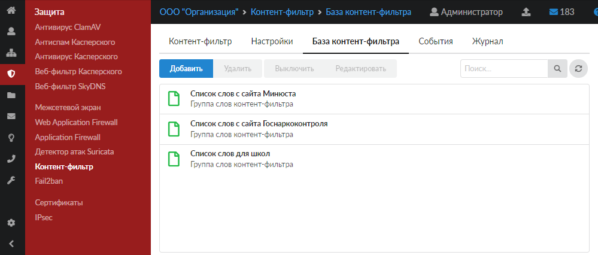

Для перехода к редактированию базы нажмите на нее в списке, а затем — на кнопку **«Редактировать»**.

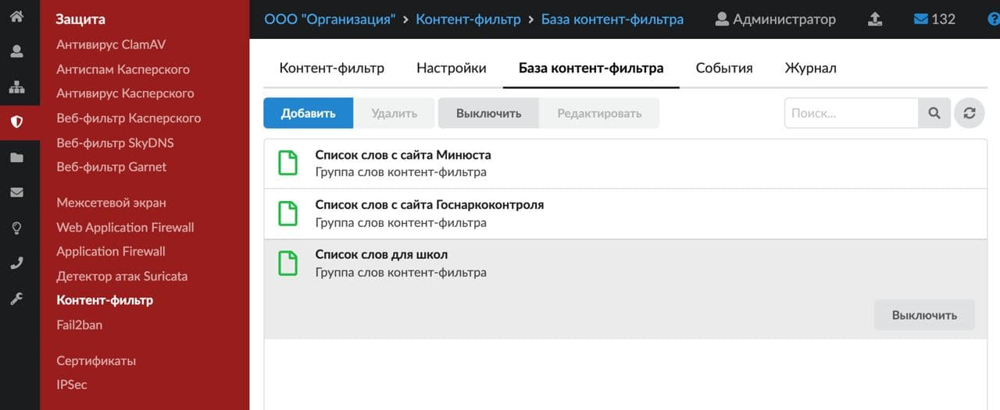

Окно редактирования содержит три **вкладки**: «Общее», «Шаблоны» и «Ключевые слова» (в списках по умолчанию две вкладки: «Шаблоны» и «Ключевые слова»).

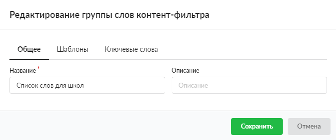

На вкладке **«Общее»** указаны название и описание базы.

Вкладка **«Шаблоны»** позволяет задать регулярные выражения.

Примеры:

- Привет — контент-фильтр будет искать неизменяемое регулярное выражение «Привет»;
- /\bрус.*\b/ - контент-фильтр сработает на слова: русич, русский, русофоб, рус.яз.

При добавлении регулярного выражения в шаблоны необходимо придерживаться конструкции: /регулярное выражение/. Само регулярное выражение задается по общепринятым нормам. Узнать о регулярных выражениях можно [тут](https://tproger.ru/articles/regexp-for-beginners/).

Важно! Буква «ё» воспринимается как буква «е».

В списках по умолчанию можно выключать блокировку некоторых шаблонов. Для этого просто снимите флаг с шаблона, на который не должен срабатывать контент-фильтр.

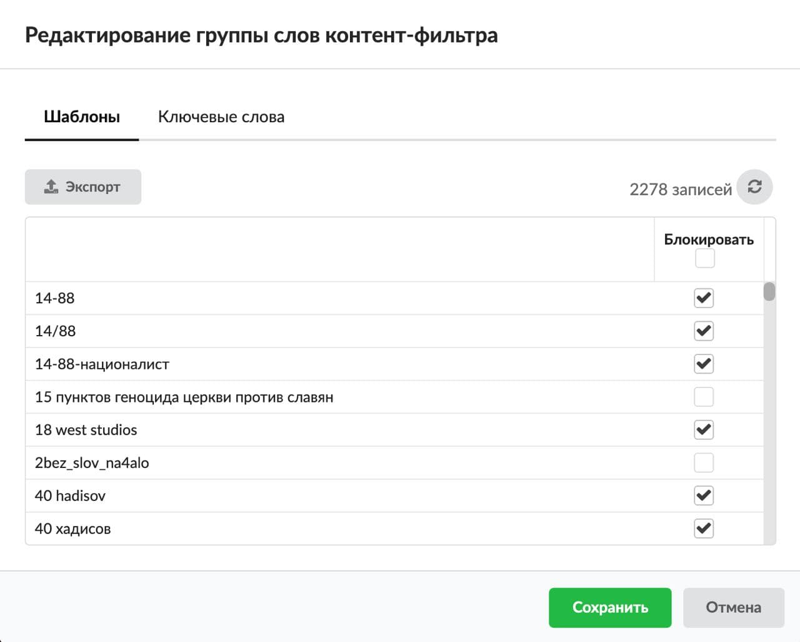

Вкладка **«Ключевые слова»** позволяет задать строку любой длины, содержащую любые символы. Контент-фильтр сработает на данную строку, если перед и после указанной строки идет любой символ, кроме буквенного. При необходимости можно импортировать уже готовый список ключевых слов нажатием на соответствующую кнопку.

Пример

Задано «ет Са». Контент-фильтр не сработает на «Привет Саша», но сработает на «Прив-ет Са».

В окне редактирования при помощи соответствующих кнопок можно добавлять и удалять шаблоны и ключевые слова, а также экспортировать и импортировать содержимое списков. При экспорте список будет загружен браузером с именем файла <Имя базы>-<тип списка>.txt (например, Список слов с сайта Госнаркоконтроля-regexp.txt). Для импорта файл должен быть в формате *.txt, каждое слово (шаблон) с новой строки.

В списках по умолчанию можно выключать блокировку некоторых слов. Для этого просто снимите флаг со слова, на которое не должен срабатывать контент-фильтр.

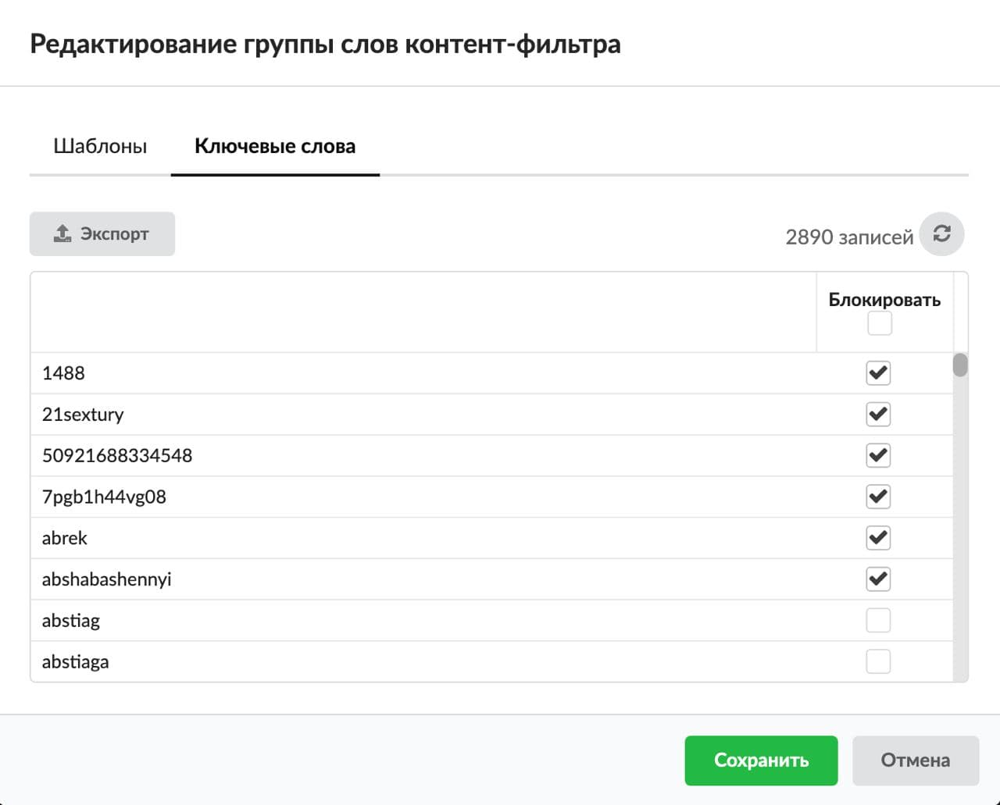

Внимание! Модуль «Контент-фильтр» производит фильтрацию контента по списку шаблонов и списку ключевых слов, которые состоят из общих списков соответствующих шаблонов и слов каждой из включенных баз. Фильтрация по шаблонам и словам выключенной базы производиться не будет.

Для того чтобы **создать новую группу слов контент-фильтра**, выполните следующие действия:

1. Нажмите кнопку **«Добавить»**.
2. На вкладке **«Общее»** введите название и описание новой группы слов.

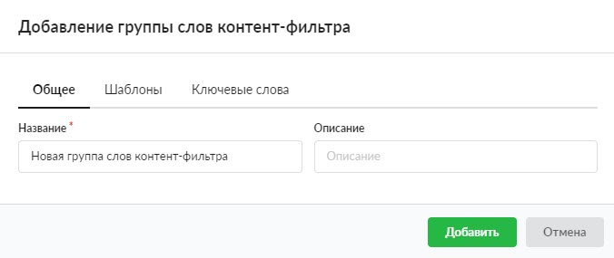
3. Заполните вкладку **«Шаблоны»** по аналогии с процессом редактирования. При необходимости можно импортировать уже готовый список шаблонов нажатием на соответствующую кнопку.

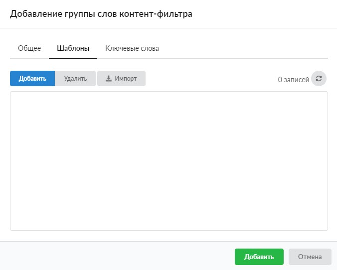
4. Заполните вкладку **«Ключевые слова»** по аналогии с процессом редактирования. При необходимости можно импортировать уже готовый список ключевых слов нажатием на соответствующую кнопку.
5. Нажмите кнопку **«Добавить»** — новая группа слов появится в списке.

На вкладке можно осуществлять **поиск** шаблонов и ключевых слов в списках баз, а также **удалять** ранее созданные базы.

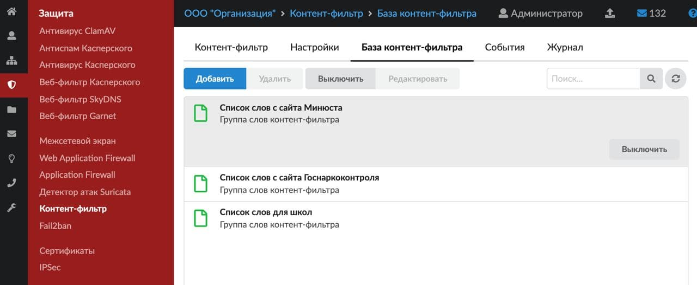

Внимание! Удалить списки базы по умолчанию (Минюст, Госнаркоконтроль и список слов для школ) нельзя.

## События

Данная вкладка позволяет просматривать, фильтровать и экспортировать информацию о блокировках контента. Все заблокированные ресурсы отображаются с пояснением по шаблону или слову, на котором произошла блокировка.

Управление на данной вкладке осуществляется по аналогии с [журналом](#tab5).

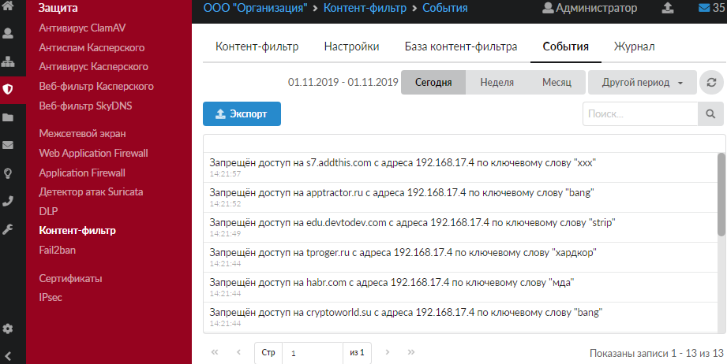

При нажатии на событие можно посмотреть полный [URL](/index.php?article=24#url) заблокированного ресурса.

## Журнал

На данной вкладке отображается сводка всех системных сообщений модуля с указанием даты и времени.

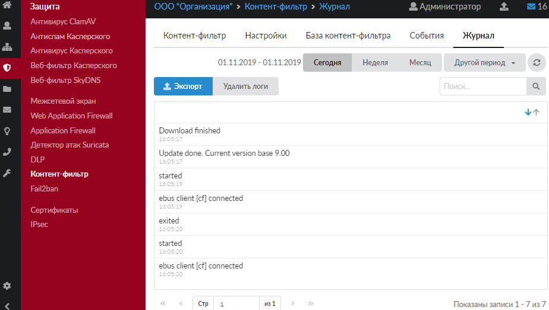

[Журнал](/index.php?article=196#summary) является стандартным элементом веб-интерфейса ИКС.

Внимание! Кнопка **«Удалить логи»** удаляет все логи, которые ведутся модулем **«Контент-фильтр»**.
