Модуль управления сертификатами для защищенных SSL/TLS-соединений типа клиент-сервер.

---

Модуль **«Сертификаты»** предназначен для управления сертификатами, которые используются в установлении защищенных [SSL](../../o-dokumentacii/slovar-terminov-3.md)/[TLS](../../o-dokumentacii/slovar-terminov-3.md)-соединений типа клиент-сервер.

Созданные сертификаты могут применяться как в ИКС, так и в сторонних программах.

Внимание! C версии 7.1.0 прекращена поддержка сертификатов с шифрованием md5.

При первой [установке ИКС](https://doc.a-real.ru/index.php?article=269) автоматически создаются конечные сертификаты [для веб-интерфейса](https://doc.a-real.ru/index.php?category=16), [телефонии](../../telefoniya/telefoniya-obzor-3.md) и [почты](../../pochta/pochta-obzor-2.md).

Для открытия модуля перейдите в меню **Защита > Сертификаты**.

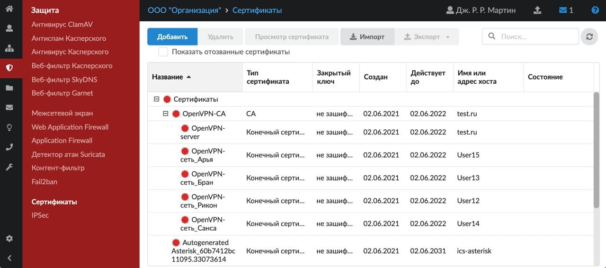

Список сертификатов представлен в виде иерархического древа. В таблице отображаются следующие сведения: тип ключа родительского сертификата, дата начала и окончания действия, имя хоста (или [IP-адрес](../../o-dokumentacii/slovar-terminov-3.md)), который представляет данный сертификат, состояние.

В модуле при помощи соответствующих кнопок можно выполнять **ряд операций**:

- [Обновить сертификат Let's Encrypt](#letsencrypt)

Для того чтобы в списке были показаны и отозванные сертификаты, установите соответствующий флаг.

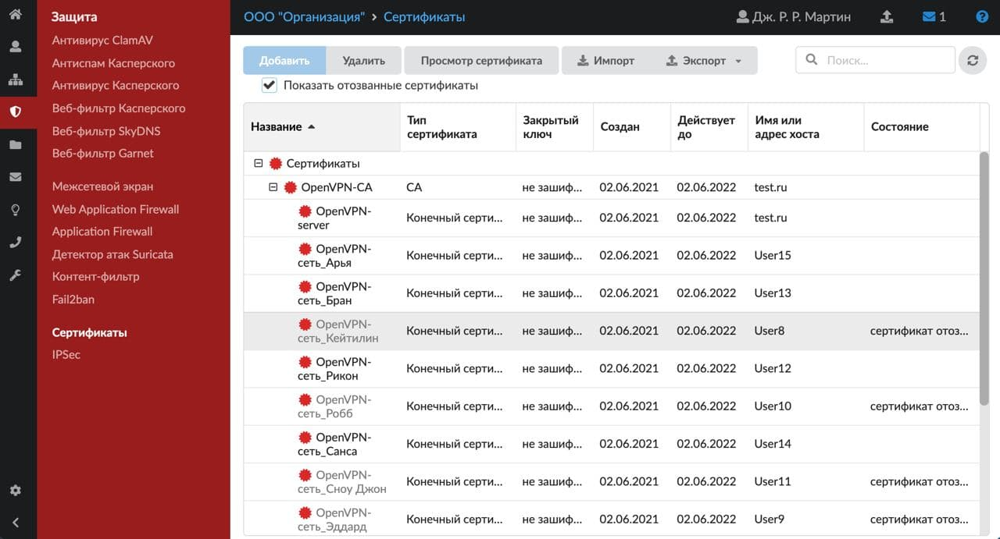

## Добавить сертификат

Чтобы создать новый сертификат, выполните следующие действия:

1. Нажмите **«Добавить»** и выберите **«Сертификат»**.

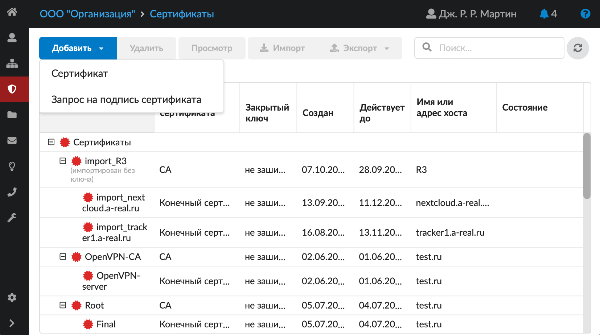
2. На вкладке **«Общее»** укажите название сертификата, код страны, местоположение, сведения об организации, имя хоста или его IP-адрес. В поле **«Список дополнительных доменов и поддоменов»** можно указать все домены и поддомены, которые будут защищаться данным сертификатом (то есть SSL-сертификат с опцией [SAN](../../o-dokumentacii/slovar-terminov-3.md)).

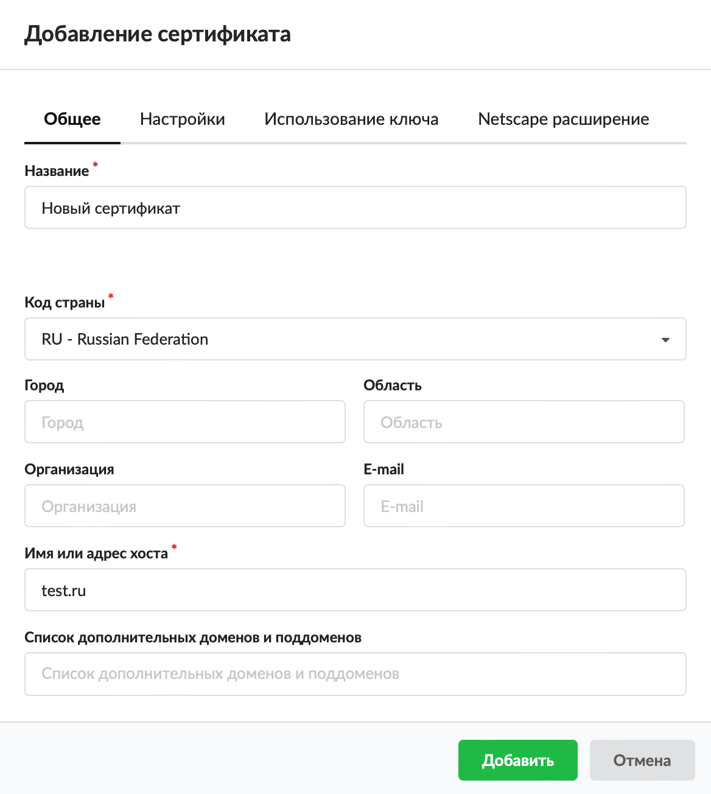
3. На вкладке **«Настройки»** задайте тип сертификата (CA (корневой) или конечный), алгоритм, тип шифрования, срок действия сертификата и длину ключа (в битах). При необходимости установите флаг **«Добавить в доверенные сертификаты»**.

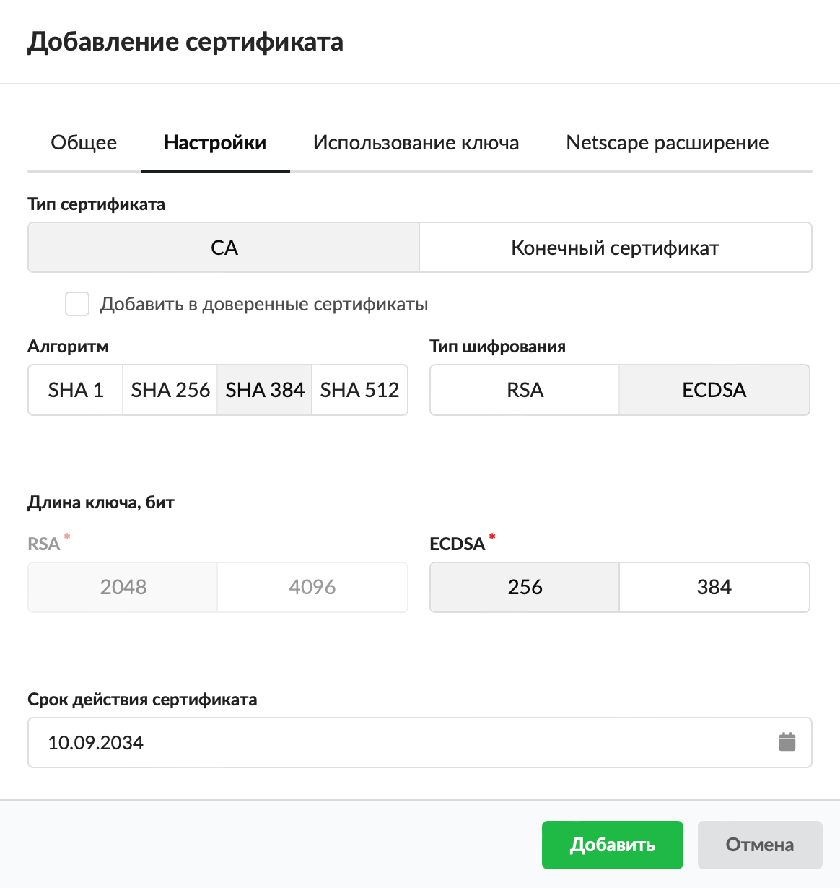
4. На вкладке **«Использование ключа»** можно выбрать шаблон использования открытого ключа сертификата (поле **«Шаблон»**) либо указать вручную при помощи флагов в блоках **«Использование ключа»** и **«Расширенное использование ключа»**.

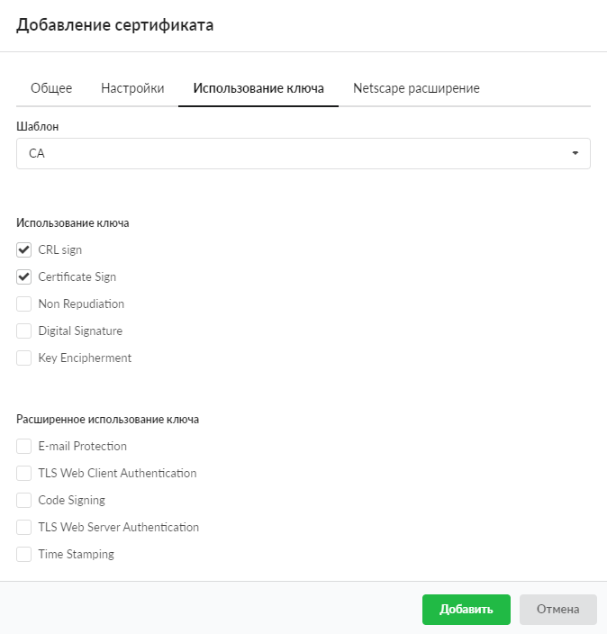
5. На вкладке **«Netscape расширение»** можно задать использование ключа для совместимости со старыми Netscape-приложениями (выпущенными до принятия стандарта X.509 v3).

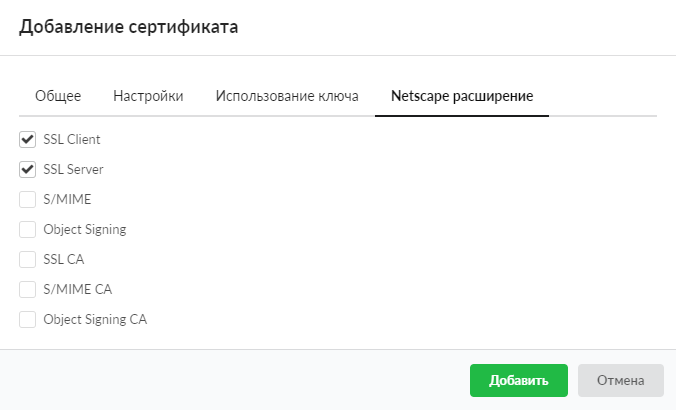
6. Нажмите **«Добавить»**.
7. В открывшемся окне при помощи переключателя выберите, требуется ли шифровать закрытый ключ паролем. При выборе шифрования введите пароль.

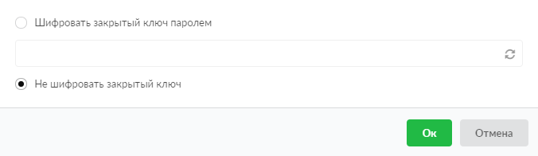

Внимание! Для служб ИКС всегда применяются только нешифрованные сертификаты.
8. Нажмите **«Ок»** — новый сертификат появится в списке.

Внимание! Необходимо сначала создать корневой сертификат, а затем — дочерние конечные сертификаты. К службам ИКС (кроме [SSL-фильтрации](../../set/proksi/nastroyka-httpsfiltracii-2.md)) применяются только конечные сертификаты. Будьте внимательны: неверное применение сертификата к службам может сделать их недоступными для пользователя.

Важно! Например, несколько сертификатов добавлены в доверенные. Если все сертификаты удалить из доверенных, то в консоли не удаляются данные о последнем сертификате. Он остается доверенным, хотя в интерфейсе у него не установлен соответствующий флаг.

## Добавить запрос на подпись сертификата

Запрос на подпись сертификата — это запрос, отправленный в центр сертификации (ЦС) для проверки подлинности учетных данных, содержащихся в сертификате.

После создания запроса его можно экспортировать, подписать в центре сертификации и импортировать обратно.

Важно! При импорте подписанного запроса необходимо выделить созданный ранее запрос на подпись. Таким образом, ключ сертификата и подписанный запрос объединятся, после чего запрос на подпись пропадет и вместо него появится сертификат в списке сертификатов.

Чтобы создать новый запрос на подпись сертификата, выполните следующие действия:

1. Нажмите **«Добавить»** и выберите **«Запрос на подпись сертификата»**.

2. Введите **название** запроса.
3. Выберите **код страны**.
4. Если требуется, укажите **город**, **область**, **название организации** и **e-mail**.
5. Введите **имя или адрес хоста**.

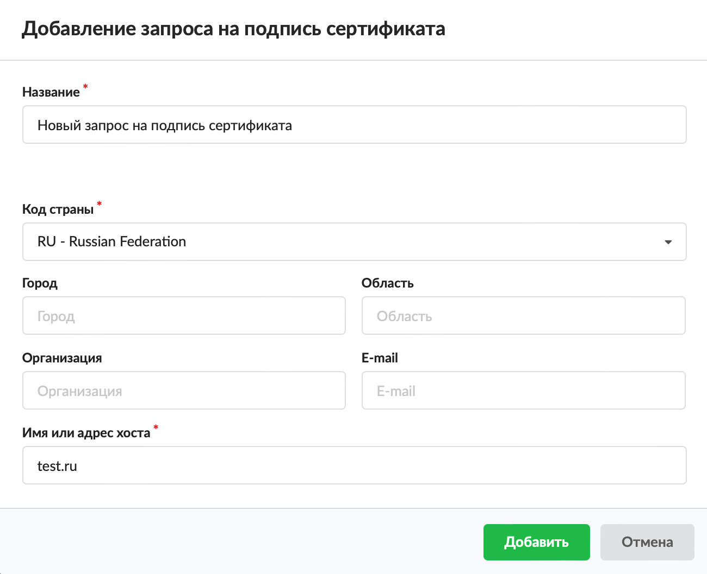
6. Нажмите **«Добавить»** — новый запрос на подпись сертификата появится в списке.

## Удалить сертификат

Для удаления сертификата выберите его в списке и нажмите кнопку **«Удалить»**, а затем — **«Ок»** в окне подтверждения.

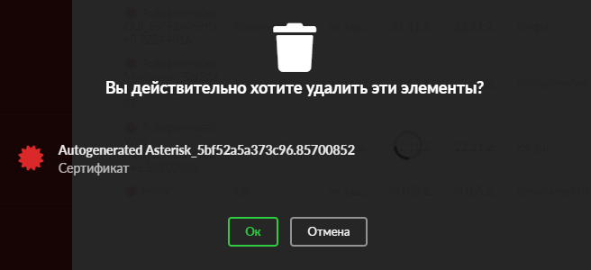

Если сертификат используется какой-либо службой ИКС, система выдаст сообщение об ошибке.

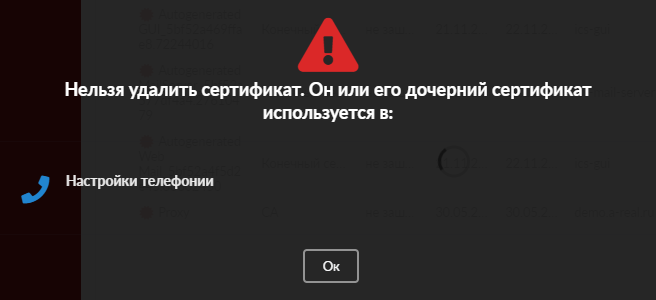

При удалении отозванного сертификата система выдаст предупреждение.

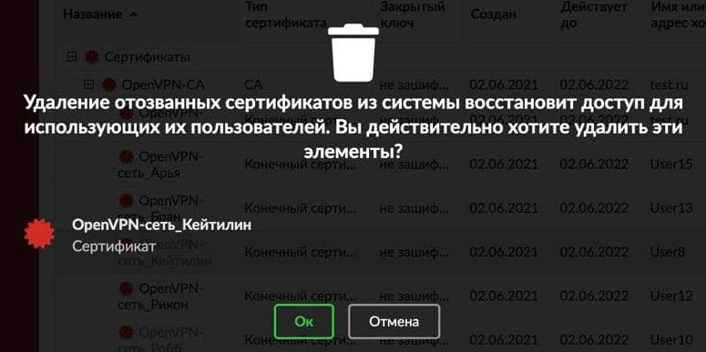

## Импорт

Чтобы импортировать сторонние сертификаты в ИКС, выполните следующие действия:

1. Нажмите кнопку **«Импорт»**.
2. Выберите файл **сертификата** и файл **ключа**.
3. Укажите **пароль**.

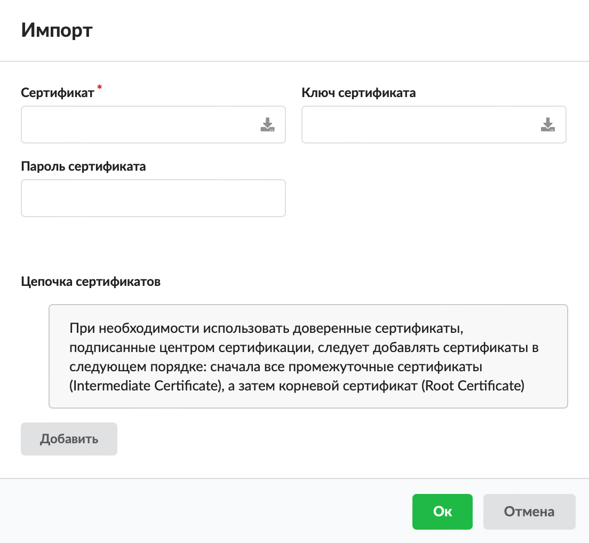
4. Нажмите **«Ок»** — сертификат будет загружен в ИКС.

## Экспорт

Чтобы экспортировать сертификат, выберите его в списке, нажмите кнопку **«Экспорт»**, а затем выберите вариант из списка.

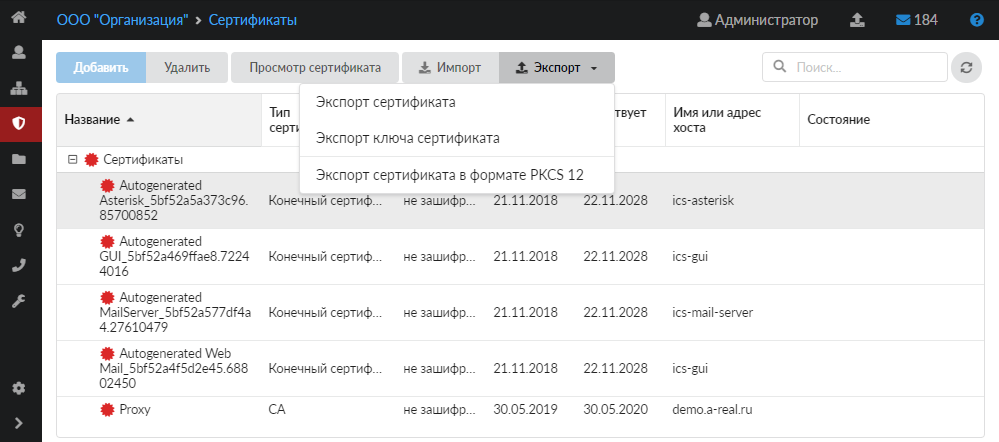

## Просмотреть сертификат

Для просмотра информации о сертификате просто выберите нужный сертификат в списке и нажмите кнопку **«Просмотр сертификата»** — на экране появится окно с данными.

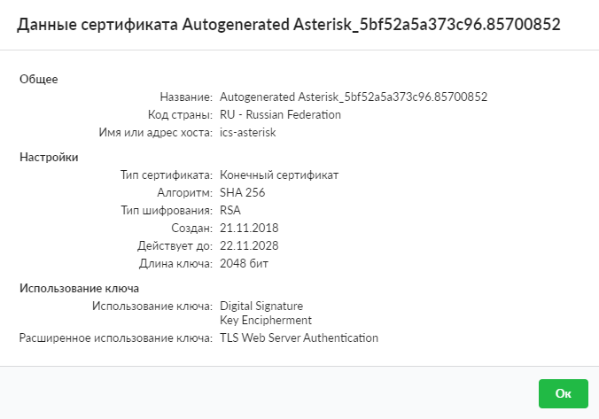

Внимание! Если провайдер расшифровывает трафик и выдал СА сертификат, то после [импорта](#import) сертификата на ИКС откройте информацию о нем. В открывшемся окне нажмите **«Добавить в доверенные сертификаты»**, иначе ИКС не будет доверять данным сертификатам и не откроет запрашиваемые страницы.

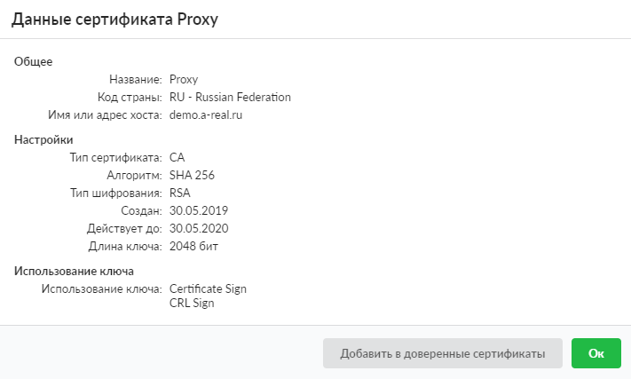

## Обновить сертификат Let's Encrypt

Для того чтобы обновить сертификат, который получен через Let's Encrypt и привязан в данный момент к виртуальному хосту, виртуальному хосту с перенаправлением либо к WebDAV-ресурсу, выберите этот сертификат в списке, а затем нажмите на кнопку 

.

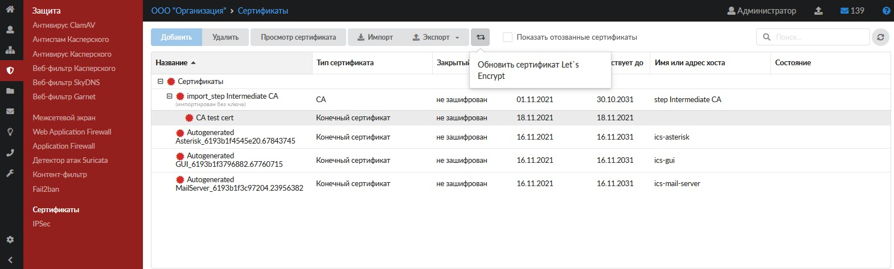

Если срок сертификата еще не истек, на экране появится соответствующее уведомление с просьбой подтвердить операцию.
