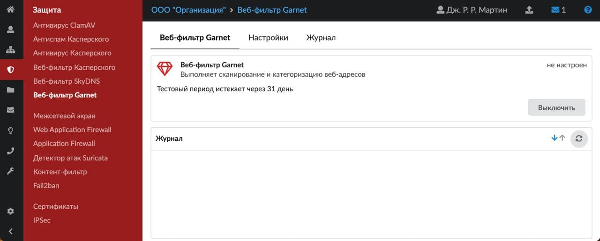
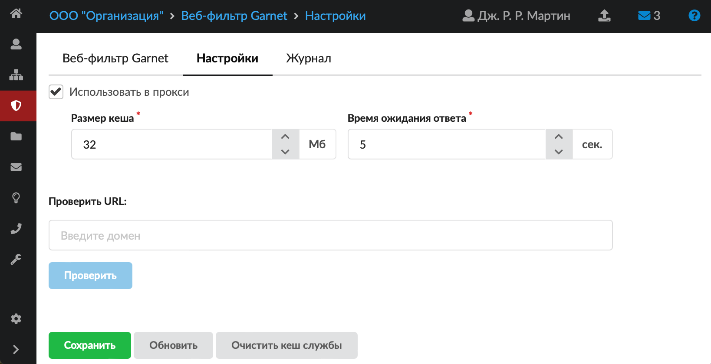
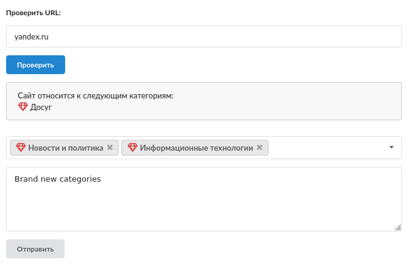
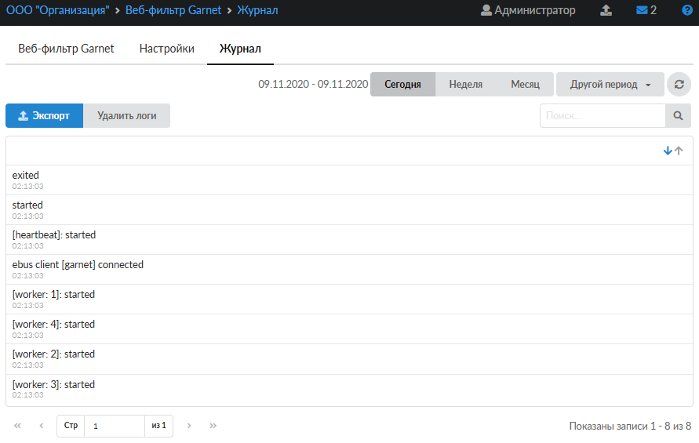

# Веб-фильтр Garnet

Веб-фильтр Garnet представляет собой систему автоматизированной категоризации сайтов сети Интернет. Определение категории сайта производится на основе анализа его текстового содержимого при помощи алгоритмов машинного обучения.

---

## Общие сведения

Веб-фильтр Garnet представляет собой систему автоматизированной категоризации сайтов сети Интернет. Определение категории сайта производится на основе анализа его текстового содержимого при помощи алгоритмов машинного обучения. На данный момент каждый сайт может быть отнесен к одной или нескольким из следующих категорий:

- сайты, распространяющие вредоносное ПО или посвященные обману пользователей;
- сайты, распространяющие нелегальный контент;
- сайты для взрослых;
- сайты для обмена/скачивания/доступа к контенту;
- сайты, посвященные социальному взаимодействию;
- сайты коммерческих или финансовых организаций;
- новости и политика;
- сайты досугового и развлекательного характера;
- сайты, посвященные купле-продаже;
- сайты об IT, веб-почта, поисковые системы;
- сайты государственных учреждений и некоммерческих организаций;
- сайты технического назначения;
- сайты религиозной и антирелигиозной направленности;
- маркетплейсы;
- сайты знакомств;
- медицина и здоровье;
- финансы и экономика;
- военная тематика и оружие;
- наука и знания;
- хобби;
- реклама и спам;
- почта;
- поисковые системы;
- хостинг;
- азартные игры;
- веб-ресурсы в сети Tor;
- кафе, рестораны, еда;
- музыка и поэзия;
- животные;
- наркотики;
- алкоголь и табак;
- мессенджеры;
- криптовалюта;
- игры;
- спорт.

## Веб-фильтр Garnet в ИКС

Сервис Garnet расширяет список возможных [категорий трафика](https://doc.a-real.ru/index.php?article=46), которые могут быть использованы в [запрещающих](https://doc.a-real.ru/index.php?article=150), [разрешающих](https://doc.a-real.ru/index.php?article=153) правилах прокси или [исключениях прокси](https://doc.a-real.ru/index.php?article=160) для пользователей и групп пользователей.

Для того чтобы использовать веб-фильтр Garnet в ИКС, оплатите доступ к модулю.

Для открытия модуля **«Веб-фильтр Garnet»** перейдите в меню **Защита &gt; Веб-фильтр Garnet**.

В модуле расположены следующие вкладки:

- Веб-фильтр Garnet
- Настройки
- Журнал

## Веб-фильтр Garnet

На данной вкладке отображается состояние службы **«Веб-фильтр Garnet»**:

- статус службы (запущен, остановлен, выключен, не настроен);
- срок действия лицензии;
- кнопка **«Включить»** (**«Выключить»**) — позволяет запустить или остановить службу;
- журнал последних событий.

Служба «Веб-фильтр Garnet» отвечает за работоспособность предустановленного веб-фильтра Garnet, который определяет, к какой категории принадлежит открываемый веб-сайт (если установлен соответствующий флаг в настройках [прокси-сервера](https://doc.a-real.ru/index.php?article=62)).

> ⚠ Внимание! По умолчанию служба находится в состоянии «не настроен». Чтобы активировать ее, установите в настройках [прокси-сервера](https://doc.a-real.ru/index.php?article=62#tab2) флаг **«Использовать Garnet»**.

> ⚠ На старых версиях ИКС, у которых не был активирован веб-фильтр Garnet, срок лицензии будет считаться по сроку действия лицензии на ИКС.

> ⚠ В бесплатной версии ИКС Lite веб-фильтр Garnet не доступен для использования.

## Настройки

Флаг **«Использовать в прокси»** соответствует аналогичному флагу в настройках [прокси](https://doc.a-real.ru/index.php?article=62#tab2). Данный флаг включает Веб-фильтр Garnet для фильтрации трафика, проходящего через прокси-сервер. Если флаг установлен, то можно определить **размер кеша** прокси, который будет использоваться для обработки данных, а также **время ожидания ответа** от облачного сервиса.

Чтобы изменения вступили в силу, нажмите **«Сохранить»**.

Для актуализации категории URL-адресов нажмите кнопку **«Очистить кеш службы»** — локальный кеш Garnet будет очищен.

### Проверка URL и обратная связь

На вкладке настроек также доступен функционал проверки конкретных [URL](https://doc.a-real.ru/index.php?article=24#url)-адресов. После ввода необходимого URL и нажатия кнопки **«Проверить»** будет выведен список категорий сервиса Garnet, к которым относится введенный URL, либо категория не будет определена, если проверяемый сайт или сам сервис не доступны.

Так как работа сервиса основана на алгоритмах машинного обучения, то результаты проверки адресов могут быть неполными либо полностью (частично) неверными. Применяемые алгоритмы постоянно улучшаются, и вы можете сделать их еще более точными. Для этого достаточно воспользоваться **формой обратной связи**, которая появится, как только введенный URL будет категоризирован.

В поле **«Предлагаемые категории»** выберите одну или несколько категорий.

В поле **«Комментарий»** можно оставить комментарий (необязательное поле).

Отправка отзыва будет осуществлена после нажатия кнопки **«Отправить»**.

## Журнал

На данной вкладке отображается сводка всех системных сообщений модуля с указанием даты и времени.

[Журнал](https://doc.a-real.ru/index.php?article=196#summary) является стандартным элементом веб-интерфейса ИКС.

---

**Источник:** [Документация ИКС — Веб-фильтр Garnet](https://doc.a-real.ru/index.php?article=354)
