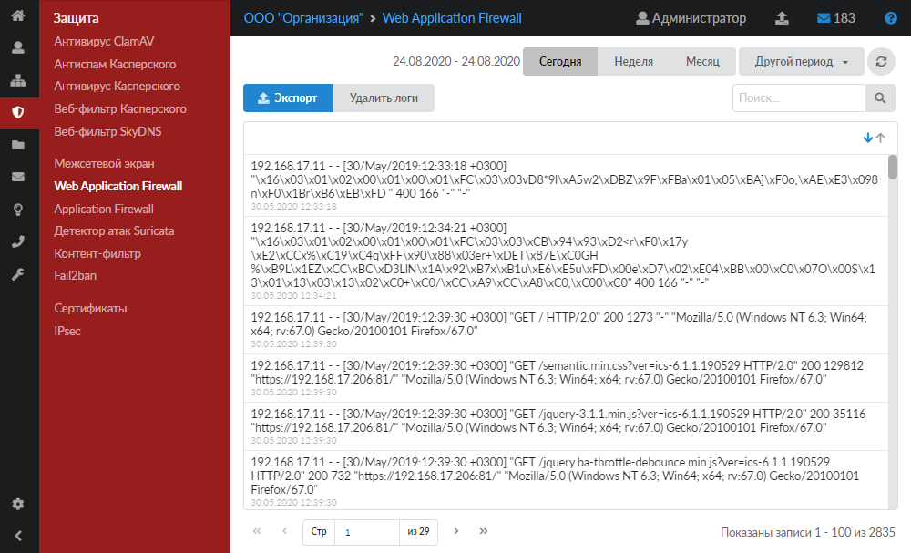

Модуль «Web Application Firewall» (WAF) отслеживает и блокирует HTTP/HTTPS-трафик, входящий и исходящий от установленных веб-приложений на ИКС или в локальной сети.

---

Модуль **«Web Application Firewall»** (WAF) отслеживает и блокирует весь [HTTP](../o-dokumentacii/slovar-terminov-3.md)/[HTTPS](../o-dokumentacii/slovar-terminov-3.md)-трафик, входящий и исходящий от установленных веб-приложений на ИКС или в локальной сети.

При помощи анализа HTTP/HTTPS-трафика WAF может предотвращать атаки, которые основаны на недостатках защиты веб-приложений ([SQL](../o-dokumentacii/slovar-terminov-3.md)-инъекции, межсайтовый скриптинг ([XSS](../o-dokumentacii/slovar-terminov-3.md)), включение файлов, неправильная настройка безопасности).

Для открытия модуля перейдите в меню **Защита > Web Application Firewall**.

На странице отображается журнал всех системных сообщений модуля с указанием даты и времени. Также в журнал попадают системные сообщения веб-сервера nginx.

[Журнал](../vebinterfeys-iks/standartnye-elementy-vebinterfeysa.md) является стандартным элементом веб-интерфейса ИКС.

За включение (выключение) фильтрации трафика отвечает флаг **«Использовать Web Application Firewall»**, который можно установить при создании или редактировании [виртуального хоста](../faylovyy-server/veb/virtualnyy-host-3.md) и [виртуального хоста с перенаправлением](../faylovyy-server/veb/virtualnyy-host-s-perenapravleniem-3.md).

> ⚠ Внимание! [Веб-сервер](../faylovyy-server/veb/veb-obzor-2.md) должен быть настроен и запущен.
